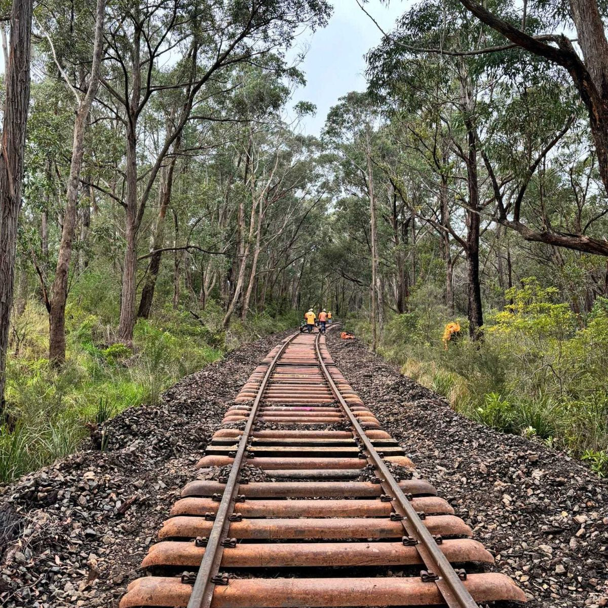
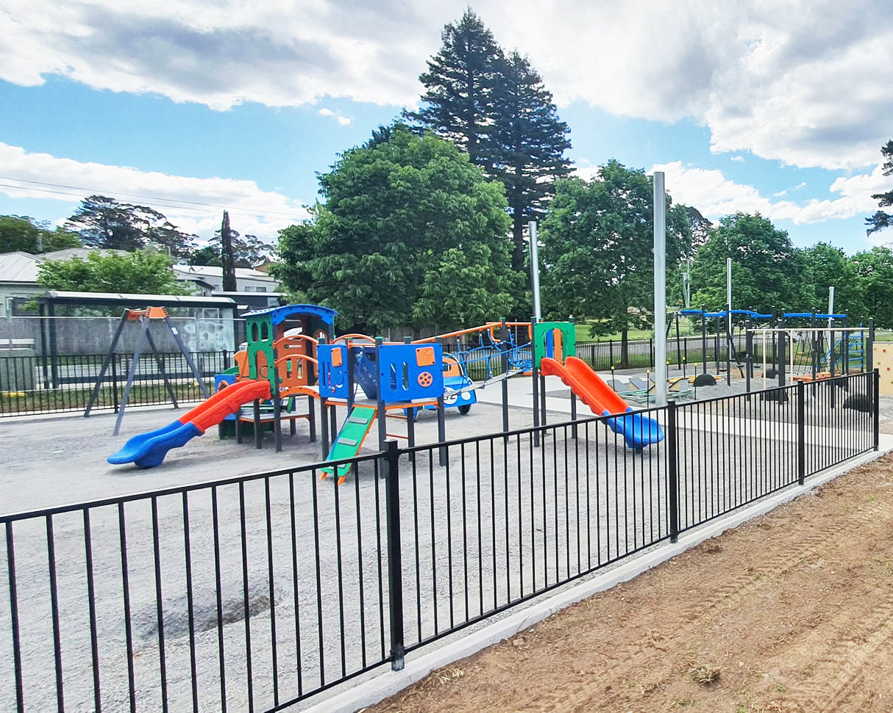
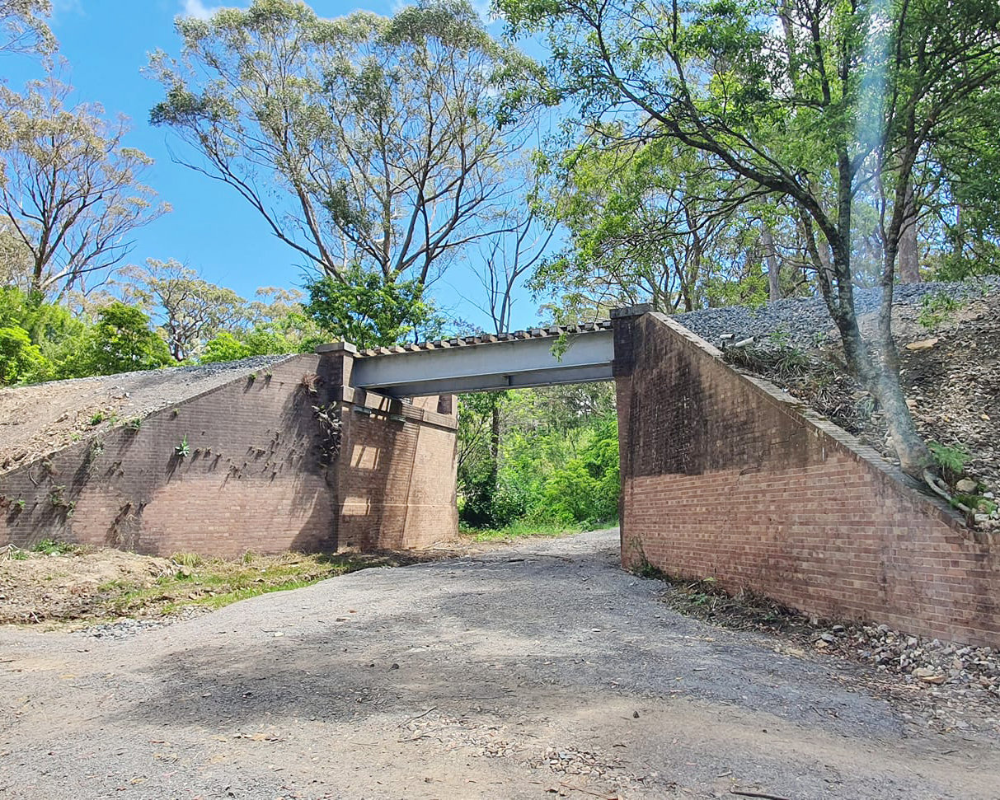

**Hazardous tree management underway**

**From now until the end of this year, work is taking place along the Loop Line corridor to address hazardous trees.**

**This will involve selective trimming and removal of trees that pose a risk to the safe operation of heritage trains or obstruct road users' visibility at level crossings. A low-impact approach will be used, and where possible, larger tree remnants will be placed alongside the rail corridor to preserve habitat for local wildlife.**

Most of the work will occur in bushland areas with minimal disruption to the community. However, we remind the public to remain alert around the Loop Line rail corridor and at level crossings. *Safety remains our top priority!*

**Re-sleepering to recommence late November**

**Work will soon recommence to complete re-sleepering of the track between Buxton and Balmoral.**

This phase is scheduled to begin in late November and will take approximately two weeks to complete, finalising all re-sleepering required as part of the Loop Line Upgrade Project.

Additional track work, including ballasting and resurfacing, is planned for early 2025.

**Hill Top playground installation underway**

**The installation of a new playground at Hill Top, funded by Wingecarribee Shire Council and the Hill Top Community Association (through bushfire recovery grants) with support from THNSW, is now in progress.**

Earlier this year, the Transport Asset Holding Entity (TAHE) granted a license to Wingecarribee Shire Council to develop the playspace adjacent to the station precinct.

Construction is anticipated to be completed by the end of 2024.

**Ligar Street Underbridge remediation continues**

**Remediation works have continued at Ligar Street Underbridge, with cleaning and removal of graffiti near complete.**

Earlier this year, the 110-year-old former bridge span was removed and stored. Additional repairs were also made to the bridge abutments, and the track formation was reconditioned for 25 metres on each side of the bridge.
