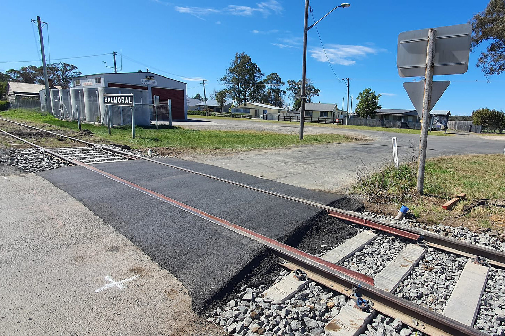
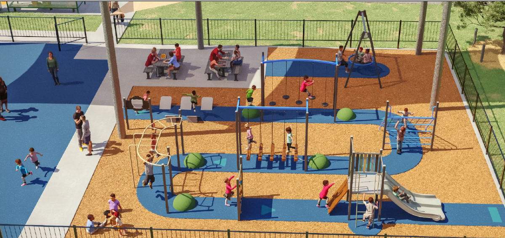

**Track works at Colo Vale now complete**

**The Loop Line Upgrade Project has reached yet another critical milestone with the completion of track works at Colo Vale Station.**

**These works included:**

- Installation of a brand new turnout at the southern end

- Overhaul of the existing turnout at the northern end

- Reconditioning and re-railing of both main and loop track

- Installation of over 1,000-tonnes of new ballast

- Installation of a 40-metre shunting neck.

When the line is reactivated, these works will enable locomotives to run-around at Colo Vale to make the return journey to Thirlmere.

**Level crossing upgrades complete**

**The first stage of level crossings renewals have been undertaken along the Loop Line corridor to Colo Vale.**

The existing track panels were removed and replaced with concrete sleepers, heavy duty rail, new flangeway rails, improved drainage and finally, a new bitumen surface installed over the track panel area.

The team will return to the level crossings later in the project for further upgrade works, including establishment of vegetation sight-lines, road surface upgrades, line marking and signage installation.

**New playspace for Hill Top Station precinct**

**Transport Heritage NSW is pleased to have facilitated the signing of an agreement with the NSW Government to pave the way for a new playspace at Hill Top.**

Under the agreement, a licence has been granted by the Transport Asset Holding Entity (TAHE) to Wingecarribee Shire Council. This licence allows for the development of a playspace adjacent to the station precinct, with construction expected to start this year.

Some of the playspace equipment being installed comes as a result of grant funding secured by the Hill Top Community Association, along with joint advocacy efforts by both the association and Transport Heritage NSW.

*For more information on the playspace and its design, see the* [*Wingecaribee Shire Council website*](https://participatewingecarribee.wsc.nsw.gov.au/hilltop-playspace?mc_cid=9ca3224f8a&mc_eid=620387c4ef)
