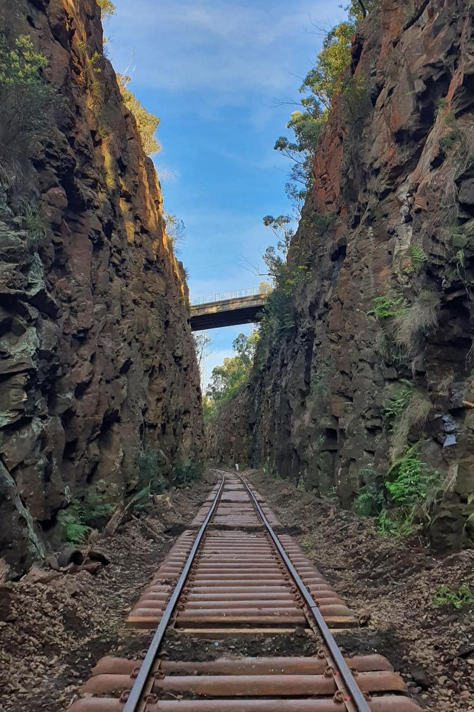

**The newly installed Ligar Street Bridge span**

**Ligar Street Bridge replacement**

Residents in Hill Top may have noticed that the Ligar Street railway bridge has now been replaced.

The 110-year-old former bridge span was removed and stored. Some repairs were also undertaken to the bridge abutments, and reconditioning of the track formation has occurred for 25-metres each side of the bridge.

The bridge’s replacement will now enable the safe operation of heritage trains over Ligar Street and brings us one step closer to reopening the Loop Line between Buxton and Colo Vale.

**Re-sleepering Big Hill Cutting**

Over the past two weeks, the project team have been working diligently from Hill Top through Big Hill Cutting towards Balmoral.

To date, over 10,000 sleepers have been replaced as we continue to progress towards Buxton.

Big Hill Cutting is a historically significant part of the line. Originally designed as a tunnel in the 1860s, planners opted for an open cutting to avoid trapping smoke from steam locomotives, which could have suffocated crews and passengers. This decision led to the creation of what once was the deepest railway cut in the Southern Hemisphere, measuring 23 metres in depth.

**Upcoming level crossing upgrades**

Over the coming months, a range of works will occur between Buxton and Colo Vale.

Planning is currently underway to upgrade level crossings at:

* Fitzroy Street, Hill Top
* Coates Road, Hill Top
* East Parade, Buxton, south of Balmoral Park Road
* Railway Parade, Balmoral, adjacent to the Balmoral Rural Fire Station
* Railway Parade, Balmoral, at the southern end of Balmoral village.

Level crossing upgrades will ensure improved accessibility for residents along the rail corridor, as well as safe passage for motor vehicles and heritage trains.

Please note, some 48-hour traffic diversions are expected to take place when level crossings are upgraded. Once work schedules are finalised, THNSW will provide further details of any traffic diversions.

**Hazardous trees**

From August, work will occur throughout the Loop Line corridor to mitigate hazardous trees. This will involve selected tree trimming and removal in accordance with the [Review of Environmental Factors](https://aus01.safelinks.protection.outlook.com/?url=https%3A%2F%2Fthnsw.us3.list-manage.com%2Ftrack%2Fclick%3Fu%3Dde9527c8f74a3fbc6e6f4e311%26id%3D5df7c1e299%26e%3D620387c4ef&data=05%7C02%7Charry.stranger%40thnsw.com.au%7C0cb4818417a1472a665e08dcb102f5db%7Cf648ee6277614aadb44717236b527f13%7C0%7C0%7C638579873491355483%7CUnknown%7CTWFpbGZsb3d8eyJWIjoiMC4wLjAwMDAiLCJQIjoiV2luMzIiLCJBTiI6Ik1haWwiLCJXVCI6Mn0%3D%7C0%7C%7C%7C&sdata=H97DnY7nv%2FbJu3ib9YosOHDBQrJg0%2FJSlrvFms7qi%2FA%3D&reserved=0). Only trees that pose a risk to the safe passage of heritage trains will be treated and a low-impact approach is planned. Remnants of any of the larger trees removed will be laid down in the rail corridor to create and/or maintain habitats for local fauna.

**Colo Vale turnout refurbishment**

At Colo Vale Station precinct, a series of works will soon commence and continue for six weeks. These works will reactivate the passing loop that enables the locomotive to “run-around” from one end of the train to the other. Scope includes the installation of a new turnout at the Colo Vale end of the rail yard and repair of an existing turnout at the northern end of the rail yard. Additionally, life-expired timber sleepers will be replaced with steel sleepers, track ballast will be installed on both the main line and the crossing loop, and the mechanical signalling equipment will be upgraded.

**Community drop-in sessions**
Transport Heritage NSW will be hosting community 'drop-in' sessions to answer any of your questions in relation to the Loop Line Upgrade Project at the following locations on Sunday 11 August:

* 10.00am – 12.00pm: Hill Top Station Precinct
* 1.00pm – 3.00pm: NSW Rail Museum (inside Main Exhibition Building)

There is no need to register! Just turn up at a time that’s convenient to you at one of the above locations.

*For more information visit the* [*Loop Line Upgrade Project page*](http://www.thnsw.com.au/loopline)*.*
