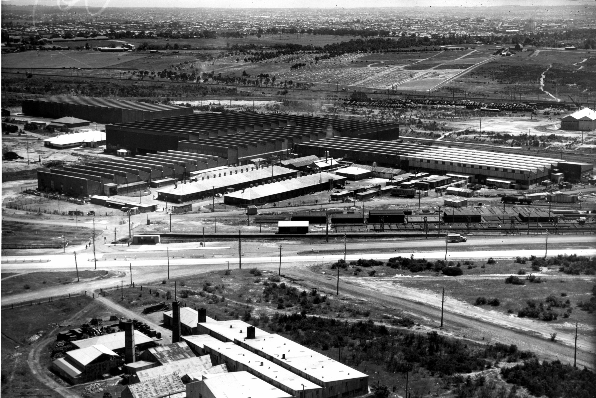

**Since the formation of Transport Heritage NSW in 2013, we’ve doubled community engagement with NSW’s heritage transport, both at the NSW Rail Museum and through events held right across NSW.**

However, we know more can be done to better protect and preserve our significant heritage collection items.

Today, the NSW Government and Transport Heritage NSW announced that a centralised storage, maintenance and operations facility will be developed at Chullora.

Chullora Heritage Hub will enable many opportunities, including:

* Proper storage for the collection including rolling stock and small objects, providing much needed protection from deterioration
* Large workshop for restoration projects and ongoing maintenance
* Easy access to the main line network for more efficient heritage train operations
* Potential for other recognised heritage transport groups to have a presence at the new hub
* Knowledge sharing and skill development
* Public access for special occasions in the longer term

Moving to Chullora means Transport Heritage NSW will no longer have collection items at Eveleigh and Broadmeadow, while the NSW Rail Museum at Thirlmere will remain as the premiere public showcase for rail heritage in NSW.

Further information will become available as detailed project planning commences in early 2019.
