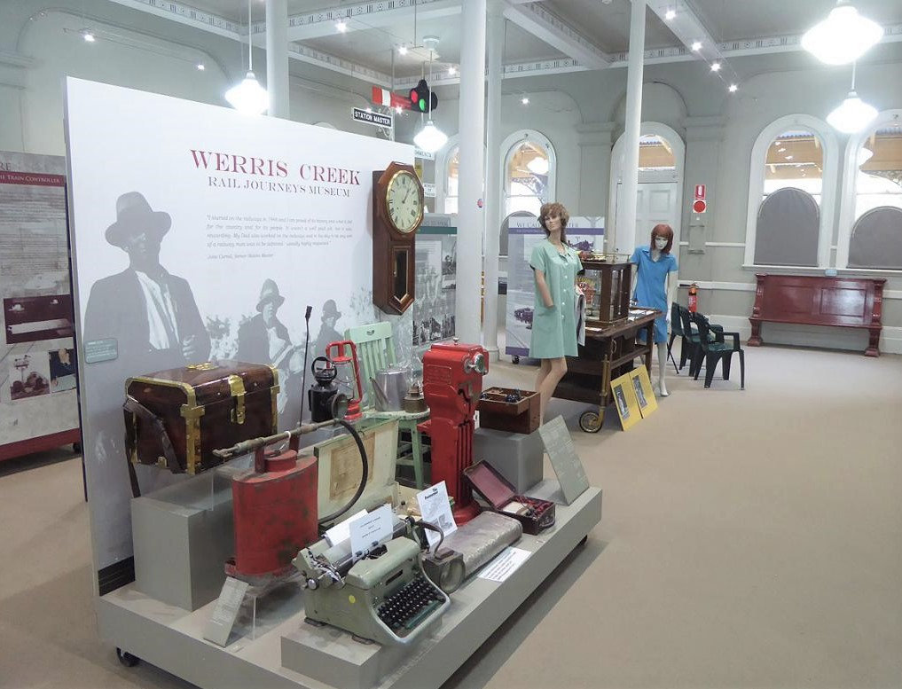

**Tell us a little about your career and what made you want to work for the railways.**

**I joined the NSW Government Railways (NSWGR) at the age of 15 as a junior station assistant and worked at Werris Creek for a short 8-month period. Then I left to take up employment with the Postmaster Generals Department, also in Werris Creek. At that time, I was elected to attend a 12-month training course in Strathfield to qualify me as a postal clerk and telegraphist. I served in that capacity for approximately three years before reapplying to return to the railway at Werris Creek as a station assistant.**

From a railway family, I had always retained a real interest in its progress. After progressing through the ranks of leading station assistant, shunter and guard, I was invited by the district superintendent to serve as a train controller. I held this position for some twenty years before being transferred from Werris Creek Train Control to Broadmeadow.

**What do you do at the Rail Journeys Museum?**

I have been president of the Rail Journeys Museum in Werris Creek for 13 years. I work with 40 dedicated volunteers from the Werris Creek, Tamworth, Quirindi and Sydney communities. My duty days are Friday and Saturday, and whenever I am required to assist on other days.

**How did the Rail Journeys Museum come about?**

In 1989, following the relocation of Werris Creek Train Control to Broadmeadow, I was employed in the crew rostering office. It was there that I decided to take action to ensure the longevity of the historic railway refreshment room complex on Werris Creek Railway Station. I submitted a request to the government of the day to consider preservation of the building by creating a major railway museum as a ‘must see’ tourist attraction in North and Norther Western NSW. A ministerial deputation came to town to review the idea and embraced it with great enthusiasm, committing $250,000 to commence the project.

**What has been the most notable project you have worked on?**

There are two projects that have given, and will continue to give, great interest. The first is the Australian Railway Monument where the names of those railway employees who meet untimely deaths whilst in the employ of the various states are forever remembered. It has been a real challenge obtaining the names of those killed on duty from other states and we are seeking assistance from the NSW Minister for Transport to contact his opposites in other states to complete this great project.

A hugely successful project has been the Path of Service creation, whereby people who have served on the railways of Australia may purchase an embossed ‘brick’ in recognition of their service.

**What’s your favourite object in the collection? Why?**

I have three favourite objects:

1. The magnificently restored Sydney to Newcastle train control board

2. Station master’s desk and equipment relevant to the train controller’s position

3. The huge former Werris Creek Station clock

Werris Creek Rail Journeys Musuem

*This article was originally published in the autumn 2018 sector report.*
