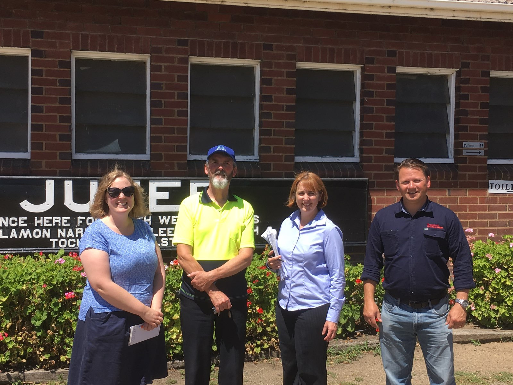

**Ron Ison is the museum curator for the Regional Heritage Transport Association (RHTA), who operate the [Junee Roundhouse Museum](https://roundhousemuseum.com.au/). Ron’s role involves setting up displays and objects to tell the story of Junee’s rich railway history. He is also the chairman of The Omnibus Preservation Society (TOPS), a sector group that works closely with the Sydney Bus Museum in preserving NSW bus history.**

Junee Roundhouse Museum Curator, Ron Ison (second from left), with visiting staff members from THNSW's heritage and collections unit. -Regional Heritage Transport Association

**How did you first become involved in the transport heritage sector?**

I became involved in bus preservation in the late 1960s when working for a local bus company in Sydney. I became a member of what was the Historic Commercial Vehicle Associate (HCVA) with other likeminded individuals who found it necessary to save our bus history in NSW from disappearing completely.

I have had an interest in railways, especially steam engines, from childhood and became a member and volunteer for the NSW Rail Transport Museum (now [NSW Rail Museum](https://www.nswrailmuseum.com.au/)) in the 70s.

I became Chair at RHTA in 2001 through to 2005 and have been on the Board of Directors to this day. I have also been Chair of TOPS since the society’s inception in 2007.

**What is your favourite part about being involved in the Junee Roundhouse Museum and TOPS?**

My favourite part of being associated with both groups is the passion and enthusiasm of our members and volunteers. I also love the challenges – being able to continually improve our operations and help our museum tell the story with fresh displays and objects. With the buses, the enjoyment of driving them and the smiles they put on peoples’ faces is fantastic!

**Why do you believe museums and heritage organisations are valuable in today’s world?**

Without heritage museums, our history would be lost. The best transport museums in NSW today, in my humble opinion, are the [NSW Rail Museum](https://www.nswrailmuseum.com.au/) at Thirlmere and the [Sydney Bus Museum](http://www.sydneybusmuseum.info/) at Leichhardt. Their collections are amazing and well presented, with a majority of the work performed by volunteers.

**Are there any difficulties facing either organisation you could tell us about? What are some of the challenges that regional transport museums face?**

The biggest challenge we face here in Junee is a volunteer shortage. Trying to encourage new people is most difficult and none of us are getting any younger.

**What has been the most notable project you have worked on?**

The most notable project I’ve worked on for RHTA is, without a doubt, Express Passenger Steam Locomotive 3609. It has taken over 17 years to come to fruition, but 2018 will see the locomotive moved from Thirlmere to Junee and the reconstruction process will begin.

For TOPS, our most notable project would be our ex Public Transport Commission Leyland Atlantean 1016. Brought from a paddock in derelict condition in 2007, the double-decker bus has been beautifully restored to operational condition and is much loved by our members and the community.

**What is your favourite object in each of the collections and why?**

My favourite object in the current RHTA collection would have to be our diesel electric locomotive 4872. Against all advice, we painted the locomotive in the ex SRA Cardiff Workshops ‘Red Terror’ livery and our visitors love it!

For TOPS, it would be our Atlantean 1016, closely followed by our THNSW grant recipient Leopard 3753. Both vehicles are iconic Sydney buses and are hugely popular with our visitors to the museum, especially when out working heritage bus rides.

*This article was originally published in the summer 2018 sector report.*
