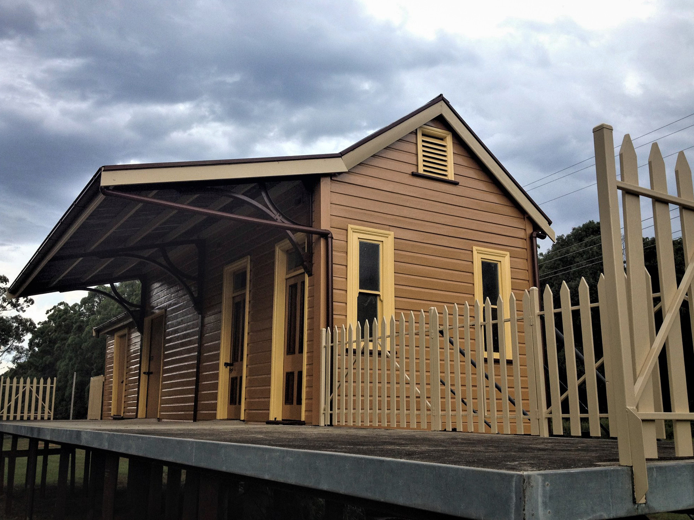

**There is little information available on Moorland Station, apart from it opening on 12 April 1915 and closing on 21 July 1971.**

The station was donated to Glenreagh Mountain Railway (GMR) and relocated to Glenreagh West in 2005, where it was reassembled on piers and painted.

Little has been done to the historic building until its most recent external refurbishment.

GMR obtained a grant through the Transport Heritage Grants Program in 2018 to paint the station’s exterior to an appropriate heritage colour scheme. The project is now complete and the end result looks fantastic.

The internal condition of Moorland Station required no additional work and remains in excellent condition. The station currently houses GMR historical records and artefacts, and is open for inspection on selected days during the year.

Well done to all involved!

Moorland Station newly painted. -Glenreagh Mountain Railway

*This article was originally published in the winter 2019 edition of the sector report.*
