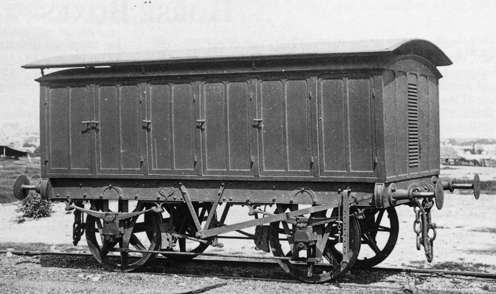

**It has been 150 years since Mortuary Station was opened as a starting point for funeral trains taking coffins and mourners to Rookwood Necropolis.**

The NSW Railways provided funeral train services to three NSW cemeteries: Rookwood Necropolis, Woronora in Sydney and Sandgate in Newcastle. In the first part of this two-part article, we’ll look at Mortuary Station and Rookwood.

**Early Sydney**

During the 1840s, Sydney’s burial grounds were reaching capacity and church leaders were pressuring the NSW Colonial Secretary to establish a new cemetery on the outskirts of the city.

Sydney’s original burial ground was on the site of today’s Town Hall on George Street. A burial ground had been established on this site during the 1790s. It was known by various names over the years, including the George Street Burial Ground, Cathedral Close Cemetery, Town Hall Cemetery and Old Sydney Burial Ground.

This site was selected by Governor Phillip and the Reverend Richard Johnson in September 1792. It was considered a place of quiet seclusion and would not affect the health of the town.

Governor Lachlan Macquarie authorised an extension of the burial ground in 1792. This extension made the site 2 acres (.8 hectares) and included a grant for a new church next door. The church became St. Andrew’s Cathedral.

The burial ground was used until approximately 1819, with Church of England clergy officiating at funerals without keeping official records. Convicts, early free settlers and the military were buried in different areas of the cemetery.

The cemetery was full by 1820 and a new burial ground was set aside at Brickfield Hill, now the site of Central Station. Some bodies were relocated to the new burial ground.

The closed cemetery on George Street suffered vandalism and became ‘a resort for bad characters at night’. During the day, stray pigs, goats and horses wandered among the graves. In hot weather, unbearable smells rose from the grounds due to grave robbers unearthing graves to steal the lead lining of the coffins.

The new cemetery at Brickfield Hill was 4 acres (1.6 hectares) and enclosed by a brick wall. During the next four years, the cemetery was expanded by an additional 7 acres (2.8 hectares) to the south. A new road named Devonshire Street was established along the southern border and the northern border of the cemetery was the present Eddy Avenue.

In 1901, the cemetery was resumed for the development of Central Station. The relatives of people buried in the Devonshire Street Cemetery were given two weeks to arrange removal of remains. Remains were transferred to various cemeteries around Sydney and reasonable costs were borne by the NSW Government. Central Station opened on 4 August 1906.

**Rookwood Cemetery**

By the 1840s, the Devonshire Street burial ground was nearing capacity and a site for a new cemetery was urgently needed. A location near Randwick was chosen and then abandoned in 1859 due to complaints from residents. Church authorities were pressing for a site on the outskirts of Sydney, as the railway line opened as far as Parramatta in 1856. Several sites along the line were surveyed and abandoned. Finally, in 1862, a 200-acre (80 hectare) site at Haslems Creek (the present-day Lidcombe) was purchased by the government due to its relevant isolation and proximity to the railway line.

Devonshire Street Cemetery. -NSW State Archives

Due to pressure from locals who did not like the association with the cemetery, the nearby locality was renamed Rookwood. Unfortunately, the cemetery became known as Rookwood Necropolis, but what was to become one of the largest cemeteries in the world was established.

The cemetery was served by a rail line via the main line from 1867 to 1948. Mortuary stations served each of the three sections of the necropolis, with a fourth at the main junction and a fifth on Regent Street adjacent to Central Station. The railway line construction began in November 1864 and, from 1 January 1865, trains began their run into the cemetery.

Trains stopped at prearranged stations on the journey from Sydney in order to pick up mourners and coffins. The trains departed Sydney at 9.30am and 3.00pm, using unimproved Redfern cars to carry mourners from the city to the cemetery.

There were two types of hearse carriages used on the trains. One consisted of a four-wheeled van that carried up to 10 coffins on its upper and lower shelves. Each of these shelves was designed so it could open onto the platform. There were also eight-wheeled vans that could hold 30 coffins. Both types of vehicles were attached to the back of the train for transporting coffins to the cemetery. At the terminus inside the cemetery, the coffins were unloaded using wheeled, hand-propelled litters.

An original four-wheel BK hearse. -NSW Railway Archives

**Mortuary Station**

Mortuary Station was designed by James Barnet and built between 1868 and 1869. It was officially opened in June 1869. Both white and biscuit-brown varieties of Pyrmont sandstone was used in the construction of the station, which was completed on 22 March 1869.

The building was used as the terminus for funeral trains until 1938, when motor hearses took over transporting the deceased. Trains left from the main terminus platforms at Central between 1938 and 1948. With there being no further need for the rail hearse, the Mortuary Station ceased to function as it was originally intended.

From 14 March 1938, Mortuary Station was used for the consignment of horses and dogs, and its name was changed to Regent Street. By February 1950, it was used as a parcels dispatch station, at which time overhead wires were placed inside the rail pavilion and (apparently at this same time) the easternmost arches at either end were removed of ornament on the inner face to allow for the passage of larger rail vehicles. The sight of an electric mail vehicle standing under the arches was common in the 1950s and 1960s.

In 1981, the State Rail Authority (SRA) decided to restore the station. By this time, it had been classified by both the National Trust of Australia (NSW) and the Australian Heritage Commission. The Heritage Council of NSW had also placed it under a Permanent Conservation Order. Restoration was co-ordinated by the Way and Works Branch of State Rail and $600,000 was spent on the restoration work.

Since then, Mortuary Station has been used as a restaurant and a venue for weddings and product launches. The SRA also used it to launch new rolling stock. With the construction of the bus terminus at the northern side of the property, about one third of the length of the platform was lost by encroachment. The original platform was exactly the length of the covered portion.

Mortuary Station photographed in 1871 showing the building in its original 1868 form. -NSW Railway Archives

**Rookwood Cemetery railway line**

The Rookwood cemetery branch, opened on 1 April 1867, left the Main Western line and curved into the cemetery site just east of Haslams Creek (Lidcombe) Station. Originally, funeral trains arriving from Sydney reversed from the Haslams Creek platform and pushed the train onto the branch. When the branch was extended in 1908, a loop was installed near the junction with the main line. Then the locomotives were able to run around the train and haul along the branch.

The original station on the branch was known by many names between 1875 and 1908. When the final extension was added, the station became known as Mortuary Station No.1. This station was originally at the end of the line just 915m from the junction. The station at this site was also designed by James Barnet and was another of his magnificent Sydney sandstone edifices. The station was a single line, but had platforms on each side. The platforms were 575 feet (175m) long. The building was 104 feet (31m) long and contained a waiting room with a fireplace along the end of the building as, at this time, this was a terminal station.

About 30 minutes before the train departed for Sydney, a bell was sounded to alert mourners of the approaching departure.

As the cemetery grew, the railway line was extended. The waiting room at the first station was removed so the branch could be extended. Three more stations were eventually added.

The second station along the line was named Roman Catholic Platform and was opened on 31 December 1901, but was renamed Cemetery Station No.2 on 15 June 1908.

The third station opened as Mortuary on 26 May 1897. The name was changed to Mortuary Terminus on 26 July 1897, then to Cemetery Station No.3 on 15 June 1908.

Cemetery Station No.4 was opened on 15 June 1908 and consisted of a 530 foot (160m) long platform. A run round loop was provided so the locomotive could haul the train back to Lidcombe. Facilities for watering were also provided at the site. Two refuge siding were provided beyond the platform and up to three funeral trains could be handled. Two trains could be stored in the sidings while a third was in the station.

A morning and afternoon funeral train was provided on weekdays. The trains travelled at a slow pace, as they could be flagged down by station staff to pick up mourners along the way. Newtown, Croydon and Strathfield had facilities for loading coffins.

On departure from the cemetery, the train would be hauled back to the loop just before the main line and the engine would run around the train and propel it into Lidcombe Station ready to return to Sydney.

The transport of corpses to Rookwood was discontinued in 1929 and weekday services for visitors were reduced. CPH railmotors were used in the final days of the line to provide passenger services. The service finished on 3 December 1948 and was closed on 29 December 1948.

On 1 June 1939, the first 525 feet (160m) of the line had overhead wiring installed and was used for stabling suburban electric trains. This was later extended to 1,050 feet (320m). The loop that was used by the locomotive to run around its train was removed on 22 December 1965. The line was further reduced in length several times over the years until it was finally reduced to 590 feet (179m) on 7 February 1983.

Following closure of the line, the impressive station building at Cemetery Station No.1 fell into disrepair and was attacked by vandals. A bushfire destroyed the ornate timber and slate roof, which collapsed onto the platforms, and the bell used to summon mourners was stolen. In 1952, the Railway Department decided to dispose of the building, but it was not until 1959 that a church in Canberra bought the building for £100.00 (about $200.00).

Rookwood Cemetery Station No.1 with no roof. This photograph was taken following the closure of the line. -NSW State Archives

Reverend Edward Buckle, of All Saints Anglican Church in Ainslie, Canberra, saw an advertisement for the purchase of the building. His congregation had been worshipping in an old hall, but he saw the benefit of the building coming to his parish. Convincing his parishioners and bishop of the need, he purchased the building and a father and son building team from the parish supervised the demolition and removal to Canberra.

The new church took a year to build and was dedicated on 1 November 1959 (All Saints Day). The missing bell was replaced by one from a Shay locomotive that once ran on the Newnes railway, having been donated by the Australian Railway Historical Society. The openings in the side walls of the building have been replaced by stained glass windows and the bell tower is on the opposite side of the building to what is was originally.

There were proposals to create a loop line by extending the cemetery branch to the Main Western Line near Flemington or to the Flemington-Enfield goods line, which is located on the eastern boundary of the cemetery. Neither of these proposals got off the ground.

Another platform was constructed on the Main Western Line adjacent to the cemetery in 1887. This was originally known as Necropolis, but was renamed Rookwood on 1 January 1914. Suburban trains provided services to Rookwood on Sundays. The station remained in use until 1 September 1967.

[**READ PART 2: HERE**](https://www.thnsw.com.au/news/nsw-cemetery-railways)

**References**

*Sydney’s First Official Burial Ground*, Sydney City Council.

Resumption of the Devonshire Street Cemetery, *The Sydney Morning Herald*, 11 December 1900, via Trove.

The Devonshire Cemetery, *The Sydney Morning Herald*, 2 February 1901, via Trove.

*Mortuary Station and Site*, NSW Department of Environment.

*Sydney’s Forgotten Park and Rural Railways*, John Oakes, Australian Railway Historical Society, 2007.

*This article was originally published in the summer 2019 edition of Roundhouse magazine. Written by John Casey, Roundhouse Editor.*
