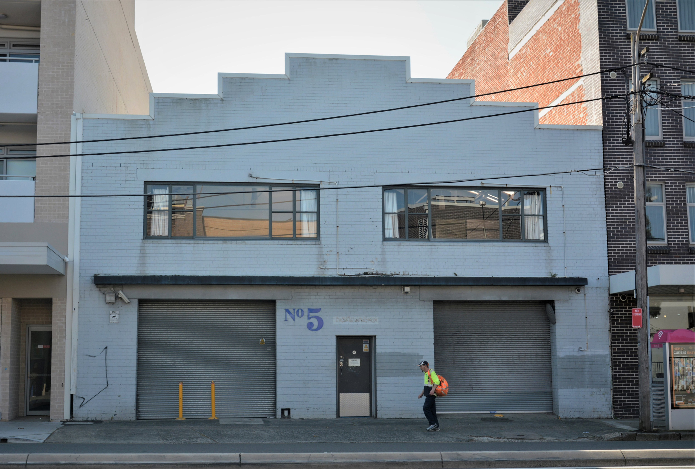

**ARHSnsw recently completed the purchase of a new premises, 5 Henderson Road, Alexandria. This is an exciting development for the society and an important milestone in our 85-year history.**

The building will be our new headquarters, bringing together our bookshop and resource centre on the ground floor, as well as office space and a multi-purpose auditorium on the first floor. Not only will this be an attractive new space for enthusiasts and historians to focus their interest, it will also be an engaging and appealing place to present the story of railways in New South Wales to the public.

As part of preparations to move to the new premises, we’ve done a stocktake of the various items in the RRC collection. Across our two sites, Redfern and Alexandria, we have a total of approximately 1,200 metres of shelf space, of which roughly 1,000 metres is used. This is split evenly between books, documents, material requiring secure storage (such as photos and slides, plus rare items) and journals, most of which are bound. With this information, we can plan for sufficient space in the new building.

Additionally, we have more than 30,000 engineering drawings, which are in the process of being scanned. Much of the material has been scanned over many years, which puts us in an excellent position for our project to improve cataloguing and enable access to the collection online.

In the past month, we have been identifying and cataloguing all the small items of hardware, such as signal arms, wagon builders’ plates, RRR crockery, etc., so we have a record of the collection and can place some of it on display in the new facility.

We continue to expand our collection and have developed unique expertise in efficiently scanning, cataloguing and storing images. Please get in touch with us if you have a collection of photographs, slides or other items of a historical nature relevant to Australian railways and are willing to donate them for future generations to enjoy.

5 Henderson Road, Alexandria

*This article was originally published in the summer 2019 sector report. Written by James Dalton, Resource Room Manager, ARHS.*
