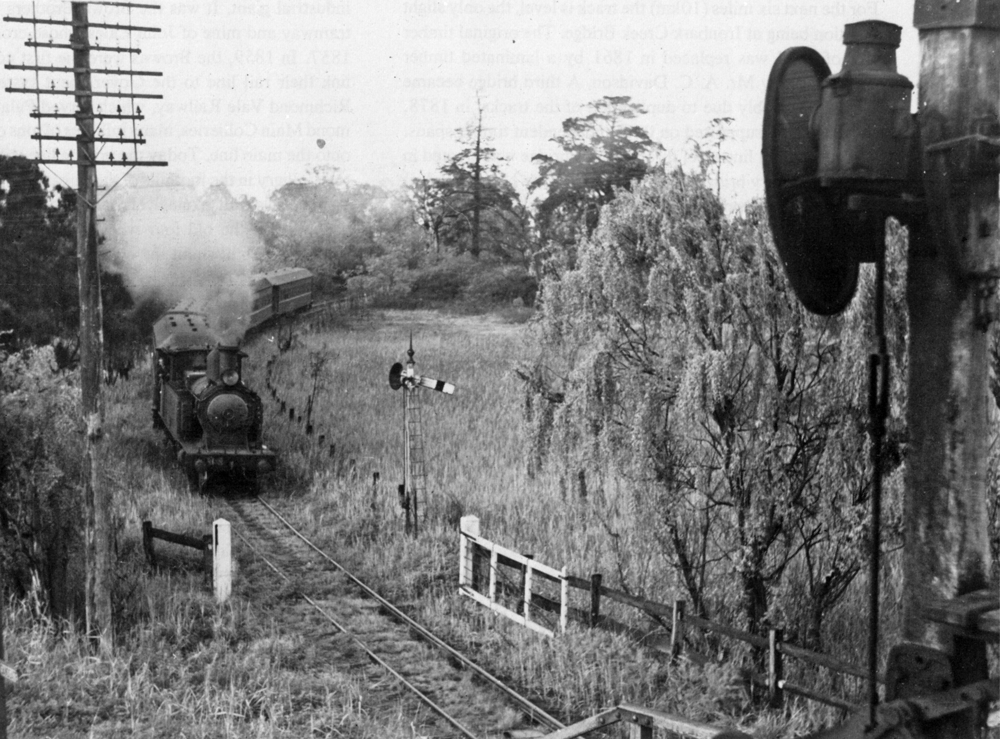
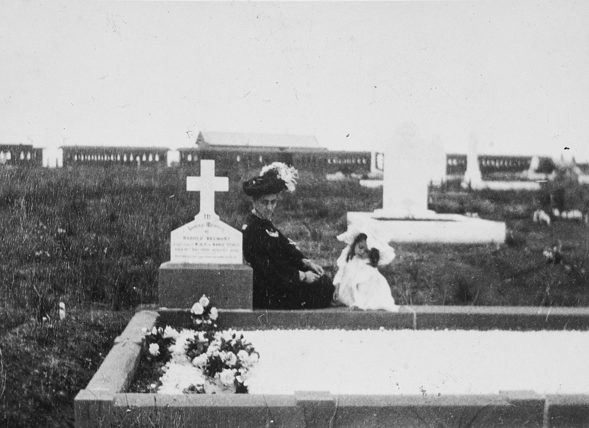

**In the summer issue of *Roundhouse*, we looked at Mortuary Station in Chippendale and the Rookwood Cemetery line. In this issue, we complete our look at the cemetery railways of New South Wales.**

[**READ PART 1: HERE**](https://www.thnsw.com.au/news/mortuary-station-celebrates-150-years)

**Sandgate Cemetery Railway**

The Sandgate Cemetery branch opened on 15 January 1881 and served the people of the Newcastle region for more than 100 years until the last train ran on 13 October 1985. The Sandgate line was the last of the branch lines that served cemeteries in NSW.

The NSW Railways issued a notice on 9 September 1881 advertising the line would service a platform to be known as General Cemetery. From the main line junction, the branch was just under 1km long. The station was renamed Sandgate Cemetery on 1 January 1890.

There was very little population in the area to provide a station at Sandgate, let alone for the railways to build a branch line to the cemetery. The line at this time was a single line through Sandgate that was duplicated in 1878, while quadruplication passed to the south of the platforms in 1913.

The timber platform’s building was described in the *Newcastle Herald* of 14 April 1881 as, “A handsome mortuary receiving house or waiting room provided. The benefit of this arrangement will be greatly appreciated: since by the plan thus adopted funeral parties can be conveyed to the nearest approach to either one of the various denominational sections into which the whole is sub-divided.”

The timber building was a one-room structure with a gabled roof. It had an awning supported by timber posts and windows curved in at the top, creating a Gothic effect. No toilets were provided, but on 8 November 1887, the Newcastle Herald reported that ‘retiring rooms’ (toilets) were to be constructed at Sandgate.

The platform was 480 feet (146 metres) long and consisted of a timber frame with timber decking, possibly old sleepers. By the late 1970s, the length of the platform had been reduced to 151 feet (46 metres). At the rear of the station building was an earth ramp, which was used to take the coffins off the platform.

In the early 1930s, part of the timber structure was replaced by an earth-filled platform with a brick wall and coping. The platform and buildings were demolished in 1978 with only the brick wall remaining. The cemetery trust requested the line’s removal so that the life of the cemetery could be extended by eight to ten years. A paved pathway was provided from Sandgate Station to the cemetery.

Originally, funeral trains ran from Newcastle Mortuary to the cemetery, providing facilities for coffins and mourners.

The timetable at the time of closure provided for two Sunday services by a two-car diesel railcar, with services departing Newcastle as 2.46pm and 3.35pm. They reached the cemetery at 2.56pm and 3.55pm, respectively. Departure from the cemetery was at 3.28pm and 4.08pm, arriving back at Newcastle at 3.47pm and 4.27pm.

During 1956, Sunday afternoon trains consisted of five cars hauled by a 30 class. In this photograph, 3118 passes the junction signal and cemetery boundary gate before joining the main line for the return to Newcastle. -Ron Preston, NSW Rail Museum Collection

**Woronora Cemetery Railway**

With construction of the South Coast railway line, a portion of Kurnell was designated as a site for ‘noxious trades’ and that trade was to be a cemetery. Plans were made to build a branch railway from Sutherland to service the cemetery.

In 1895, the 110 acres of Woronora Cemetery was a brickworks and designated to become a racecourse. However, at the last minute, the Mayor of Rockdale, John Bowmer (there was no Sutherland Shire Council in those days), decided the community needed a place to remember loved ones in a setting of beauty and serenity. So, the cemetery was born.

In 1897, 87 acres (35 hectares) of land on the western side of the railway line at Sutherland was dedicated as a cemetery and placed in the care of a trust. The first burial took place on 1 April 1900.

A branch line built by day labour was opened on 13 July 1900 from Sutherland to the Woronora Cemetery. The line was single track with a length of 38 chains (0.77km). At its terminus was a 440 foot (134m) long platform and locomotive run round loop. The line left the main line just south of Sutherland Station and curved across East Parade near the junction of Linden Street, and continued to curve north-west ending at the station. The cemetery’s current office stands on the site of the original platform.

Funeral trains to Woronora departed Sydney Terminal rather than Mortuary Station in Regent Street, Chippendale, and picked up coffins along the Illawarra line. Coffins would be left on trestles along the line and were picked up where required. In 1927, the trains departed Sydney at 1.52pm (Monday to Fridays), 2.15pm (Saturdays) and 2.37pm (Sundays).

Prior to departure from the cemetery, the locomotive whistle would be sounded to give mourners time to return to the train for departure.

The line was never electrified and in its final years following the discontinuation of the funeral trains, the service was provided by a CPH railmotor.

In 1902, when the Devonshire Street Cemetery was closed to make way for Central Station, some of the deceased were relocated to Woronora. Several of the headstones in the cemetery show dates prior to its opening.

As with Rookwood cemetery, motor traffic made inroads into the patronage of the rail service and train operations were discontinued. The line was officially closed on 23 May 1947, followed by the platform being demolished and the track removed.

This is one of only two known photographs of the Woronora Cemetery railway. The train stands at the platform in the background, while widow and child mourn their dear departed. The small station building is just visible in the centre of the photograph. -Sutherland Shire Libraries

**References**

*Sydney’s Forgotten Park and Rural Railways*, John Oakes, Australian Railway Historical Society, 2007.

*Railway Digest*, October 1985, p.297.

*Sandgate and Sandgate Cemetery Stations*, Stuart Sharp, 2016.

*Railways and Tramways in the Sutherland Shire*, Peter Neve, Sutherland Shire Council, 1994.

*This article was originally published in the autumn 2019 edition of Roundhouse magazine. Written by John Casey, Roundhouse Editor.*
