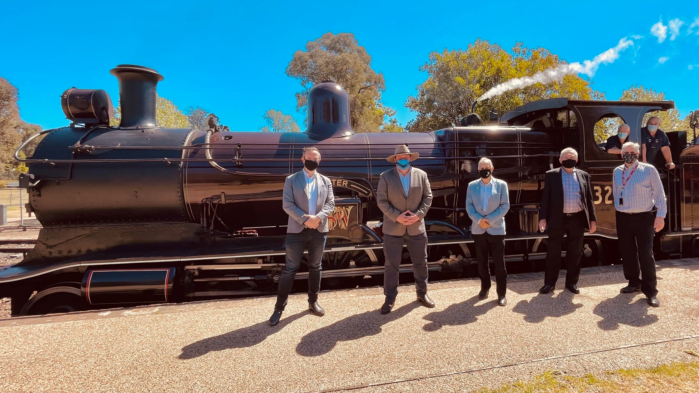

**The NSW Government has announced an additional $9.1 million to complete the Loop Line Upgrade Project.**

The funding is in addition to the $5.5 million committed by the NSW Government in 2019 and allows Transport Heritage NSW to now complete all works associated with the line's upgrade.

Work will commence from this week on the existing operational section to Buxton, before moving onto reactivating the line to Colo Vale from early next year.

The project is expected to be completed by mid-2023.

For more information visit the [Loop Line Upgrade Project page](http://www.thnsw.com.au/loop-line).

*Wollondilly Cr. Matt Deeth; Member for Wollondilly, Nathaniel Smith MP; Wollondilly Mayor, Cr. Robert Kahn and Wingecarribee Administrator, Viv May join with THNSW Chair, Rob Mason and locomotive crew Mick Potter and Ben Elliot at Thirlmere Station to announce funding for the Loop Line upgrade on Monday 20 September 2021.*
