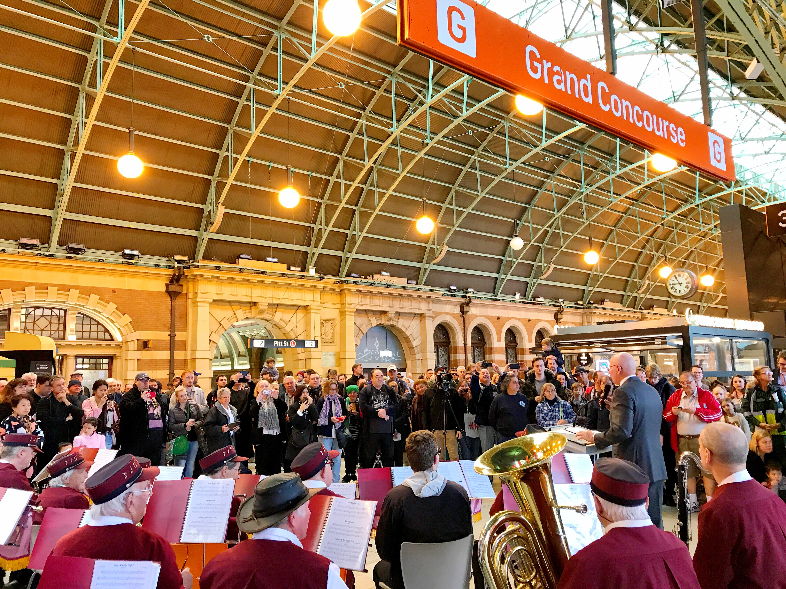
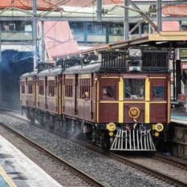
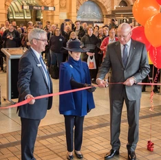
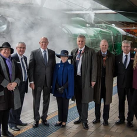
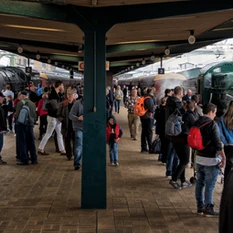
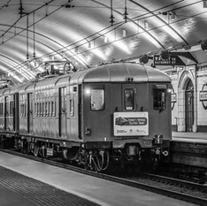
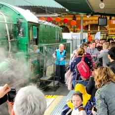
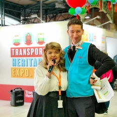
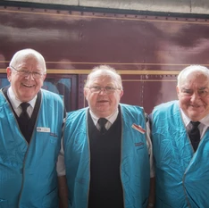
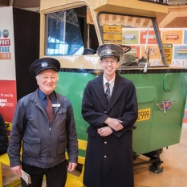

**Our biggest ever transport heritage expo took place over the Queen’s Birthday June long weekend at central Station.**

This year’s Expo kicked off on Saturday, 9 June with a short ceremony on the Grand Concourse with His Excellency General The Honourable David Hurley AC DSC (Ret’d), Governor of NSW who officially opened the event ahead of the Great Train Race that morning.

The NSW Governor His Excellency General The Honourable David Hurley AC DSC (Ret'd) launches the Transport Heritage Expo before a large crowd and accompanied by the NSW Railway Band on 9 June 2018. -David Bennett

After taking a turn at shovelling coal on the footplate of locomotive 3642, His Excellency the Governor boarded Beyer Garratt locomotive 6029’s train for the Great Train Race. The Garratt is Australia’s most powerful operating steam engine and this year it was up against 101-year-old steam locomotive 3526 ‘the Nanny’. The race would be the Nanny’s first passenger service since returning from its extensive 7-year restoration.

This year’s race was certainly one of our finest. Our Chair, Rob Mason, said in his opening remarks, “The fact we can do this through a major metropolitan city, within the confines of a modern rail network, is a sight rarely seen anywhere else in the world!”

For the first time, we broadcast the race live from on-board the footplate of the Garratt. The footage was so popular it was watched by over 16,000 people from all over the world, totalling more than 41,000 minutes of combined viewing.

Following the race, given the extra carriages on loan from the former Canberra Railway Museum, we were able to operate two separate high capacity steam train shuttles 7―8 times per day between Central and Hurstville.

The extra capacity was a welcome addition given the strong demand for short steam train ride experiences. This, combined with the vintage electric rides around the City Circle, railmotor tours of the Sydney freight lines, Devonshire tea sittings on the Southern Aurora, vintage bus rides around the CBD, great entertainment, and engaging heritage displays on the concourse, set the scene for a truly memorable event.

**Over 9,000 tickets sold!**

Our targeted digital campaign ensured 50 per cent of tickets (around 5,000 seats) were sold within four weeks of the event going on sale. Our exclusive media arrangement with the 7 Network provided further extensive coverage across 7 News bulletins and 7’s social media platforms. This additional free exposure led to a final ticket sales result of 9,019 ― up 26.4 per cent (1,884 tickets) on 2017 and almost double that of the 2014 Expo. This final result also represents the biggest single-ticketed event ever conducted by Transport Heritage NSW since its establishment in 2013. It certainly reinforces the community’s strong desire and appreciation for the State’s transport history and demonstrates the increasing demand for authentic heritage experiences.

**Special Thanks**

The Transport Heritage Expo would not be possible without the support of the NSW Government, including a small but dedicated group of staff at Sydney Trains and NSW TrainLink. The hundreds of volunteers from a variety of transport heritage groups, including the NSW Rail Museum, the Sydney Bus Museum, Lachlan Valley Railway, Historic Electric Traction and the Sydney Tramway Museum, deserve special thanks.

Finally, a huge thank you to the staff and volunteers at Transport Heritage NSW who spent many hours preparing locomotives, carriages and collection items to stage the event.

**Missed the Transport Heritage Expo?**

Check out the event wrap up video or catch up on the Great Train Race in full at the NSW Rail Museum YouTube channel at <https://tinyurl.com/yaodxn67>.

*Images courtesy of Steve Burrows and David Bennett.*

*This article was originally published in the winter 2018 edition of Roundhouse magazine. Written by David Bennett, Marketing & Commercial Services Manager.*
