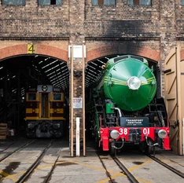

**Locomotive 3801 was officially relaunched at Sydney's Central Station on Friday 12 March 2021 by Her Excellency, the Honourable Margaret Beazley AC QC, Governor of New South Wales.**

Over 1,500 people were among the first to ride behind 3801 since 2007, as the legend of steam graced the Sydney Trains network with 1-hour steam train rides between Central and Hurstville.

A new era now begins. Why not join us on the journey?

For more info on upcoming 3801 events across NSW visit the [3801 page](http://www.thnsw.com.au/3801).

