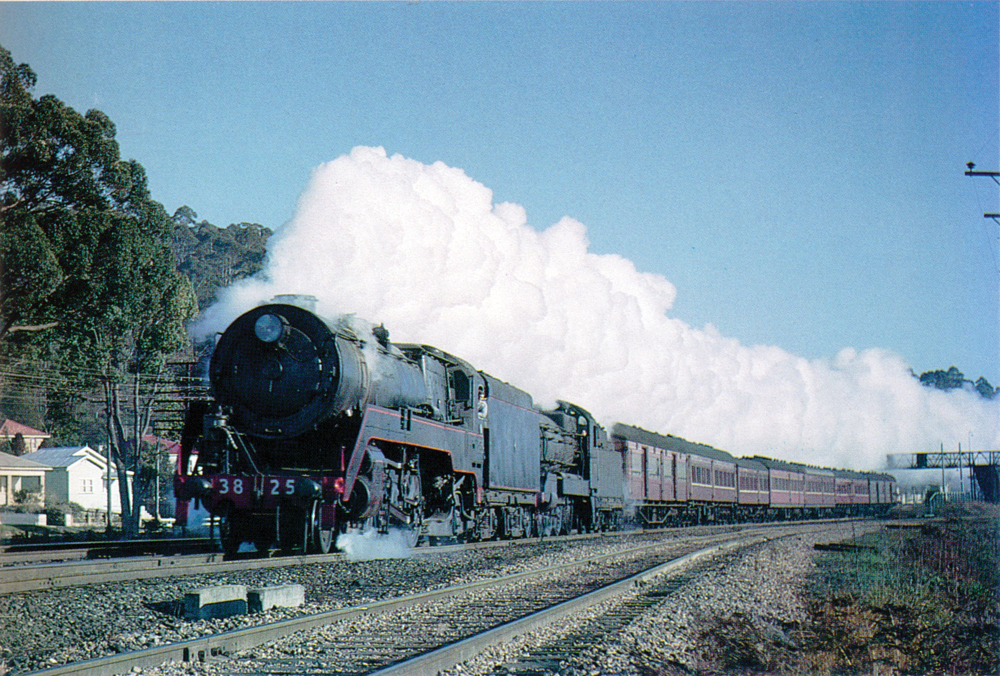
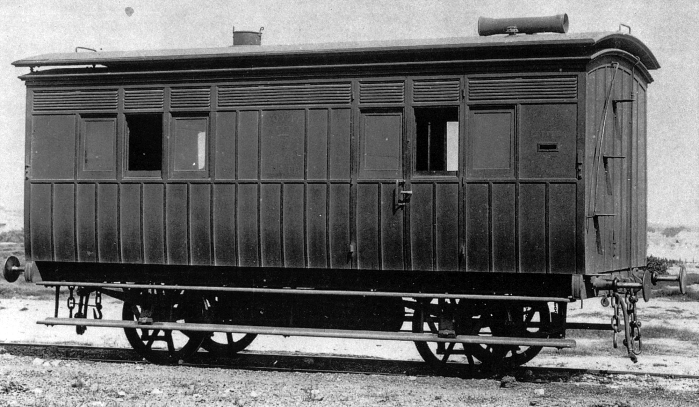
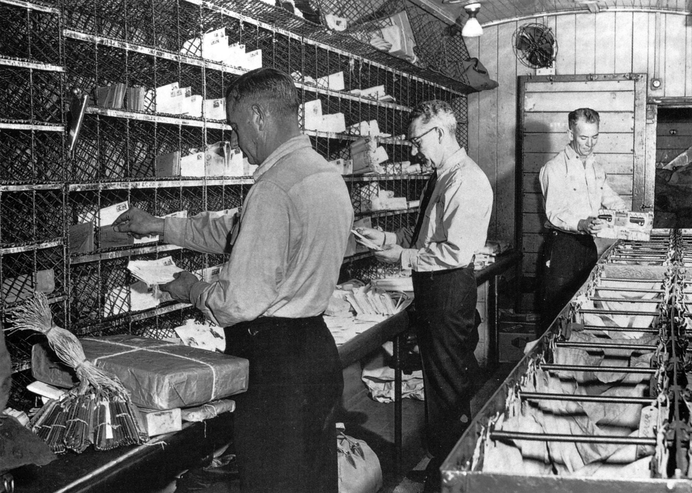

**It has been 30 years since the last mail train ran in New South Wales. The NSW Railways operated mail trains for over 130 years, serving many country towns and villages throughout the state.**

The idea of the mail train was thought to have been developed in England around 1855 when the Great Western Railway introduced services between Paddington and Bristol.

The first passenger carrying railway line in Sydney opened to Granville on 26 September 1855, and the first mail and parcels were carried to destinations along the line one week later. The line reached Parramatta on 4 July 1860, where mail was carried to Parramatta by train, then continued on its way by road.

The railway was operated under contract by William Randle and the postal authorities paid him for providing the service. The cost was higher than road cartage, but mail could be accepted later in Sydney and delivered earlier in Campbelltown and Penrith – up to 1.5 hours earlier.

On 14 August 1856, the NSW Government announced it would take over operation of the railways in the state, and the delivery of mail by rail was taken over by the Department of Railways.

The down Glen Innes Mail (No.13) normally divided at Tamworth, three or four cars forming the connection to Barraba, whilst the remaining four or five cars continued north toward Armindale and Glen Innes. In the up direction, the train amalgamated at Tamworth and returned to Sydney. On a frosty morning in August 1965, No.12 Glen Innes Mail - comprising MHO, ACS, CR (Barraba cars), FS, BS, TAM, MHO (Glen Innes cars) - roars through Ourimbah led by 3825 and 3508, the latter fitted with a turret tender. The 35 class was 'light-attached' from Broadmeadow to Gosford in order to work a return military special to Broadmeadow. -Ray Love

As the network of branch lines opened across NSW, passenger services were provided. The branch lines were serviced by feeder services mostly off mail trains. The railways delivered parcels, groceries, medical supplies and newspapers in addition to general mail. The mail trains provided commercial travellers with transport for the new wares they were bringing to country people.

While the railways timetabled their trains to match the travelling needs of the public, postal services had restraints, including the collection, sorting and bagging of mail. These tasks took time and needed to fit in with the letter writing public.

The idea of sorting mail while travelling was one of the benefits of rail and the expanding NSW railway system was one of the advantages of the travelling post office.

Postal Inspector de Milhau proposed in his annual report of 1868 that: “Many letters are thrown into the mail carriage or given to the mail guards at the railway station. It is an unsatisfactory way for the public to send their letters and for the mail guards to receive them. It gives more security to the public to have a letterbox fixed to the railway carriage. At the same time, a late fee should be charged on those letters, the said fee to be 2d extra.”

“It would be very convenient for the mail guards if the railway mail carriages were provided with the necessary number of pigeon holes to enable mail guards to sort letters for the different offices on the line.”

On 2 February 1870, Postal Inspector Moyse reported that mail guards were travelling in the brake van, which was highly undesirable. Moyse recommended that second class carriages for the postal service be fitted up as a mail vans and that ‘Royal Mail’ be painted on the exterior.

On 12 March 1870, approval was given for the conversion of one carriage with the cost to be met by the post office. By December that year, two vans had been converted and were in service on the Great Southern Railway.

Both vans were fitted with a letter box on each side, a stamping table, seats and hooks for mail bags. The words ‘Post Office Letter Box’ were written near the slot, while ‘Royal Mail Van’ was painted on each side with ‘VR’, Victoria Regina, between the words.

Two additional cars were converted in 1871. All of these cars were former second class, four-wheel stock. The Travelling Post Office (TPO) was up and running.

While the vans were used to move bags of letters, sorting in transit did not commence until early 1876. Problems with poor lighting prevented an earlier start to mail sorting on the trains.

The term Travelling Post Office appears to have come into use around 1877.

Mail van No.11 built by Hudson Bros in 1886. -NSW Railway Archives

By May 1887, there were 24 mail guards employed by the post office – four at Newcastle, seven at Orange, nine at Cootamundra, three at Tamworth and one at Murrurundi.

The first bogie mail vans appeared in 1891 when Hudson Brothers supplied eight KL type. Fitted with gas lighting, these 46’ vans included a ten-seat second class compartment at each end and a 32’6” mail sorting compartment in the centre. A ninth van, coded KS, was built by the railway’s own workshops.

In 1901, a KF coded 35’6” van with a capacity of 7 tons was introduced. This van could accommodate two sorters. In 1909, a single KM van was built with a capacity of 13.5 tons. This van accommodated four sorters.

In 1903, a pair of KB bulk mail vans with clerestory roofs were built at Eveleigh.

Ritchie Brothers built eleven 63’4” KP vans capable of holding 20 tons between 1912 and 1914. These vans had two storage areas, as well as the sorting area. The KP vans were owned by the Postmaster General’s Department, but were maintained by the railways. Any modifications required by the post office were costed and agreed to before proceeding.

Departure times were set by a number of factors. The mail had to be collected and roughly sorted into the districts served by the various trains. Another factor to be taken into account was the arrival time in major towns. Passengers had to be considered and there was no sense in arriving at a major town in the early hours of the morning.

Postal officers sorting mail in a KP van. -NSW Railway Archives

**Parcels**

Mail trains also carried parcels and small packages that brought supplies, gifts, food and other necessities to country dwellers. Each night, a fleet of post office vans delivered larger containers of parcels in addition to letters. Larger crates were delivered to the Darling Harbour Goods Yard and delivered to country locations by goods trains.

In August 1938, a regular staff of 200 handled around six million parcels per year. The number of staff grew to as many as 465 around Christmas. During other busy times, special parcel trains consisting of louvre and guards’ vans supplemented the normal mail trains.

The mail and parcels delivery service quickly outgrew the capacity of the passenger fleet guards’ vans, so goods vans were added to trains to cope with the loads. BLV and MLV vans were the preferred vehicle and many trains included one on a regular basis.

Parcel traffic remained a part of mail train operations and was promoted and advertised in the 1970s.

**End of an era**

The end of mail trains began on 5 December 1974 when the Chief Commissioner of the Public Transport Commission wrote to the Director, Posts and Telegraphs in NSW, confirming that the TPO services would be withdrawn from 19 September 1975. The KP vans were now 60 years old and the cost of maintenance was one of the reasons given for the withdrawal of the service. Other reasons cited were the intention to provide ‘direct links’ and ‘speedier services’, and to ‘improve railway facilities’.

Negotiations between the two departments began to no avail until the Public Transport Commission finally won and the move to road transport began. One by one TPOs were withdrawn. Some mail trains held on for a few years, but these were no more than overnight passenger trains with the capacity to carry parcels.

The parcels traffic was still a vital service for country people and the railways were happy to accommodate goods such as car and tractor parts and other farm necessities. Eventually, this business was discouraged and the last mail train departed from Tenterfield on 25 November 1988.

A noted rail author commented: “With the disappearance of the mail trains passed a whole era of rail travel and, for many, a way of life.”

***References***

*Coaching Stock of the NSW Railways, Volume 1, David Cooke, Don Estell, Keith Seckold, John Beckhaus, Dennis Toohey, Eveleigh Press, 1999.*

*Time of the Passenger Train, Ron Preston, Eveleigh Press, 2004.*

*This article was originally published in the spring 2018 edition of Roundhouse magazine. Written by John Casey, Roundhouse Editor.*
