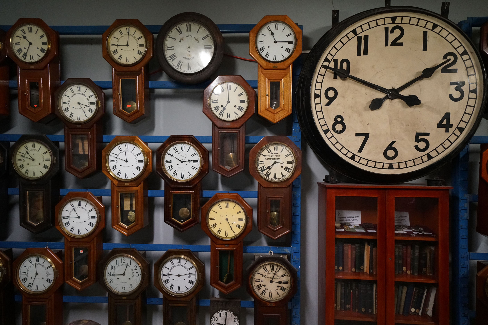
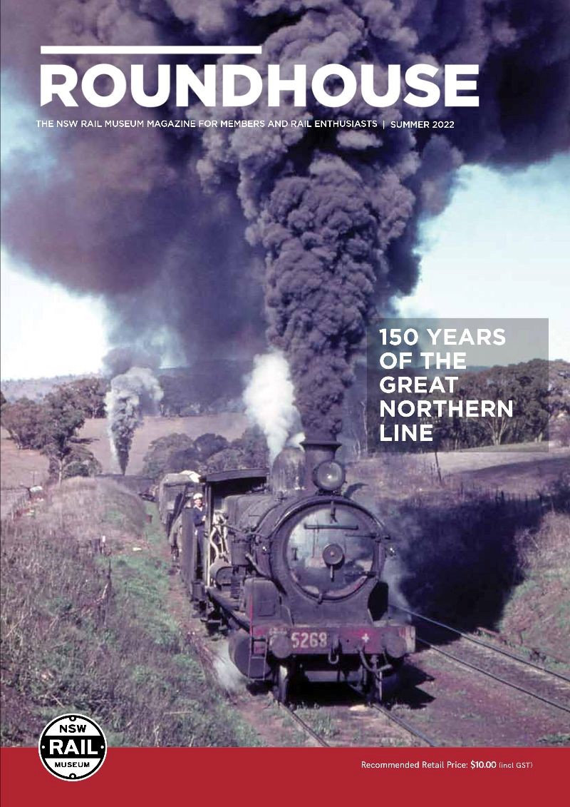

***Extract from feature article 'NSW Railway clock collection' by Gretta Logue of the Sydney Trains Heritage Unit, published in the Summer 2022 edition of Roundhouse Magazine***

**The NSW Railway clock collection was recently featured in the popular SBS TV series ‘Inside Central Station’. This segment and the production of the short documentary, ‘Running on time’ by Sydney Trains, has put railway timekeeping devices in the minds of transport heritage enthusiasts. Gretta Logue, Sydney Trains Heritage Specialist, takes us through the significance and some of the key items in the NSW Railways clock collection.**

**Early time keeping**

**Time keeping in the early NSW colony was based on navigational chronometers brought over from England, which were used to set up Sydney’s first public clocks such as that on the Hyde Park Barracks on Macquarie Street. Time keeping spread haphazardly as the colony grew. It was often the case that a town had more than one source of public time ― such as at the courthouse or church ― each showing a slight variation. Time variations were also found between towns due to slow communication methods that relied on rudimentary roads or water passage. Despite the best efforts of authorities, unreliable public clocks remained a constant irritation throughout the first half of the nineteenth century, with one example of a public clock in Parramatta varying up to a full half hour to that in Sydney! It’s hard to believe today but ‘standardised time’ was still a far-off concept.**

**Railway time**

It wasn’t until the establishment of the passenger railway in 1855 that ‘railway time’ was introduced to NSW. As the railways stretched from Sydney to connect the regions to ports and cities, accurate time was needed for train timetabling, safe working and for passenger arrival and departures. An accurate standard time had to be known at each station on the railway system.

From 1859, Sydney’s time was set by a time ball which dropped at noon every day from the Observatory Tower in Millers Point. The time ball was connected to imported English clocks at Sydney Terminus via a telegraph wire; and quickly became an indispensable part of the railway time-measurement system. Guards would set their pocket watches by the time at Sydney Terminus at the start of a journey. On arrival at each destination the guard would communicate Sydney time to the station master who would adjust the clocks at that station. Thereby Sydney time travelled down the line with the train and the notion of ‘railway time’ rippled across the NSW railway system.

The railways became a harsh teacher of punctuality to the travelling general public ― the railways wait for no man! Gradually, railway time was recognised by the broader population in cities and regional towns to be the ‘correct time’, to which other public clocks would be set.

**NSW Government Railway clocks**

As correct and accurate time became synonymous with the railways, the NSW Government looked for standard designs and suppliers to meet the increasing demand for consistent timekeeping across the growing network. Seth The clock room in the basement of Central Station.

Seth Thomas, an American company, won the tender to supply the NSWGR with mechanical station clocks, also known as ‘schoolhouse clocks’ due to their widespread use in American schools. They had octagonal wooden casings and a long drop for the pendulum.

From the 1880s…

**Read the full article in the Summer 2022 edition of** ***Roundhouse*** **magazine.**

Buy your copy online at the [NSW Rail Museum online shop](https://www.nswrailmuseum.com.au/product-page/roundhouse-magazine-summer-2022), or subscribe to Roundhouse by becoming a [Transport Heritage NSW member](https://www.thnsw.com.au/membership) today.
