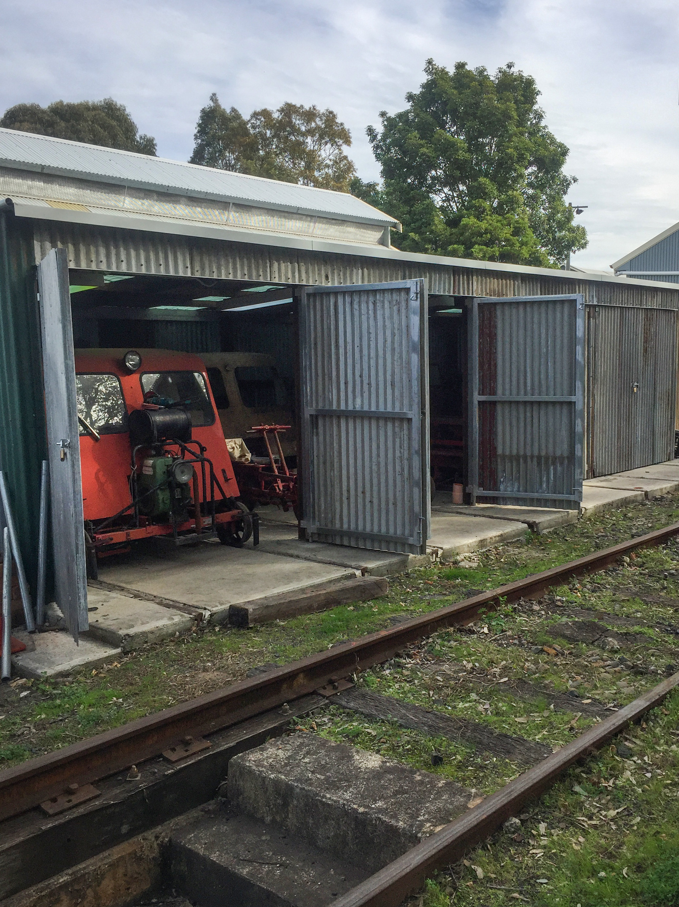

**In its early days, Valley Heights Locomotive Depot Heritage Museum had a mismatched group of sheds that served the purpose of a ‘mini depot’ for railway gangers or fettlers. Here they kept their per way tools, such as sledges, spanners and track plates, along with assorted fettlers’ vehicles. Over the years, the museum has collected a number of these items, as well as a large tool selection. Many of the latter are regularly used by our per way team for maintenance and upgrades of the museum’s tracks. A long-running, but nearly complete, current major project involves restoring the crossover points between the arrival and departure roads as in the steam era.**

Storing these assets has cluttered the roundhouse, requiring some sections of the building to be closed to the public. Many years ago, museum members started the process of building a suitable fettlers’ shed. Plans were eventually completed to original NSW Railways 1961 design, and approvals received from RailCorp (the landowner) and the Office of Environment & Heritage. A budget was approved by the museum’s executive committee and the project funded with the assistance of members’ donations.

In May 2019, the six-bay shed was finally completed, including the relocation of the track maintenance vehicles and tools. The shed houses ten vehicles and a bay to store our per way tools. You will notice the shed wraps around a disused overhead wiring stanchion, which had to remain as it is heritage listed like the rest of the site. We also decided to leave the shed’s corrugated iron sheeting unpainted to be more faithful to the era. The floor was concreted for safety and practical reasons and, when funds permit, a concrete ramp up to the tracks will allow easy and safe access for members utilising these vehicles. Lighting and power have been provided in all bays, as vehicles still require restoration and/or maintenance.

Our future plans include guided tours for the public to show them another side of railway life in the days where most per way works involved huge amounts of manual labour and very basic machinery.

*This article was originally published in the winter 2019 edition of Roundhouse magazine. Written by THNSW volunteer Bruce Coxon.*
