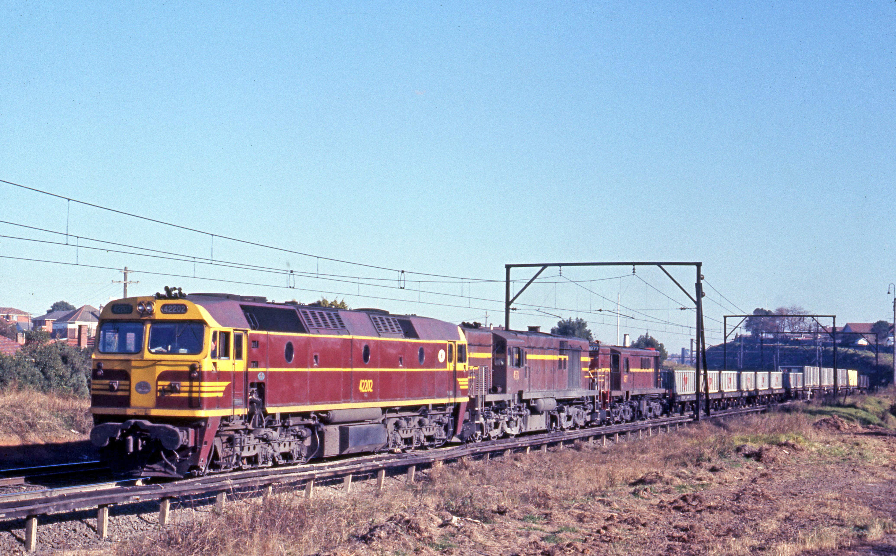
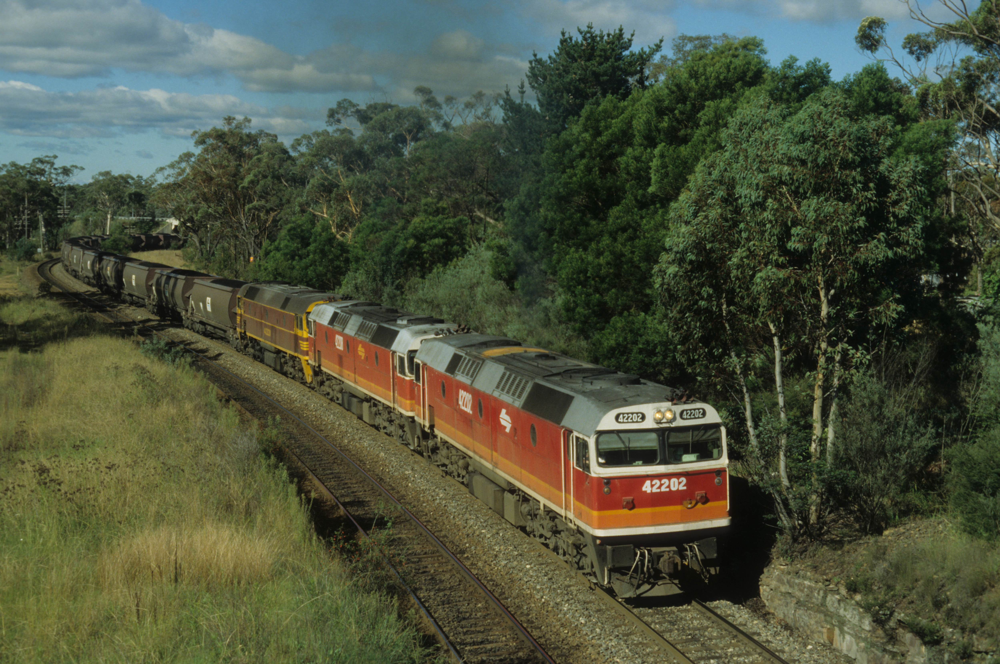

**The 422 class diesel-electric locomotives were one of the most respected locomotives on the NSW system when introduced in January 1969.**

The engines provided a trouble-free ride and soon became firm favourites with the crews who drove them.

Clyde Engineering Co in Sydney designed and built the locomotives, which were the most powerful on the system at the time. The 2,200 h.p. EMD 645E V.16 engine was the same as the Victorian Railways X class, which had proved very reliable in that state.

The body style was a new look for NSW locomotives, which for many years had been of the streamlined style driving ends. These engines had an Australian-designed full-width non-streamlined cab at each end. The basic nose design was adopted by the Commonwealth railways in the construction of their NJ class locomotives.

Following crew training, the engines entered service on the Main Southern line between Sydney and Albury and the Illawarra line from Sydney to Port Kembla and Moss Vale. All the locomotives were in service by January 1970 and were numbered 42201 to 42220.

On 4 July 1971, 42202, 4501 and 4877 haul an up freight from Enfield through Belmore North on the way to Port Botany. -John Ward

The 422 class spent most of their NSW careers hauling passenger and freight services. Among the passenger services they hauled were the *Canberra Express*, *Intercapital Daylight Express*, *South Coast Daylight Express*, *Southern Aurora* and *Spirit of Progress*.

In 1980, 42220 was rebuilt by Clyde Engineering, Rosewater, SA, receiving an AR16 alternator, a new electrical system and ‘Super Series’ wheel slip technology. It was a test bed for many of the features incorporated into the future 81 class.

From 1982, they began to operate through to Melbourne. This ceased in February 1990 when non-air-conditioned locomotives would no longer be accepted by Victorian drivers.

With the formation of National Rail, the 422s were all allocated to the new interstate carrier in July 1995 pending delivery of its NR class locomotives. This saw them once again frequently operating to Melbourne, albeit usually as second units and over new territory to Parkes via Forbes and, from August 1996, via the North Coast line to South Brisbane. When they were returned to the NSW Railways (now named FreightCorp) in September 1997, their southern duties were being handled by 81 class, so most were stored.

In 1999, 42202 and 42206 were sold to FreightCorp’s North Coast sub-contractor, Northern Rivers Railroad, passing on with the business to QR National in May 2002.

In the early 1980s, members of the 422 class commenced to be painted in the new 'Candy' livery. On 22 April 1990, GK33 loaded coal train from Glenlee to Port Kembla, via Moss Vale, passes the site of Yanderra behind 42202/42203/42220. The leading two locomotives are painted in the Candy livery but with variations. The leading locomotive has small numbers applied on the front of the cab while it also has white 'double-7' logos on the side of the body, whereas 42203 has the orange version. The trailing locomotive, 42220, was rebuilt by Clyde Engineering in South Australia several years earlier with many upgraded features to demonstrate to the State Rail Authority of NSW what was available in the market place at the time.

By January 2000, only 42203 and 42220 remained in service with FreightCorp, these having been fitted with air-conditioning. They were retained primarily to operate country passenger services from Sydney to Griffith and, from January 2000, on the *Outback Express* to Broken Hill. These were sold to Chicago Freight Car Leasing Australia (CFCLA) in 2001 and later rebuilt as HL203 and FL220.

In May 2000, the other 16 were sold to the Australian Southern Railroad and transferred in one movement from Werris Creek where they had been stored to Dry Creek, Adelaide, where they were gradually reactivated. Some were placed in service operating construction trains on the Alice Springs to Darwin line, as well as in South Australia and Western Australia. Others returned to NSW on hire to other operators. It was decided to rebuild all 16 as the 422 class, which among other modifications, saw air-conditioning fitted, although only 14 ended up being completed at Downer Rail, Port Augusta.

With the splitting up of private operator Australian Railroad Group, 11 passed to Aurizon in February 2006 and five to Genesee & Wyoming Australia in June 2006. In January 2015, four were sold to Apex Industrial and exported to Durban, South Africa, being scrapped in December 2015. Both CFCLA units were sold to Watco Australia in 2016 and transferred to Perth to operate Brookfield Rail infrastructure trains.

**References**

*Locomotives of Australia*, Leon Oberg, various editions.

“The 422 Class Locomotives of NSW”, *Railway Digest*, February 2000, page 42.

*This article was originally published in the autumn 2019 edition of Roundhouse magazine. Written by John Casey, Roundhouse Editor.*
