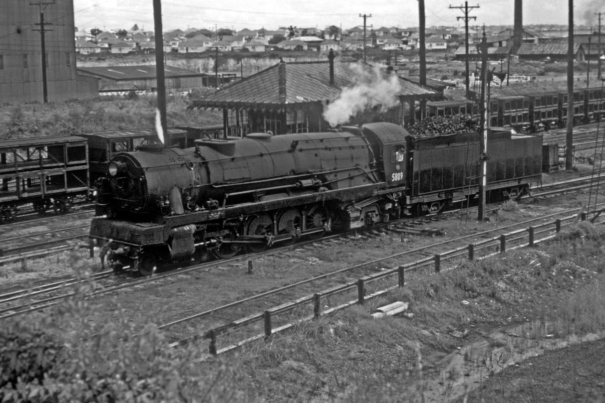
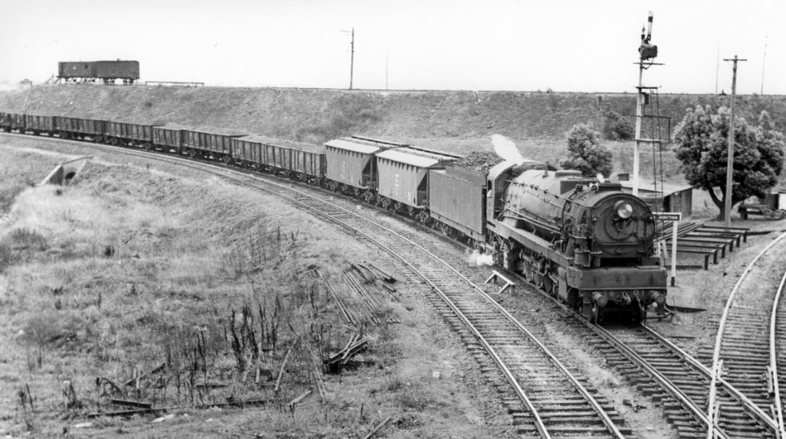

**Part 1 – Development**

**Steam locomotive design and manufacturing in Departmental Workshops ended after 82 years when 5812 entered service on 4 April 1952.**

It has been more than 60 years since the thirteen 58 class engines were withdrawn from service on the eve of the Sydney to Lithgow electrification in June 1957.

They were a modern, powerful goods locomotive, entering service in 1950. Unfortunately, their introduction was severely delayed by the war years and they only had an average service life of a little over six years.

After the introduction of steam to the NSW Railways in 1855, motive power was largely sourced from overseas suppliers during the first 50 years, with limited local input.

The situation started to change with the appointment of William Thow who, in collaboration with Beyer, Peacock of Manchester in the United Kingdom, introduced the 32 class passenger locomotives and 50 class goods locomotives in 1892 and 1896, respectively.

Further goods locomotives of the subsequent 53 and 55 classes were an on-going development of the basic 50 class design, until a total of 590 locomotives were in service, collectively known as the ‘Standard Goods’ engines.

Locomotive 5809 is reasonably clean in this photograph taken at Enfield South Box in the 1950s. It appears to be backing onto a train in the South Yard in preparation for possibly working an Illawarra line train. These locomotives worked trains only as far as Thirroul, the locomotive depot being equipped with a 90-foot turntable. This engine entered service on 30 March 1951 and had its only heavy overhaul in April 1956 when it was fitted with overhauled boiler 5805 in lieu of its own. The locomotive also travelled to Cardiff for a light repair in August 1952. It was withdrawn from service in May 1957. -Rod Knight

Thow’s successor, Edward Lucy, from the Great Western Railway in the UK, became the first Chief Mechanical Engineer to design and introduce a ‘NSW design’ of locomotive without significant input from overseas manufacturers. The result was the 35 class, represented by 3526 at Thirlmere. Subsequently, the 36 class passenger locomotive emerged and a radical change to goods locomotive design came with the 57 class of 1929, being reflective of known international best practice at the time.

Afterwards, the design office produced the famous 38 class and finally the 58 class, which was considered a ‘goods engine equivalent of the 38 class’. This period reflected the pinnacle of contemporary local design and knowledge, as all subsequent acquisitions of motive power were bought mostly ‘off the shelf’ from suppliers overseas, though with local input to ensure the product conformed to local conditions, such as loading gauge, track conditions and turning facilities.

This provides basic historical context of the significance of the 58 class, embodying nearly 100 years of operating knowledge and thinking in the NSW Railways.

Engine 5711 at Valley Heights is the only survivor of the 38 locomotives of the 57/58 class, demonstrating the engineering embodied in these large locomotives and reflecting the significant part played to the economy of NSW during the 1930s to 1950s.

**Development of NSW’s large goods locomotives**

Much has been written over the years of the apparent shortcomings of the last new steam locomotive designed and built by the NSW Railways.

However, in 2018 when one tries to analyse the performance, it emerges that a lot more could have been made from the significant investment by the people of NSW.

The minimal result appears to be a reflection of the decision making processes within the then New South Wales Government Railways (NSWGR), as well as the accountability process back to Government. There does not seem to be much analysis available of the options to re-deploy these powerful locomotives once electrification to Lithgow was completed in July 1957. Options surely should have included the replacement of a significant number of Standard Goods locomotives, as the average age of the 58 class was six years compared with 50 years for the ‘Standards’.

Goods engine development took a massive leap forward in 1926 when approval was granted to increase axle loading from 20 tons to 22.3 tons, which broke away from the restrictions that up until then had perpetuated the 2-8-0 wheel arrangement, culminating the acquisition of 590 Standard Goods locomotives.

This dramatic change had its origins in the outcome of the Fay-Raven Royal Commission of 1924, which at the time recommended three cylinder locomotives. Previously, Commissioner James Fraser in 1912 had recommended that the loading gauge be changed from the original 1906 standard of 9'8" to 10'6", which theoretically would allow engines up to 40 per cent more power. Unfortunately, this proposal was not pursued. The outcome of this work resulted in the 57 class, which went on to become the most significant class in NSW for goods train working, underpinning the state’s economic growth.

Three cylinders were chosen, as they gave a higher torque without making the engines wider or larger, and a more even power transmission occurred with reduced vibration. Such practices were being widely adopted in the UK at the time, with its tight loading gauge and need for more power.

A set of 58 class cylinders are shown on a horizontal borer being machined before placement in an engine. The cylinder casting was separate to the cast frame and was in two pieces with a flanged joint between the middle and right-hand cylinder. -NSW Railway Archives

The 57 class, benefited from being designed to ‘rational formula’, reflecting best known engineering practice. It was built with a cast steel locomotive bed, cast steel delta trailing truck supporting a large firebox, precision power reverse to aid in optimising performance, a mechanical stoker to ensure that the steaming rate could be maintained and the unique Gresley conjugated valve gear for operating the middle cylinder.

The design aim of the 57 class was to eliminate the costly practice of double heading with slower locomotives, resulting in poor asset and track utilisation. There can be no doubt that the 57 class achieved the designer’s brief. However, in the early 1930s, there were numerous teething issues that required resolution.

Amongst the most troubling was the locomotives’ propensity to slip on starting their train. The limitation of 70 per cent cut off was designed to minimise exceeding the factor of adhesion on starting. The ultimate cure came with reducing the ‘lead’ on the middle cylinder from 1/8" to 1/16" to prevent overpowering during different segments of the stroke. (Lead is often called pre-admission and refers to inlet steam entering the cylinder slightly before required to provide ‘cushioning’ to the piston during its oscillations.)

Other chronic problems were related to steaming, which required blast pipe modifications to present a stronger draught to draw the hot gases through the boiler without reducing cylinder efficiency.. This was a particular problem from 1946 onwards when the Joint Coal Board (JCB) was formed to oversee the operation of coal mines and the allocation of coal to a variety of users, including the other states, as NSW supplied 80 per cent of the market and electricity generation. Prior to the formation of the JCB, the railways set the standard in terms of coal quality. Now they were forced to accept coal from a variety of sources, including the higher ash content western coals.

During construction of the 57 class, Bill Slater, Steam Shed Inspector, led a team to the USA in July 1928 to find out what advances were taking place in locomotive design and operation, and confirm some of the newer design features. They also wanted to ensure that the NSWGR established appropriate operating practices to ensure success once the new locomotives entered service. Harold Young, CME, undertook overseas travel in February 1936 to investigate best practice and returned with a bold plan to build “passenger Garratts” similar to those he had observed and ridden on in Algeria.

However, this ambitious proposal was not supported by the Commissioner who thought the design was too radical. Instead, the design office worked on a more conventional locomotive incorporating the learnings of Slater and Young from the American study tours.

The result was a 4-8-4, with inclined outside cylinders to fit the loading gauge whilst providing a powerful engine. This design progressed as far as smokebox draughting arrangements and, by August 1938, details were transmitted to the Commonwealth Steel Castings Corporation to enable them to quote on the design of an integral cast steel frame.

During this time, Clyde Engineering lobbied the NSW Government for more work to improve its financial position and keep people employed. The Commissioner requested Young to organise for Clyde to build five more 36 class locomotives to help alleviate their position.

Young replied to this request by saying, “Give me another six months and I will give you a much better locomotive.”

It would appear that the then NSWGR were keen to show off their new goods locomotive as 5801 appeared in many photographs at the time. In this scene, 5801 is coming in from the west with a coal train at Flemington Goods Junction heading for Enfield yards. -Dennis O'Brien Collection

*This article was originally published in the winter 2018 edition of Roundhouse magazine. Written by member David Oram.*
