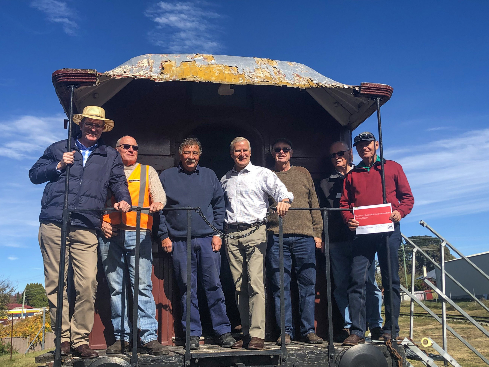

**After more than a year of negotiations, The Hon Michael McCormack MP, Deputy Prime Minister, and The Hon Andrew Gee MP, Member for Calare and OTHR Co-Patron, announced that, subject to the Liberal/National Party being re-elected, the Federal Liberal and National Government would invest $1.5 million to assist in restoring the first stage of the Oberon to Tarana branch line. This would allow a tourist train to shuttle between Oberon and Hazelgrove, attracting even more visitors to the Greater Blue Mountains.**

The Liberal/National Party duly won the Federal election and OTHR has been advised the funds will be available shortly.

Stage 1 involves the installation of 5.6 kilometres of new rail line; the purchase and placement of new sleepers, drainage and earthworks, among other infrastructure; and all labour costs.

“Volunteers at the Oberon Tarana Heritage Railway have big plans to enhance rail heritage in the region, but they needed the help of the Federal Government to make it happen,” said Mr Gee.

Along with operation of the train, there are also plans to upgrade and open Oberon Station as a vibrant Heritage and Railway Interpretive Centre. OTHR has received a further grant of $133,000 via the Oberon Council to refurbish the Oberon Station platform, with work due to commence shortly.

Oberon Tarana Heritage Railway is actively seeking shortfall funding to complete stage 1 to Hazelgrove.

The Hon Andrew Gee MP, Assistant Minister to the Deputy Prime Minister, Federal Member for Calare; Greg Bourne, President, Oberon Tarana Heritage Railway; Graham Williams, Track Manager, Oberon Tarana Heritage Railway; The Hon Michael McCormack MP, Deputy Prime Minister, Minister for Infrastructure, Transport and Regional Development; David McMurray, Publicity / Funding Officer, Oberon Tarana Heritage Railway; John Brotchie, Treasurer, Oberon Tarana Heritage Railway; Martyn Salmon, Vice President, Oberon Tarana Heritage Railway.

*This article was originally published in the winter 2019 edition of the sector report. Written by Dave McMurray, Publicity / Funding Officer, Oberon Tarana Heritage Railway.*
