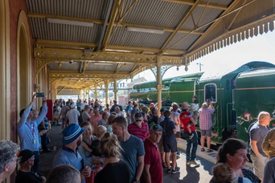
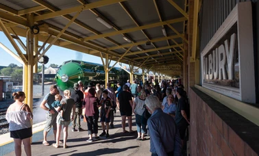
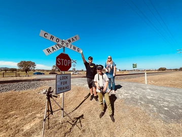
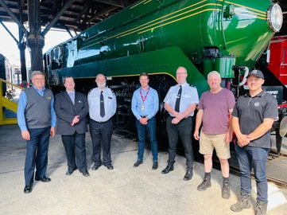
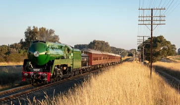
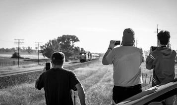
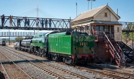
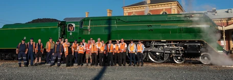

**Following locomotive 3801's official relaunch weekend in March, the engine travelled to Southern NSW to Albury, Wagga Wagga and Junee.**

Over the Easter Long Weekend, the town of Albury played host to 3801 with 12 shuttles to Gerogery South and return. The following Friday, 9 April, saw the highlight of the program with 3801 operating three journeys from Junee to Cootamundra and return via the Bethungra Spiral, followed by a program of 10 shuttles between Wagga Wagga and Uranquinty over the weekend of 10–11 April.

In-between events, 3801 was displayed at the Junee Roundhouse Railway Museum (6–8 April), where visitors had the opportunity to access the driver’s cab, as well as enjoy the many exhibits on display at the regional-based museum. In addition, the visit to Wagga Wagga brought many visitors to the Wagga Wagga Rail Heritage Association’s three areas in and around the station.

Despite restricted numbers due to ongoing COVID restrictions, over 6,000 people enjoyed a ride behind 3801 during the tour and the engine was greeted by thousands, both young and old, keen to catch a glimpse of 3801 wherever it travelled.

The tour is the first of three major regional tours of NSW to be undertaken in 2021, with more regional trips planned to western NSW in June and northern NSW in September.

Transport Heritage NSW would like to acknowledge NSW TrainLink, Junee Roundhouse Railway Museum, Junee Shire Council, Wagga City Council and Albury City Council for their support.

Images courtesy of Steve Burrows.
