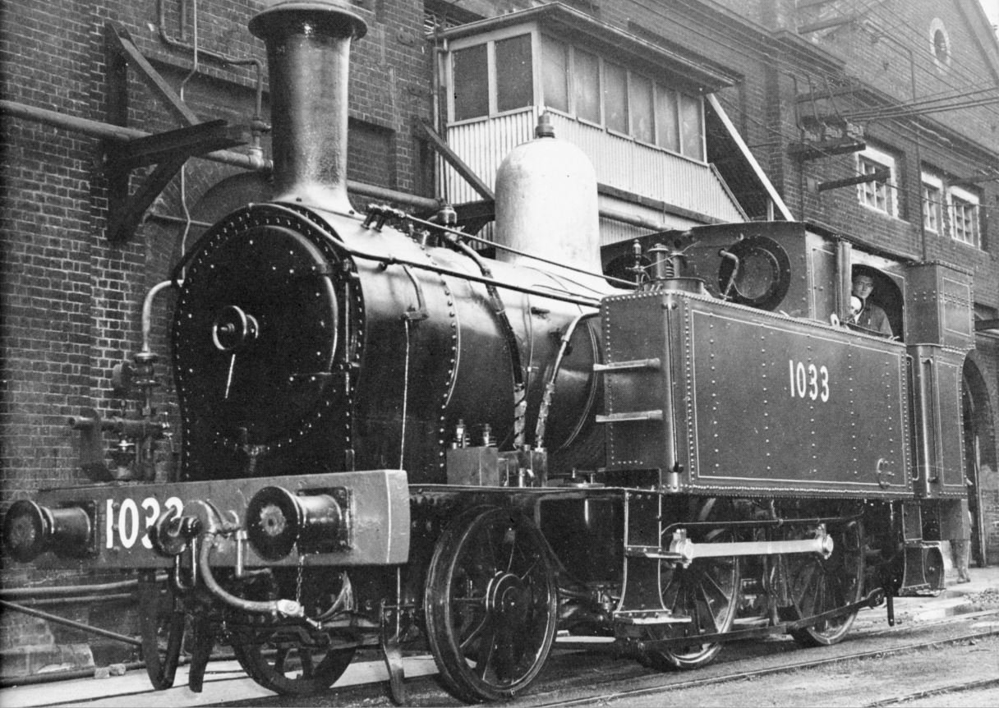
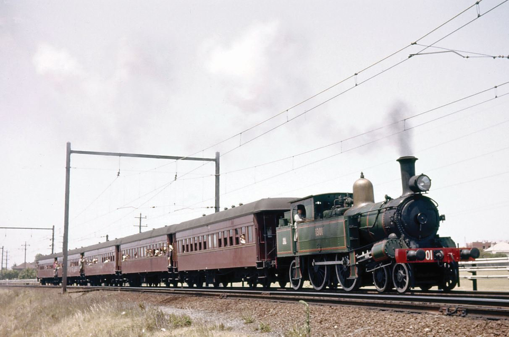
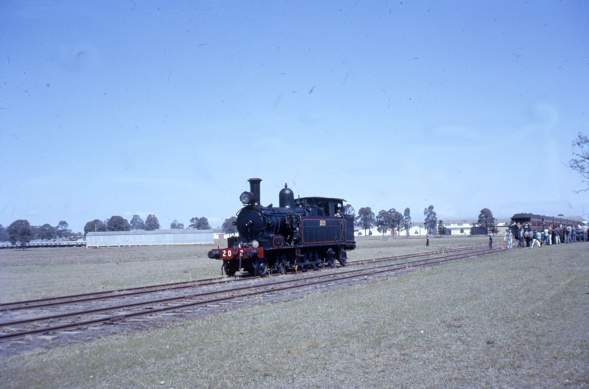
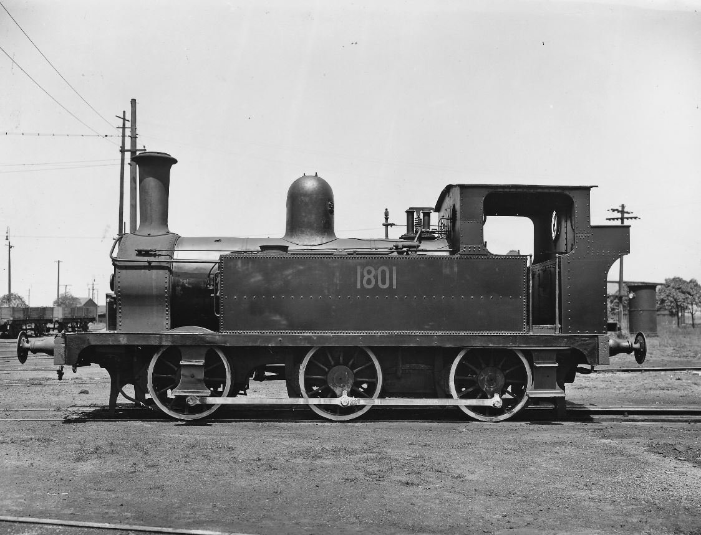
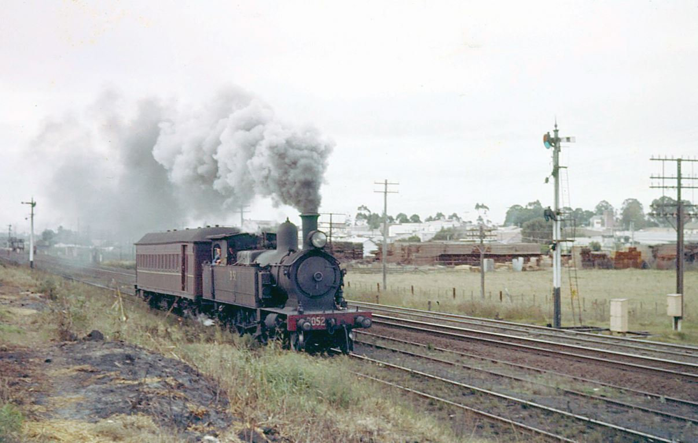

**The Sydney suburban area and surrounding rural branch lines were served by a series of suburban tank locomotives with varying success. In this article we look at the locomotives that have been preserved and can be seen at the NSW Rail Museum at Thirlmere.**

**F Class (Later 10 Class)**

Eighteen green-painted 2-4-0 side-tank engines were in service with the NSW Railways from 1885 to 1901. Twelve were built by Beyer, Peacock & Company in Manchester in the UK and another six by Henry Vale & Son at Auburn.

They were described as fast runners and bouncy and bucking in action. A heavy cast iron buffer beam was added to try and curb their tendency to derail.

On 15 February 1901, the 5.55pm train from Sydney to Hurstville hauled by F class engine 363 was derailed. The engine left the rails just south of Sydenham near the Bridge Street level crossing and collided with the level crossing gate and a signal post. The impact swung the engine around and it ran into its own train. The locomotive then travelled down Bridge Street before coming to a stand. Six passengers on the train were killed, as well as the fireman. Another 25 were injured.

The F class engines were immediately withdrawn from mainline traffic and sent to depots all over the state where they were used as shunters. Several were converted to coaling cranes with a small jib and lifting equipment installed. Others were adapted to boiler testing duties. Eight were sold to private companies as shunting locomotives. F class engine 355 was renumbered 1033 in the 1924 reclassification of locomotives, but also carried the number 355X while assigned to duplicate stock and later Lo21 while working with the Locomotive Branch. Engine 1033 spent its last days on duty at Eveleigh Workshops as a boiler tester in green livery with a polished brass dome. It saw occasional use on enthusiasts’ specials.

Locomotive 1033 is now a static exhibit at the NSW Rail Museum at Thirlmere.

Green 1033 poses for the camera at Eveleigh Workshops following an overhaul and repainting. -NSW Railway Archives

**CC Class (Later 13 Class)**

Beyer, Peacock & Company built 18 of the 4-4-0 C Class locomotives in 1877. Fourteen were allocated to the Southern and Western Railway radiating from Sydney, while the other four were sent to the isolated Great Northern Railway operating from Newcastle. The success of these locomotives led to further orders, which increased their numbers to 68. These C class locomotives were later designated as the 12 class.

In 1892, the NSW Railways introduced a new 4-6-0 locomotive (the P class, later 32 class) and the C class engines were replaced on main line duties. It was decided to convert 20 of the C class to 4-4-2 side-tank locomotives in order to overcome a shortage in suburban tank engines in Sydney and Newcastle. Engine number C79 underwent the conversion in December 1895 and proved successful. It became the last member of the CC class. In 1924, CC79 became 1301.

In later years the class became regular workers on the suburban branch lines such as Regents Park, Carlingford and Richmond. They also worked at Port Kembla, Yass, Morpeth and Ballina, and saw service on the Picton-Mittagong Loop Line.

Locomotive 1301 had the honour officially breaking the ribbon at the opening of the NSW Rail Transport Museum at Enfield on Sunday, 22 October 1972. It was also used for many years as one of the locomotives (along with 1709) on the Vintage Train.

Locomotive 1301 is currently painted green and is stored at the NSW Rail Museum at Thirlmere on static display.

Locomotive 1301 hauling a tour train stopped for a photo stop near Campsie on a tour to Campbelltown on 18 January 1964. Locomotive 1301 became an exhibit at the NSW Rail Museum at Thirlmere. -Graham Ahern

**E Class (Later 20 Class)**

Mr W. Thow imported twelve 2-6-4 side-tank locomotives in 1891 from Beyer, Peacock & Company and were allocated the letter E as their class. They were later reclassified as the A class. While the engines were painted black, the buffer beam was painted bright vermillion to give warning to track personnel.

The original intention was to use the locomotives on coal trains in Newcastle, but several were transferred to Sydney to work on secondary lines, including Carlingford, Camden, Richmond, Kurrajong and Rogans Hill. They were also put to use on the Bankstown suburban line and carriage shunting at Sydney Terminal.

Additional engines were converted from the A class 0-6-0 tender engines, bringing the total number of the E class to 33. They were grouped together as the 20 class in 1924.

Locomotive 2029 is the sole survivor of the class and is on display at the NSW Rail Museum.

NSW Rail Museum exhibit 2029 backs onto its train at Anzac Rifle Range on the Moorebank line on 11 September 1966 as tour passengers gather around to watch the recoupling. Locomotive 2029 was condemned in March 1968. -John Youngman

**R Class (Later 18 Class)**

To assist with the operation of the Sydney suburban passenger trains, six 0-6-0 side-tank locomotives were imported from the Vulcan Foundry Limited of Newton-le-Willows, Lancashire in the UK in 1883. They originally saw service on the Sydney to Parramatta line and also to Hurstville and later to Belmore. They always ran bunker first back to Sydney.

At the time of their introduction they were the most powerful of the suburban tank engines in service. The design is attributed to Thomas Midelton and was based on a design in use on the Great Northern Railway in England.

With the arrival of the first batch of the S class 4-6-4 side-tank engines, the six R class engines were relegated to secondary duties and by 1907 they had all been added to the duplicate stock roster.

With the fitting of new domed boilers and a standard design cast iron chimney, they found a new career shunting railway carriages at Sydney Terminal. Several were rebuilt as coaling crane engines, while others were used on railway construction work and shunting at Port Kembla. Two were sold to the Wallarah Colliery.

Locomotive 1803 was withdrawn in August 1962 after 78 years in service and set aside for preservation. In 2009, engine 1803 was selected to become ‘Thomas the Tank Engine’ and was painted blue and numbered 1. It can be seen at the NSW Rail Museum on special Day Out With Thomas events.

Class leader 1801 of the R class (later 18 class) poses at Enfield in February 1945. -NSW Railway Archives

**S Class (Later 30 Class)**

To assist with the operation of the Sydney suburban passenger services, thirty-five 4-6-4 tank locomotives were purchased from Beyer, Peacock & Company in 1903. An additional 60 locomotives were purchased from Beyer, Peacock and 50 were built by Eveleigh Workshops, making a total of 145.

These locomotives proved their worth on the steeply graded Northern and North Shore Lines to Hornsby. They also worked to Bombaderry on the South Coast Line on weekends. The S class could haul 10 or 11 car trains very efficiently. On the South Coast they ran local services from Scarborough to Port Kembla. They also worked the cross country service from Wollongong to Moss Vale. At Newcastle, the S class worked over the entire Newcastle suburban system.

They were painted black and lined in red. On the occasion of the Prince of Wales’ visit to Sydney, in 1920 engine 663 (later 3028) was painted Royal Blue to haul a special train with the Prince on board from Windsor to Sydney.

In 1924, the S class were reclassified as the 30 class. Some of the 30 class were later converted to tender engines and assigned the 30T classification.

Locomotives 3085 and 3137 are on static display at the NSW Rail Museum at Thirlmere.

Locomotive 3052 heads a typical Camden train near Campbelltown on 13 May 1962. -Graham Ahern

**References**

Locomotive Guide, published 1976 by NSW Rail Transport Museum.

Tender Into Tank, R. G. Preston, published 1984 by NSW Rail Transport Museum.

*This article was originally published in the winter 2018 edition of Roundhouse magazine. Written by John Casey, Roundhouse Editor.*
