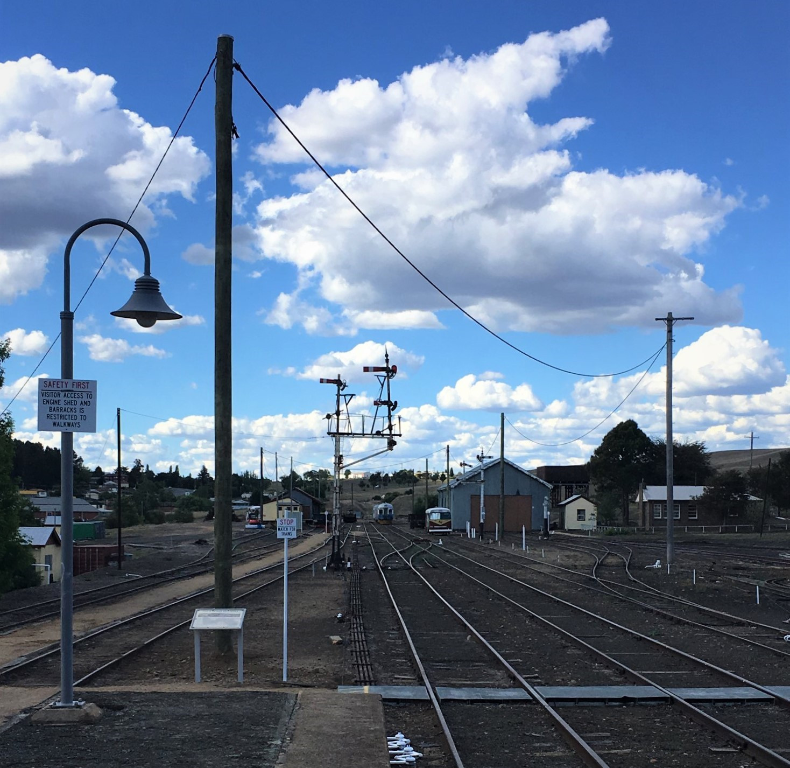

**There has been a great deal of activity in the Cooma yard precinct throughout the past year, care of our active members, volunteers and work for the dole participants.**

We have seen progress on the signal box, out of shed and engine shed store restoration projects, with painting of the interior and exterior, installation of new floor coverings and sourcing of objects for interpretive display.

Work has also progressed with the refurbishment of the District Locomotive Engineer’s building after the former Office of Rail Heritage began the project in 2013, but were unable to complete.

Having been successful in securing stream 2 funding from Transport Heritage NSW (THNSW) in 2016, work finally got underway in 2018. Progress so far has seen the first fix of electrical fittings, ceilings being insulated, gyprock installed, removal of old tiles from the wet areas, a new doorway installed and paths taken up. This has been a major undertaking from all involved. Once this project is completed, CMR will be able to relocate our administration office and headquarters into this building.

Recently, we have seen major work being completed to the internal electrical poles, wires and yard lighting following a condition assessment. In total, 9 out of 15 poles were required to be replaced, as they had been assessed to be beyond their condemning point. However, this has also provided us with the opportunity to replace the failing overhead wiring and upgrade to energy efficient yard lighting.

CMR also secured stream 3 funding from THNSW in October that will see the production of interpretive displays for our waiting room and parcel room. The central theme of our displays will be ‘Travel for Pleasure’.

Finally, two years of determined, dedicated planning and paperwork have paid off with the future of the Cooma Station precinct now confirmed and approved. CMR has been granted permission from the Office of Environment & Heritage (OEH) to undertake reconstruction work in the Cooma station master’s office, waiting room, booking office and parcels room. In addition, OEH have granted permission for CMR to install a security fence around the precinct.

As you can see, many advances have been achieved by our dedicated team at Cooma, with lots more to achieve in the near future. Thank you to all who have supported us. We look forward to even more great things happening over the next year and beyond.

*This article was originally published in the summer 2019 sector report.*
