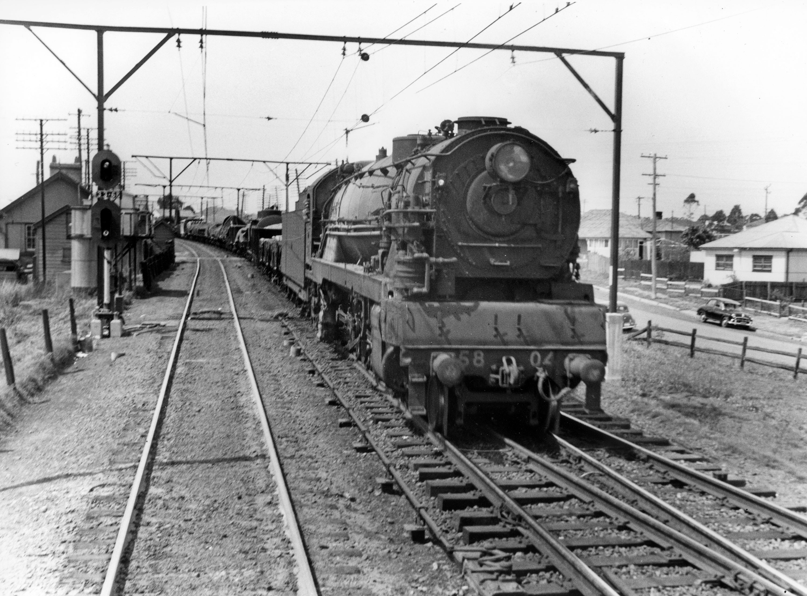
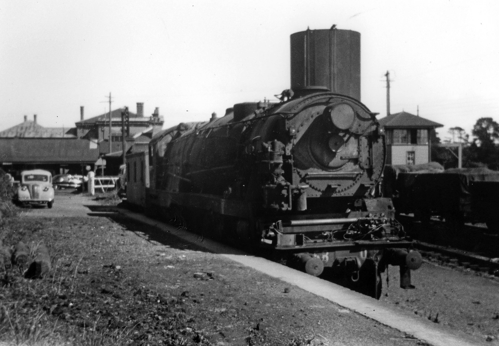
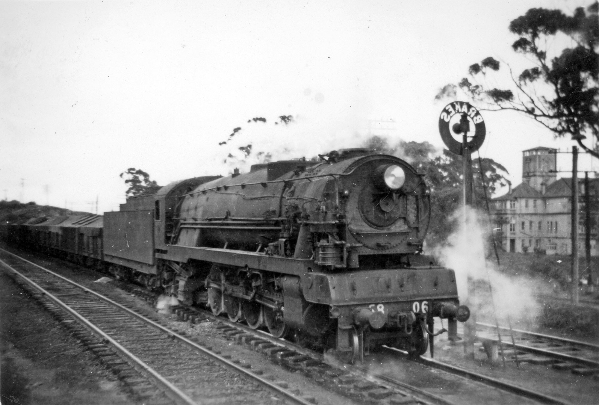
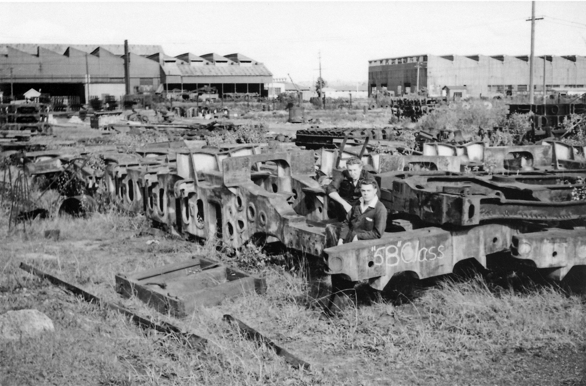

**Part 2: A Service Life**

**In the 2018 winter edition of *Roundhouse*, David Oram presented the early history of the 57 class. In this issue, part two covers the planning and details of the 58 class.**

Following the request by Clyde Engineering to receive more work from the NSW Government, the Commissioner of NSW Railways requested Harold Young, CME, to organise another five 36 class locomotives from Clyde. Young told the Commissioner that he could produce a much better locomotive.

The rest they say is history, with the resulting engine being the famous 38 class. Innovations incorporated into this design included large diameter piston valves, long travel valves with ‘trick’ ports (see note 2) and streamlined steam passages. These features, coupled with a free steaming boiler, underpinned the success of the class. Some features from the 57 class were also incorporated – namely a cast engine bed, this time including the cylinders and precision power reverse.

An order was placed with General Steel Castings Corporation of Illinois, USA, for five cast engine beds for the 38 class in 1938. For the next few years, the Mechanical Branch focused on the successful building and entry into service of the 38 class.

However, World War II had been declared in September 1939. By December 1941, U.S. had been drawn into the conflict after the attack on Pearl Harbour. As a result, the economies of allied countries were being severely stretched and Australia was no exception. The state railways were playing an increasingly significant role in moving troops and supplies supporting the war effort.

To help allies, particularly in the Pacific region, the U.S. proposed to finance construction of locomotives and rolling stock to support the railways with their wartime commitments. The intent was for equipment to be manufactured in the U.S. However, the conditions stipulated that only existing proven designs were permissible. Such was the demand on U.S. resources, however, that nothing could be made available until 1943. Accordingly, orders were placed to make twenty-five 38 class and twenty-five 58 class, which took the form of the engine beds. This order had been recommended by the Allied Supply Council and approved by the war cabinet, assuming equal priority with munitions.

Locomotive 5804 is shown between Penrith and Blacktown heading a goods train towards Enfield yards. The engine entered service on 25 September 1950, receiving a heavy overhaul in May 1955 when it was fitted with new boiler 5804a. It was withdrawn from service in June 1957. -Deniss O'Brien Collection

The basic design criteria for what became the 58 class was that the new locomotives had to conform to the 1906 loading gauge. This meant the cylinders were limited to 211/2" diameter, the same as 38 class compared to 231/4" of the 57 class, with boiler pressure limited to 200psi. Improvements such as roller bearings throughout could not be considered. However, the following features were adapted to compensate for the potential reduction in performance:

* Increased valve travel to make more efficient use of the steam
* Larger port openings to reduce pressure drop
* Larger steam chest pressure combined with larger steam passages to reduce pressure drop from boiler
* Larger piston valves (12" for 58 class (same as 38 class) compared to 10" for 57 class)
* ‘Trick’ ports, which provided a larger volume of steam per valve opening and were designed to improve power at high speeds by less back pressure

To compensate for the theoretical power reduction compared to the 57 class of 350hp, equivalence was achieved by increasing the limited cut off from 70 per cent to 83 per cent to allow a similar tractive effort on starting. New duplex coupling rods were installed to further improve performance. They were intended to reduce the propensity for slipping – a feature of engines where the average torque on the driving wheels was close to maximum. The 57 class engines required tyre turning at 20,000 miles. The duplex rods showed an improvement of this mileage to about 30,000. The duplex rods shared the piston thrust between the main and intermediate crank pins, thus reducing the torque applied to a single driving wheel and reducing the tendency to slip. A unique, NSWGR designed valve gear for the centre cylinder was provided, which replaced the Gresley conjugating gear and its inertia problems when the levers changed direction.

The immediate impact of increasing the cut-off was an increase in fuel usage of about 5 per cent, though the provision of ‘trick’ ports helped curtail this. Good steaming was crucial to any locomotive and, during the post-war period, coal quality deteriorated and the adoption of Rosebud grate technology from the U.S. allowed a freer flow of primary air to the coal bed, improving combustion. In addition, many experiments were undertaken with the blast pipe dimensions with the aim of increasing the surface area of the column of exhaust blast in the hope that it would carry more firebox gases.

Interestingly, the 57 class had different blast pipe characteristics to the 58 class, which like the 38 class required a correctly proportioned cross bar spreader to aid steaming. This was necessary due to the different cylinder diameters.

In this scene taken at Moss Vale in the early 1950s, 5807 appears to have failed and is in the railmotor dock without its tender undergoing repairs. The locomotive was built at Cardiff and entered service on 15 February 1951. It had a heavy overhaul in September 1955 when it received repaired boiler 5804. It was withdrawn in April 1957. -Dennis O'Brien Collection

Post-war recovery was underway at the time the 58 class was introduced, causing high demand for resources such as manpower, fuel and construction materials. The result was that the 58 class were expected to perform immediately, leaving little time for effective troubleshooting of teething issues. The engines were immediately pooled with the 57 class for arduous Blue Mountains working to Lithgow and return.

The 57 class design was more suited to this working environment, as it involved low speed, high horsepower work. The 58 class was designed for optimum haulage capacity in the 30 to 40 mph range. The larger diameter cylinders on the 57 class made them more tolerant of boiler pressure reduction, whereas the 58 class, like the 38 class, started to suffer a significant performance drop off with a 10 psi reduction. To recover the pressure, crew members needed to wind out the reverser, increasing the ‘bark’/draught. However, this required a higher coal and water feed rate.

As the 38 class were consistently supplied with high quality coal, they quickly recovered. Unfortunately, the 58 class used goods engine coal from the Western open cut fields, which contained a higher ash content. As a result, the 58 class were operating outside their design window, which contributed to their reported ‘mediocre’ performance at times, especially on Blue Mountains working. Had they been consistently driven like a 38 class (i.e. full regulator and judicious use of the ‘screw’) rather than like a 57 class, the story may have been different. The other problem was the newly designed valve gear for the centre cylinder. Based on rack and pinion principles, it was reported as less robust than the Gresley gear on the 57 class, and valve events may have changed on some journeys. With time and engineering input, it is highly likely that this could have been improved.

Alongside the Katoomba 'Brakes' landmark, 5806 is preparing for the descent of the mountains. The locomotive entered service on 11 December 1950 and was given a heavy overhaul in March 1956, receiving repaired boiler 5802. It was withdrawn from service in June 1957. -Dennis O'Brien Collection

As electrification and dieselisation were underway in the 1950s, the 58 class succumbed to early withdrawal for no reason other than that the NSWGR considered them ‘high maintenance and costly’. This conclusion is at odds with the available locomotive operating cost data at the time, which showed them to be slightly better than the 57 class and significantly better than the older goods engine classes.

Not surprisingly, the most economical were the 38 class.

**How could the 58 class have been better utilised?**

Standardising the driving techniques, coupled with high quality coal, their use on the Blue Mountains working would have been less problematic. They also could have been better utilised on the South, freeing up 57 class for Blue Mountains working.

Being pooled with the 57 class certainly curtailed their usefulness and points to a lack of appreciation on how to properly operate the locomotives against their design criteria. Some of the money saved on eliminating double heading could have been used to finance higher quality coal. That the locomotives were withdrawn so quickly after the Lithgow electrification, never to be used again with no valid explanation provided to the NSW Government, reflects poorly on the senior management of the NSWGR at the time. Perhaps a viable alternative would have been the ‘West’. Based at Lithgow, working the Lithgow–Orange section goods trains would have been well within their capabilities and would have eliminated double heading of older locomotives.

Likewise, on the ‘South’, there has been speculation that the NSWGR wanted to present a ‘modern image’ of fast goods train haulage by diesel locomotives and the 57/58 class were anachronistic to this. One could accept this if it were not for the fact that Standard Goods locomotives replaced the 57s and 58s. Hardly a progressive step.

In summary, it appears that the NSW taxpayer did not receive value from the 58 class as designed. All the reported difficulties, mechanically, were being successfully overcome during their short working life and the pool of enginemen getting used to the different driving style was increasing. The provision of proper coal for this design would have secured their performance as great assets.

Only thirteen of the planned twenty-five 58 class were built and entered service: 5801 - 5813. However, a number of components for the remaining 12 engines had been constructed, including a few cast engine main frames. In June 1961, three new 58 class frames languish in the long grass at Chullora Locomotive Workshops with railway apprentices Mick Ewer and Bob Sim watching over them. -Ray Love

In November 1954, it was reported that the 58 class was hauling average train loads of 650 tons, compared with 615 tons for a 57 and 554 tons for a Garratt when a number of factors were considered.

Properly analysing and proposing alternative uses post Lithgow electrification, if nothing else, would have provided the ‘owners’ of these locomotives with more information other than they were ‘too costly’.

I hope this article provides readers with more context as to the perceived ‘performance’ issues of the class and to the unfortunate decisions taken by the NSWGR that failed to properly utilise these modern assets.

*Note 1: The Fay–Raven Royal Commission was initiated by NSW Parliament in 1923 to look into all aspects of railway and tramway operation administration generally. It reported back to Parliament in October 1924 and amongst the recommendations were the building the City underground railway and electrifying the suburban network.*

*The Commissioners came from the UK and Sir Sam Fay had been the General Manager of the Great Central Railway (GCR), whilst Sir Vincent Raven had previously been CME of the North Eastern Railway (NER). However, upon the amalgamation of the NER with the NBR (North British Railway) to form the LNER (London and North Eastern Railway), he resigned in 1922. Subsequently, Sir Nigel Gresley was appointed CME, whilst Raven became a technical advisor to the LNER. In 1923, Raven travelled to Australia, NZ and India and sat on the Royal Commission during this period. When he was with the NER, he introduced three cylinder power and was a keen advocate of the same for the NSWGR.*

*Note 2: Trick ports were invented by Joseph Trick. The concept was a double inlet ported piston valve designed to more efficiently admit steam to the cylinder for expansive working, and was most effective as speed rose. It was first trialled on locomotive 3641 and subsequently applied successfully to the 38 class and then the 58 class.*

***Acknowledgements***

*57 and 58 Class – 3 Cylinder Power of the NSWGR, Craig Mackey, NSW Rail Transport Museum, 1998.*

*The Big Engines, Ken Groves, NSW Rail Transport Museum, 1990.*

*ARHS Bulletin, Various Issues.*

*This article was originally published in the spring 2018 edition of Roundhouse magazine. Written by member David Oram.*
