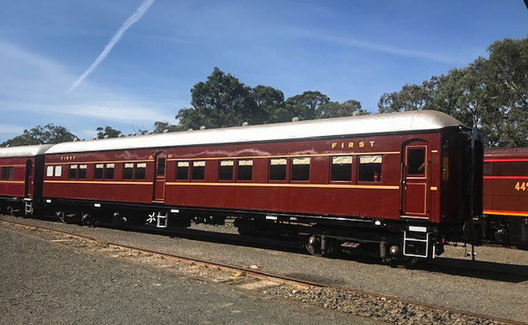
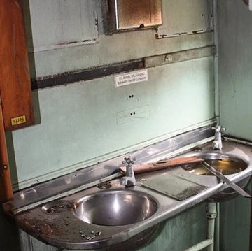
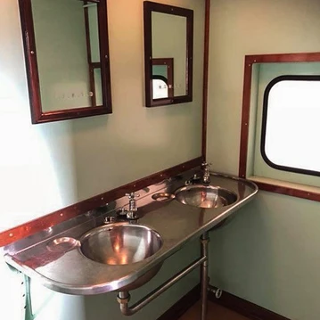
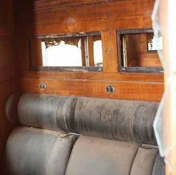
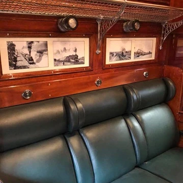
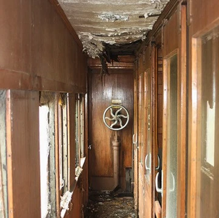
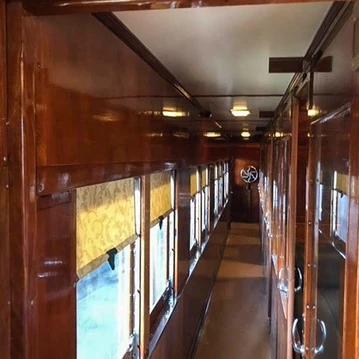
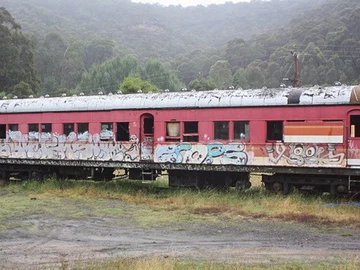
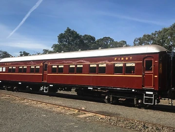

###

### Adam Sayer and Peter Young dedicated seven years to meticulously restoring BS 2076, now coded EBS 2076, preserving a piece of rail history for future generations.

###

**The exterior of the newly restored EBS 2076 carriage, originally built in 1935**

BS 2076 was built in 1935 by Clyde Engineering. The carriage originally entered service in 1936 and was withdrawn from regular service in 1989.

Northwest Coach Builders, owned and operated by Adam Sayer, purchased two carriages – BS 2076 and BS 2033, in April 2011 from a private sale at Lithgow.

“Part of the decision to purchase both carriages was that we would have enough parts to restore one operating carriage and still have some spares to support operations into the future,” explained Sayer.

After some thoughtful consideration, it was decided to restore BS 2076 and scrap the body of BS 2033.

BS 2076 was transferred by rail from Lithgow to Goulburn towards the end of 2011. After a long period of assessments and planning, restoration work began in mid-2012.

> “We took on this project because we had completed the restoration of our previous carriage, MCA2, in 2009 and had been looking for another suitable project,” said Sayer. “I have a passion for BS-type carriages, so we knew this car would complement the other operational carriages we own, which are MCA2 and GMS1.”

Most of the restoration work was completed at Goulburn Roundhouse. However, in November 2018, the car was transferred to Thirlmere by rail, where the final stages of the interior, along with the wheel and bogie work, were completed.

“The entire interior, as well as all the removable parts, were removed from the carriage and taken home to our garages for restoration or replacement,” shared Sayer.

Sayer and long-time friend Peter Young primarily completed restoration work on the carriage. However, they received a helping hand from several others. Greg Sayer assisted with some of the exterior painting; Ian Gregory assisted with constructing and wiring the complex electrical switch panel for the car; Ben Elliot, Jeff Snedden and the workshop staff at Transport Heritage NSW (THNSW) assisted with the final push to complete the project; and multiple photographers generously supplied photos from their collections to display in the compartments.

### **Restoration works**

The carriage was completely stripped of all existing timbers, which were either replaced or repaired depending on the condition. BS 2076 received a new roofing membrane and hard-wearing flooring to match the original design.

There is completely new electrical wiring throughout, and all the original fittings were used, including reading lamps, light fittings, luggage racks, fans and mirrors. To help capture the original atmosphere, black and white railway photographs were printed and displayed in each seating compartment.

A new toilet system was installed, which includes a large holding tank underneath the car for waste storage. Finally, the team produced new roller curtains using the original mechanisms and re-upholstered the original seating with new vinyl to mimic the car when it was in service.

After seven years of meticulous work, the restoration of BS 2076 was completed in March 2019 and successful trials occurred in April 2019. Today, newly coded EBS 2076 is a passenger favourite used on main line trips operated by THNSW. It has officially joined Northwest Coach Builder’s other two carriages on the rails and will serve THNSW well into the future.

###

### **The restoration experience**

When asked about the restoration experience, Sayer explained the project was both challenging and rewarding.

“It was demanding and sometimes draining on the soul, but the most challenging aspect of the re-build was finding the time to work on the project,” shared Sayer. “Peter and I both have full-time careers and family responsibilities, so it was tough at times.”

However, there were many rewarding aspects of the project.

> “It was great to finish at the end of each day and look back at the results we achieved,” described Sayer. “We also applied new technologies to the process to ensure the carriage will perform efficiently in the future and we’re proud of bringing a piece of history back to the rails that passengers appreciate.”

We asked Sayer if he had any advice to share with others thinking about starting a restoration project. Here’s what he had to say:

“Have a good look at the *whole* process and have a solid plan for how to achieve such a large restoration from start to finish. Time is a key factor in the process, so make sure you can find time to get the work done. Also, have an extremely understanding family and solid support group! Surround yourself with good people who can add value and assist with the restoration.”

###

### **Before and after restoration photographs**

The washroom

The passenger compartments were in a severe state of disrepair before the team started work on them. On the right is a completed compartment with new upholstery and photographs on the bulkhead.

The corridor of BS 2076 has been completely refurbished with new ceiling, floor and window blinds.

The work done by the team can be seen clearly in these two.

*This article was originally published in the spring 2019 edition of Roundhouse magazine. Written by Tatiana Lazowski, Marketing and Communications Officer.*
