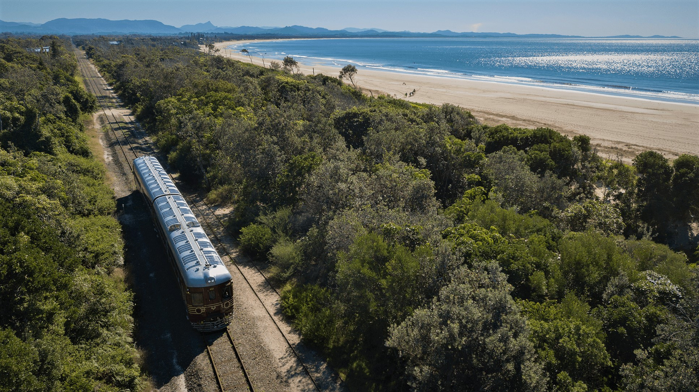
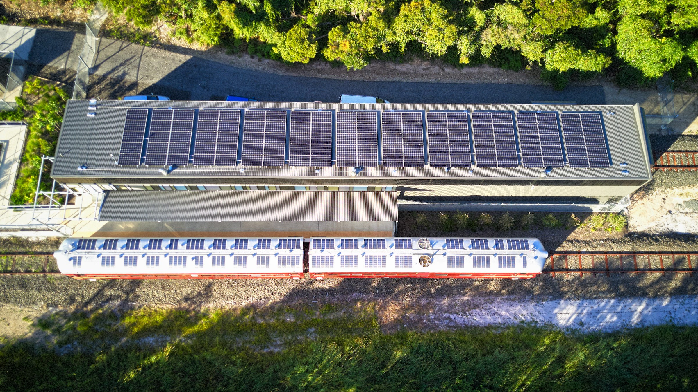

**Since launching on 16 December 2017, the Byron Solar Train has collected numerous awards for its world first innovation, including the Engineering Excellence Award received at Engineering Australia’s National Awards in Sydney last year.**

“This was the icing on the cake,” said Development Director Jeremy Holmes. “The goal was to be net carbon positive and to get there we needed serious engineering acumen.”

Byron Bay Railroad Company also took the Rail Sustainability Award at the Australasian Rail Association Awards and two Good Design awards, including a Good Design Gold Award.

“We were honoured to be approached and invited to enter all of these awards,” said Jeremy Holmes.

This is net carbon positive travel, Byron style. The service generates enough power over and above what is needed to run the operation to power 17.5 three-bedroom homes for a year – all thanks to a 4.6 billion year-old power source.

The Byron Solar Train glides along the track with stunning ocean views.

The 1949 era two-carriage railmotor was restored and converted to solar power at the Lithgow Railway Workshop under the guidance of Tim Elderton. So far, the service has carried in excess of 110,000 passengers, with two thirds of these being visitors to Byron Bay.

“Our survey data tells us that 40% of passengers are riding for ‘an experience’", outlined Holmes. “Of course, we get a lot of interest because of the solar conversion. But a lot of passengers ride because of the heritage train. We don’t have any other trains operating here in the Northern Rivers, so we see a lot of children who I think would be happy riding any train!”

The Byron Solar Train operates a return service every day of the year, excluding Christmas Day, between the burgeoning North Beach Precinct and the Byron Bay Town Centre. Passengers journey along the scenic 3km coastal track past littoral rainforest, endangered coastal wetlands and over the Belongil Creek, part of Cape Byron Marine Park, at a cost of $4 per adult for a one-way journey.

Although the Byron Solar Train is still the only solar powered train globally, the application of solar power in the rail industry is growing.

Byron Solar Train at the North Beach Station.

For more information, visit [www.byronbaytrain.com.au](http://www.byronbaytrain.com.au/).

*This article was originally published in the autumn 2019 edition of the sector report.*
