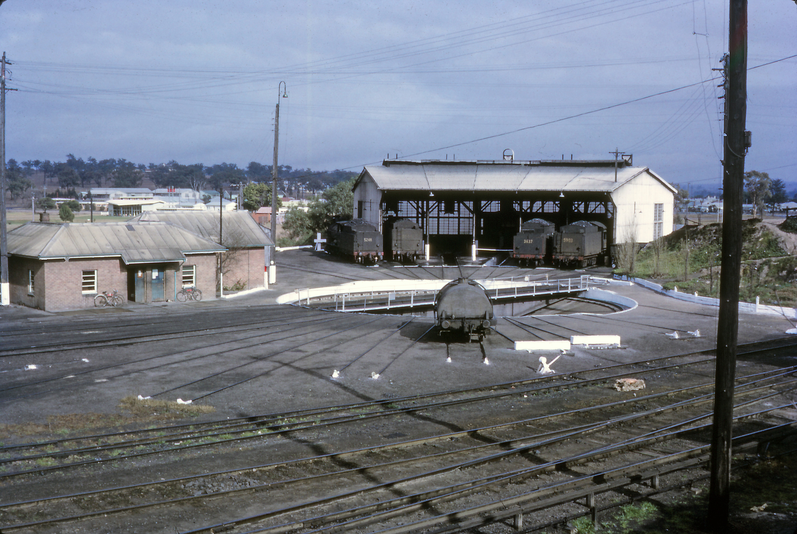
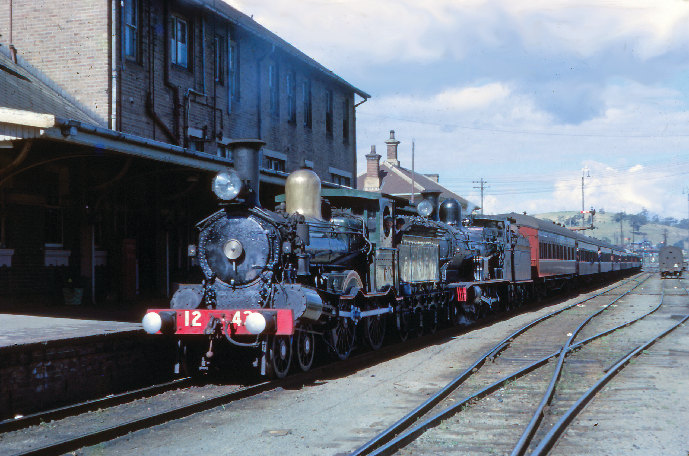

**The single railway line from Singleton to 'Musclebrook' (the original name) was completed and opened on 19 May 1869 by the Earl of Belmore, Governor of NSW. The contract for construction for the Singleton-Musclebrook section was awarded to George Blunt on 2 September 1864. The station was renamed ‘Muswellbrook’ on 1 September 1890.**

The line (formerly known as the Great Northern Railway or GNR) begins as a branch line off the Main Suburban line at Strathfield and runs north through the Central Coast, Hunter and New England regions. The GNR was the original main line between Sydney and Brisbane; however, this required a change of trains at Wallan-garra due to the narrower gauge of the Queensland railway system. The GNR was later referred to as the Main North line. The original Main North line is now closed north of Armidale and the main Brisbane-Sydney route is the current North Coast line. At Maitland, the North Coast railway line branches from the Main North line.

On 7 May 1863, the 23km section of line from Branxton reached Singleton and was opened for traffic. Singleton, originally known as Darlington, was then connected by rail with Maitland, 48km to the south.

During the next six years, railway construction pushed north towards Muswellbrook. Construction continued north over the following nine years and reached West Tamworth in 1878. This construction resulted in the coastal port of Newcastle being linked to the New England region by a 293km long single line, which included many severe grades.

Over the years, lengthy sections of the original single line linking the Hunter region to the New England were duplicated. At the present day, the double track ends at Muswellbrook and the single line continues to Armidale.

The 1869 Muswellbrook station building is one of several early stations attributed to John Whitton during his long career with the NSW Railways. The building borrows heavily from his design experience in England and the influence of Georgian and Victorian architectural styles. Internally, it comprised a stationmaster's office, ticket office, waiting room, ladies’ room and lavatories.

The station platform was lengthened in 1890 and a gatehouse built at the level crossing in 1892. In 1898 and 1911, the platform was extended again and a stationmaster's residence was approved at a cost of ₤545 in 1909.

Muswellbrook railway precinct was expanded in the early 20th century with the addition of large two storey brick railway refreshment rooms immediately adjacent to the station building.

The refreshment rooms were opened in 1922. A report in the *Singleton Argus* on 19 October 1922 said: “The new refreshment rooms at the Muswellbrook railway station were opened on Monday on the arrival of the passenger train from Tamworth. Miss Lawson, who acted as manageress at Glen Innes for seven years and five years in a similar capacity at Singleton, is in charge of the rooms. The staff consists of ten hands, four of whom were local appointments. Most of the food required will be brought from Sydney. The ground floor comprises: dining saloon (30 feet wide and 50 feet long), and a bar, 30 feet by 14 feet. At the northern end of the building on the ground floor are the cooking quarters consisting of kitchen, scullery, pantry, storeroom and washhouse. On the top floor are eight rooms, bathroom and linen press for use of the staff.”

In 1927, the refreshment rooms were extended to include five bedrooms for the public.

A subway underpass was constructed in 1928 at the north end of the platform as a replacement for the level crossing at the Sydney end of the station. An overbridge was also built on Bridge Street, replacing the level crossing.

In 1891, a small area for servicing locomotives was established on a site near Muswellbrook Station. During the next 52 years, improvements were carried out to suit the servicing of locomotives working in the local area, as well as those working through trains on the main line.

The meagre locomotive servicing facilities later proved to be inadequate and, in 1943, it was announced the new facilities would be built 1km south of the station near the Newcastle end of the goods yard. In the mid-1940s, a five-stall sector roundhouse, 75-foot turntable, coal stages, ash pits, crew amenities and offices were built on a site south of the present day road overbridge.

In 1946, a five-stall sector roundhouse and depot was built near the south end of the goods yard, replacing the minimal facilities opposite the railway station. In July 1966, four locomotives, including 3637 which is undergoing repairs, occupy the shed roads. -Ray Love

Coal mining in the Muswellbrook area has ensured a heavy involvement in railway operations, with several mines being served by coal trains.

Increased coal traffic saw provision of two sidings to accommodate Beyer-Garratt locomotives in September 1951. In March 1953, a triangle was installed at Muswellbrook on the western side of the line at the Newcastle end of the depot area. This permitted turning of the 60 class Garratts, which were becoming more frequent on coal trains. The triangle was removed in December 1975 and the land reverted to use by the local golf club.

On the main line, steam locomotives were displaced by diesel-electrics in the late 1960s. The depot then became ‘home’ for diesels used on local coal traffic, the yard shunters and those used on the Merriwa line.

Muswellbrook locomotive depot was officially an out-depot of Broadmeadow, which meant most of the locomotives in use at Muswellbrook were allocated to Broadmeadow depot. In addition, overall supervision of locomotive crews was the responsibility of Broadmeadow.

Up until the 1940s, Singleton depot supplied and serviced the locomotives used at Muswellbrook. This included 24 and 25 class 2-6-0 tender engines, 30 class tank engines and 30 class tender engines. The 30 class locomotives were used regularly on the Muswellbrook to Merriwa branch line. In 1949, Muswellbrook became responsible for servicing and crewing its own locomotives.

In September 1962, a sleeping-car tour train visited the Hunter Valley region travelling to both Merriwa and Murrurundi. On 22 September 1962, locomotives 1243 and 3344 lead the train into Muswellbrook Station, which is showing part of its impressive architectural features. On the right, part of the busy railway yard is visible. The large signal box was located opposite the station building, but was demolished in 2011. -Ray Love

The depot officially closed on 19 May 1989 when the remaining enginemen took redundancy or transferred away.

In 1977, a coal mine at Ulan was opened and, in 1982, the branch line to Sandy Hollow was extended to Ulan to transport coal to Newcastle via Muswellbrook.

In 2007, approval was given for two-staged refurbishment of the railway refreshment room as a museum; provision of stairs and entry ramp; installation of a lift; and construction of a stand-alone visitor information centre, storeroom, toilets, deck and landscaping.

The disused signal box opposite Muswellbrook station building was demolished in 2011.

THNSW participated in the sesquicentenary celebrations of Muswellbrook on 25 May, when it operated the Goulburn 150th Express from Sydney to Goulburn and return as part of the celebration.

**References**

‘Singleton Locomotive Depot’, Ray Love, *Byways of Steam 2*, published 1991 by Eveleigh Press.

‘Muswellbrook and Merriwa Locomotive Depots’, Ray Love, *Byways of Steam 3*, published 1991 by Eveleigh Press.

Muswellbrook Railway Precinct, Office of Environment & Heritage, www.environment.nsw.gov.au/heritageapp/ViewHeritageItemDetails.aspx?ID=4806182.

*This article was originally published in the winter 2019 edition of Roundhouse magazine. Written by John Casey, Roundhouse Editor.*
