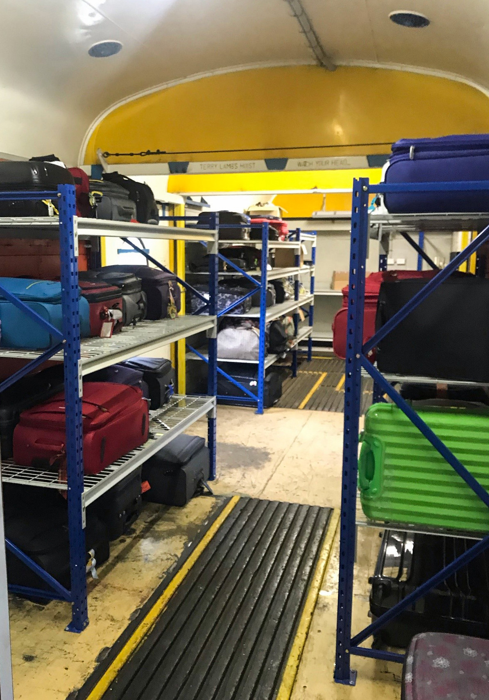

**In June 2018, the THNSW Board approved Stage 1 of the *Southern Aurora* (SA) project and the first stage has seen several milestones achieved in the last 12 months.**

The project objectives were as follows:

1. Fit retention toilet tanks to four sleeping cars. The work was contracted out to Lithgow Railway Workshops. The cars fitted were FAM 2391, NAM 2338, LAN 2377 and NAM 2332.
2. Commission power van PHN 2363. This van is one of the three originally ordered for the SA services. It is owned by Sydney Trains and is under long-term lease; it was previously on the Enfield Breakdown Train.
3. Commission luggage van MHN 2364. This van was an original SA van and its previous use was also on the Enfield Breakdown Train.
4. Commission Crew car NAM 2332. This NAM was modified for the Enfield Breakdown Train with a kitchen/meal room area installed where compartments 1-2, 3-4, 5-6 and 7-8 were originally located.
5. Replace all essential kitchen items in RMS 2358, including ovens, plate warmers, fridges, freezers and redundant equipment. Repair floor corrosion and modify and reactivate the disused staff toilet with access from the corridor for passenger’s use.
6. Install carriage lettering to all operable cars.
7. Other minor works on all operable cars, such as annual inspections within fleet maintenance works.

Neon sign on PHN 2363.

**PHN 2363**

Works completed on the carriage have included servicing the two Cummins generator sets; replacement of batteries and battery chargers; installation of low battery voltage detection and shut off contactors; removal of the air feed water system and replacement with an electric pump; requalified wheel sets; draw gear removal and inspection and repairs; floor corrosion repairs; air conditioning repairs to guards compartment; new vinyl floor; door repairs; installation of racking in former luggage space for tools and equipment for on board maintenance; electrical system repairs and rewiring; new decals; and provision to install neon sign with new power outlet and mounting brackets.

Works yet to be completed are: reactivation of retention Microphor toilet system, further replacement of expired electrical control parts of generator systems and repairs to radiator hot air outlets.

**Sleeping Cars FAM 2391, LAN 2377 & NAM 2338**

Toilet retention tanks have been fitted by Lithgow Railway Workshop. Air conditioning repairs were completed on FAM 2391, including a new compressor. Carpets were also steam cleaned. LAN 2377 has lost one of its lighting battery boxes, which allows fitting of the toilet tanks, so lighting batteries are now fitted in one box only. NAM 2338 has been removed from service to allow replacement of worn out plunger bar bushes (the components are being sourced). All decals have been reinstalled on these cars.

**NAM 2332**

A major overhaul of this car was undertaken to provide crew facilities. All windows were replaced and floor corrosion repairs undertaken in each vestibule. Expired air conditioning system components were replaced; wheel sets replaced; a missing gangway and buffer beam fitted to corridor end; air water system replaced with an electric pump; hot water services flushed and repaired; draw gear removed and repaired; brake system overhauled and bogies overhauled; gas appliances inspected and certified; retention toilet system fitted and conventional toilet installed in small compartment in middle of car; six remaining original compartments tided up; and lighting fixtures repaired.

Interior shot of RMS 2358.

**RMS 2358**

All frosted windows were replaced on RMS 2358 and the car was taken out of service for major kitchen strip out works. The interim scope of work centred on the kitchen, food preparation and cold food storage areas.

During the strip out of the ovens and fridges, it was decided to expand that scope to include removal of the vinyl floor coverings and removal of the floorboards at both kitchen wing doors and corridor. Areas of corrosion have been found around the external doors at the kitchen, corridor and end doors, as well as under the electrical cabinet. Although corrosion has been located, the general structural integrity has not been compromised. Areas will be treated and new material added to replace wasted material.

Another scope change has seen the original staff toilet reconfigured to be entered off the corridor. This, along with the fitting of a retention tank, will provide toilet facilities within the middle of the train. Exhaust fans will be fitted to the existing ventilator in the ceiling of the toilet cubicle.

The kitchen upgrades include a complete strip out of the fridge/freezer unit in kitchen area; removal of ovens, hot plate, griddle and plate warmers; and removal of the fridges at the dinning end. New fridges, freezers, ovens and hot plates, plus a dish washer and new recessed plate warmer and large food prep area, have been fitted, as well as a new compliant exhaust duct system above the hot area. LED lighting has replaced all fluro lighting, as well as lighting in the former staff area, which has had two new fridges installed. Shelving will be installed where the cupboard was originally fitted.

New vinyl will be fitted once the floor structure repairs are completed. The kitchen upgrades are basically complete at the time of writing, with floor works, carriage lift and other maintenance works due to be finalised in the next two months, with the car returning to service in September.

**BCS 2357**

Lounge car BCS 2357 was always the ‘third lounge car’ and acted in the roll of back-up to 2356/2379. With BCS 2356 being sidelined for bogie repairs, BCS 2357 has filled in.

The car was returned to service by another rail operator in the early 2000s. The car is generally in good mechanical condition. The interior is also in fair condition, however, some floor wear and tear is starting to appear in the carpets and vinyl. Works have been undertaken on the fridges and new compressors were installed.

The car came without its original (comfortable) loose lounge chairs. Instead, it came with very rough and uncomfortable loose chairs. Thanks to Greg and Adam Sayers from North West Coachbuilders, four originals have been donated from spares they saved from an Eveleigh waste bin. In an attempt to have these copied or added to in more come to light. If any members know of the whereabouts of the other missing chairs from either this car or BCS 2356, please get in touch with THNSW. BCS 2379 has its correct original chairs.

One more thing that has been a bug bare with regards to BCS 2357 is that its original side boards have been missing for many years, probably since the conclusion of the train in the early 90s. However, as part of the effort to install all new signage and decals to the operating cars, BCS 2357 finally has its side board and ‘Southern Aurora’ name back in its rightful place.

New decals on BCS 2357.

**MHN 2364**

This luggage van was attached to the Sydney Trains Breakdown Gang until around 2014. It was originally located at DELEC Enfield, then UGL MainTrain. From there, the luggage van went to Flemington Maintenance Centre, where it and two more cars (PHN 2363 and NAM 2332) were stored. These vehicles were attached to the Rail Crane & Match Truck (formally NSWGR 48 class locomotive 48131) and travelled the state on recovery missions. Sadly, the crane was damaged in an accident some years ago and the ex-*Southern Aurora* cars were eventually transferred to Broadmeadow Maintenance Depot along with Heritage Electric Fleet cars 3805, 4150 and 3814 for further storage.

During this time, THNSW inspected the vehicle and, after agreement with Sydney Trains, transferred it and the other two vehicles to Thirlmere.

Restoration back to its original configuration as a luggage van was fairly straight forward, as the interior was basically un-modified. The only exceptions were the coffin and dog box chambers, as well as the guard’s compartment internal doors along with the toilet cubicle.

During the overhaul works, the bogies were stripped down, wheel sets sent for requalifying of the roller bearings, draw gear replaced, buffers fitted back to one end and a completely new electrical system fitted by Ian Gregory.

Interior view of MHN 2364.

Works to be completed include the installation of the toilet, water tank, retention tank, neon sign plug, and mounting frame and buffer beam to the flat end.

Once completed, the Stage 1 works program on the iconic *Southern Aurora* set will see useable dining, lounge and sleeping cars available for tours. Additionally, THNSW has taken under its operating umbrella the NAM cars owned by Simon Mitchel, under his brand Vintage Rail Journeys, that have been overhauled at Lithgow Railway Workshops. With these cars and the THNSW cars, it is now possible to operate the *Southern Aurora* in the way it was operated in years gone by.

A positive response from the charter market will see the train in use on a regular basis.

*This article was originally published in the winter 2019 edition of Roundhouse magazine. Written by Jeff Snedden, Diesel Locomotive & Carriage Maintainer.*
