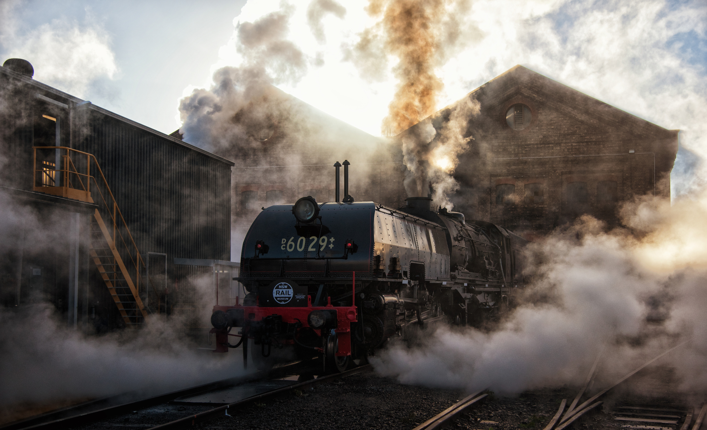

**The workshop team at Thirlmere has had very little rest during the last few months, with significant works being undertaken on the operating fleet, from annuals, car lifts, the continued overhaul of CPH 18 and locomotive 4201, and repairs to locomotive 6029. I would like to take this opportunity to thank everyone who continues to contribute to making all this possible.**

**LOCOMOTIVE 2705**

Locomotive 2705 has been operating without any problems. A purchase order has been issued for construction of a new tender tank, which will be fitted during its upcoming overhaul.

**LOCOMOTIVE 3016**

Some repairs are required before 3016’s next operation.

**LOCOMOTIVE 3265**

Our most recently overhauled engine operated successfully during Maitland Steamfest and the Transport Heritage Expo. The locomotive has also been operating on the loop line on weekends during heavy load periods.

**LOCOMOTIVE 3526**

Locomotive 3526 operated during Maitland Steamfest, the Goulburn 150th anniversary and the Transport Heritage Expo. We are experiencing some issues with supply of the hard grease used on the main driving boxes of both the 35 and 36 class. We are currently talking to our supplier to address these issues.

**LOCOMOTIVE 3642**

‘The Pig’ has been used for Day Out With Thomas events and travelled to Sydney for static display during the Transport Heritage Expo.

**LOCOMOTIVE 6029**

Work was completed in time to allow locomotive 6029 to participate in the Transport Heritage Expo during the June long weekend. This was a significant achievement to say the least. Due to other commitments, work didn’t really get underway until early May. During this time, staff installed the 305-odd boiler tubes and had the boiler back together and full of water in six days!

Three days later, the boiler inspector attended to witness the hydro test to 300 psi to verify repairs to the tubeplate and tubes. Several flexible stays fractured during the hydro test, so the cladding was removed, and the stays were manufactured and fitted the next day.

While the above was underway, new piston bull rings were machined and fitted, new slide bars were fitted to the rear unit, and the locomotive went through our annual and five-year inspection schedules.

Beyer-Garratt 6029 stands outside the Large Erecting Shop at Eveleigh during the 2019 Transport Heritage Expo. -Steve Burrows

*This article was originally published in the winter 2019 edition of Roundhouse magazine. Written by Ben Elliot, Fleet Maintenance Manager.*
