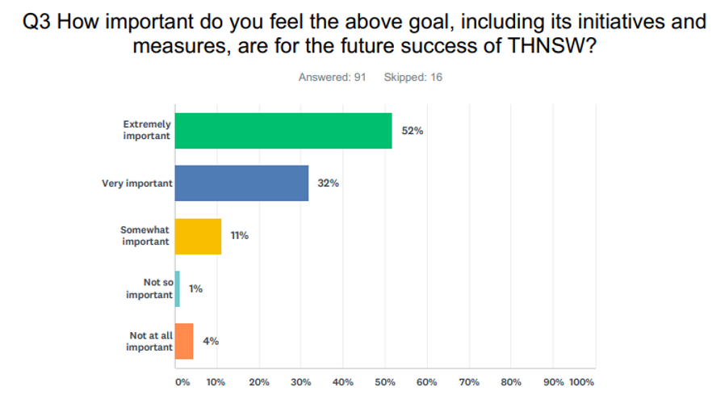

**In mid-April, THNSW published its draft strategic plan for 2019-24. The draft was circulated to provide THNSW members and stakeholders the opportunity to provide feedback via a number of channels including Member Information Forums and an online survey.**

Over 100 members completed the online survey and the majority of respondents indicated they felt the goals and priorities outlined in the draft plan were mostly ‘extremely important’ or ‘very important’.

Here's how our members who took part in the survey responded:

**GOAL 1: Engage customers and the community**

**GOAL 2: Care for our collection and heritage assets**

**GOAL 3: Collaborate with our people and partners**

**GOAL 4: Focus on sustainability**

**GOAL 5: Build a culture of risk management, safety and compliance**

Thank you to everyone who responded to the draft strategic plan.

As a result of member input, we have integrated ‘focus on sustainability’ with the remaining four goals, as well as incorporated additional information in the plan.

You can now download a copy of the final approved Strategic Plan 2019-24 below.

**View Strategic Plan 2019-24**
