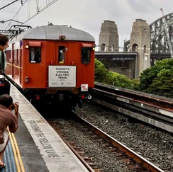
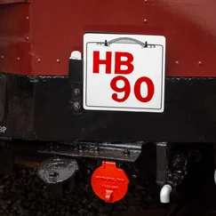
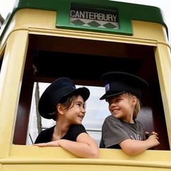

**Transport Heritage NSW was proud to partner with Transport for NSW to deliver heritage transport experiences to help celebrate the Sydney Harbour Bridge's 90th Anniversary.**

Close to 5,000 Sydneysiders enjoyed a step back in time aboard historic electric train and/or bus rides as part of the celebrations.

Events like these would not be possible without volunteers from a variety of heritage transport groups, including the Sydney Bus Museum, Historic Electric Traction and Sydney Tramway Museum.

Special thanks to Sydney Trains and Keolis Downer for assisting with heritage transport operations.

