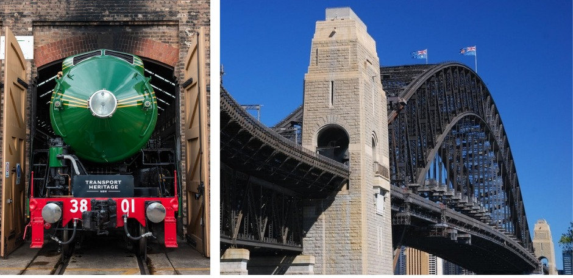
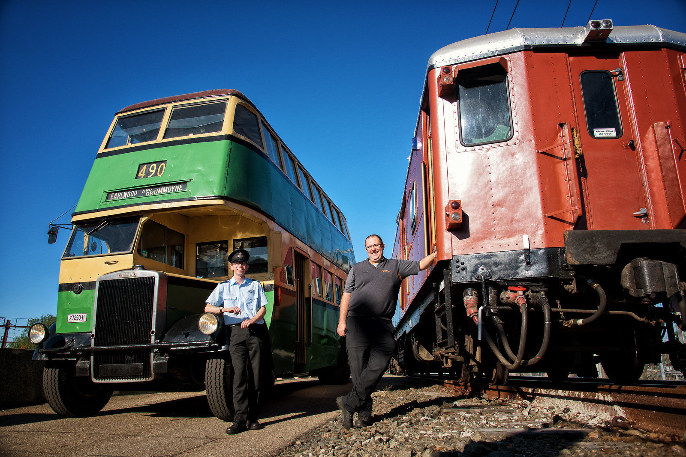

**Today, the NSW Government announced plans to celebrate 90 years of the Sydney Harbour Bridge on Saturday 19 March 2022.**

To help mark the occasion, Transport Heritage NSW will be delivering a range of heritage transport experiences, including a very special heritage train operation with legend of steam locomotive 3801.

**Two pillars of transport history, together for the first time**

On Saturday 19 March, locomotive 3801 will depart Central Station for a one-off journey, through the city underground and onto the main deck of the Sydney Harbour Bridge.

Once on the Bridge, 3801 will be met by vintage electric set F1, where both trains will pause momentarily to salute the great arch that has defined our nation for the past 90 years.

Transport for NSW are making limited tickets available from Monday 28 February for seats aboard both trains and the adjacent pedestrian cycleway, which will be repurposed as a viewing platform.

**A day of celebration and heritage transport experiences**

Following 3801's crossing of the Sydney Harbour Bridge, the community can enjoy historical displays, entertainment and vintage electric train rides between North Sydney and Wynyard (via Lavender Bay on the return journey).

There will also be heritage bus and ferry rides connecting the north shore with the city, as well as a heritage bus and tram display at Milsons Point.

**Tickets and more information**

For tickets and further information visit [transport.nsw.gov.au/sydneyharbourbridge](http://transport.nsw.gov.au/sydneyharbourbridge?fbclid=IwAR0zsr6606kS0Sqg7QaPMx-tm8SfC23bFiT1lY9sGx7rSp5_Q1Ivf8V3J54)
