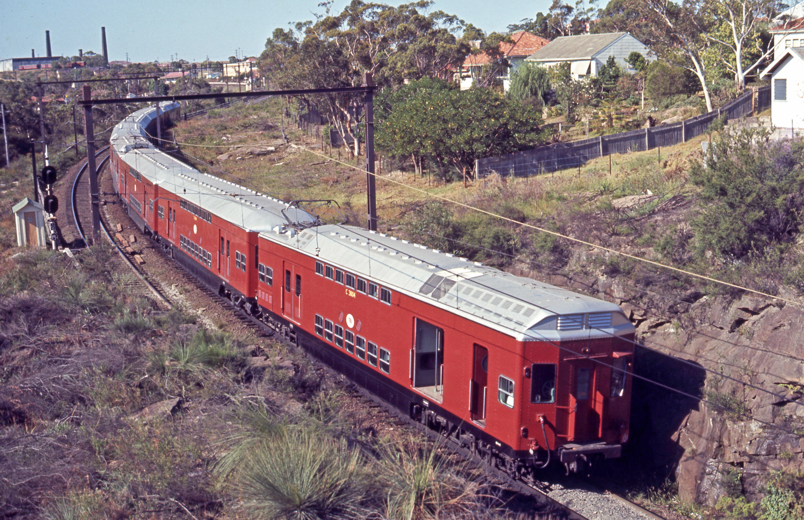

**When the NSW Railways called for tenders in late 1960 for single-deck trailer cars to replace the timber-body trailers still in service, the only respondent that provided an alternative to the original tender documents was Tulloch Ltd.**

The original tender called for 120 single-deck trailer cars, but Tulloch proposed a double-deck design by one of its engineers, Mr Roy Leembruggen. Tulloch addressed the overcrowding issue of the Sydney suburban network and, with longer trains not being possible, the double-deck idea received a positive response from the Railway Commissioner, Mr Neal McCusker, and other railway staff.

Tulloch was facing financial stress at the time and no contract was awarded. Replacement stock was urgently needed by the time the NSW Railways revisited Tulloch’s design and the Commissioner dealt directly with Tulloch instead of calling for tenders again. A contract was signed in late 1962 with the first car to be delivered by the end of 1963 and the contract completed by the end of 1966.

Tulloch’s design was based on a design used in Paris since 1933. The concept had been tried in 1927 in Capetown, South Africa, but the car was not successful.

Tulloch reduced the weight of the cars by using aluminium for the sheathing with a steel frame. A colour scheme based on shades of greens was used in contrast to the brown and cream with a white ceiling that had been used on suburban electric trains. The sides of the cars contained 40 Beclawat sliding windows that were tinted. The windows in the lower and end sections of the cars had a slightly larger window with a fixed section. The cars were illuminated by 20-watt fluorescent tubes and a new style throwover seat was used.

Cars T4801–4840 were delivered with power-operated doors so they could work with the 1955-type single-deck motor cars. These motor cars had four traction motors and were capable of hauling a single double-deck trailer car, which meant there would be four double-deck trailers in an eight-car suburban set.

Cars T4841–4920 were delivered with manually operated doors and wired to operate with older motor cars. It was thought that the older motor cars would only be able to handle two double-deck cars in an eight-car set. Experience showed that these older cars were able to handle the heavier load of four cars per eight-car set. The manually operated door cars were allocated to the B and M sets.

Some of the Tulloch double-deck trailer cars were converted to manual door operation in 1987 and used with the M sets.

The cars were originally delivered in the standard Tuscan red without lining. In November 1972, a blue and white livery was applied to T4859 and 4862, which were used on the official train for the opening of the Como bridge. Variations of the blue and white scheme were applied to the cars throughout 1972.

During 1979, experiments were undertaken with grey and silver paint schemes to match the stainless steel cars that had been delivered by Comeng and Goninan. A darker shade of grey was finally decided on and the last car was painted in this colour in August 1989. In March 1991, set H22 was decorated to promote Taronga Park Zoo, a scheme it carried throughout the year. Set W1 had a colour scheme applied that represented an aspect of Sydney.

The cars were overhauled during the late 1990s in preparation for the Sydney Olympic Games with seating similar to the Tangara cars. The exterior was painted a light grey and the interior became grey with blue seat covers.

The last cars were withdrawn from service on 31 March 2004.

**Experimental motor cars**

Advances in technology allowed Tulloch to develop four experimental motor cars in 1967. Different equipment was installed in each of the cars and four bogie designs were used. Three styles of pantographs were also installed. The cars went into service in January 1969.

The original double-deck trailer car design was modified with the incorporation of a driver’s cabin and guard’s compartment in the No.2 end. The roof above the No.2 end was fitted with ventilators to allow cooling air to circulate around the electrical equipment and other components. On the No.1 end, the pantograph was placed on a lowered section of the roof.

The first car delivered was C3804 on 23 May 1968, with C3803 on 23 August, C3801 on 11 September and C3802 on 11 November 1968. They were designed for a maximum speed of 112km/hr.

With the introduction of these experimental motor cars, double-deck trailers T4839, 4840, 4843 and 4844 were altered to operate with them in a set designated S10.

Trials were carried out all over the network and cars were withdrawn for modifications and repairs during the trial period. They entered revenue service on 6 January 1969.

**C3801**

C3801 had Mitsubishi electrical equipment fitted and a static converter provided 120V d.c. auxiliary power. The pantograph was a cross-arm Mitsubishi type. The bogies were supplied by Bradford Kendall and based on the General Steel Industries ‘General 70’ non-equalised design.

The car was withdrawn from service on 25 October 1974 and stored at Punchbowl Car Sheds for three years. The car was stripped of electrical equipment during 1978 and returned to service as a trailer car numbered T4797. The car was withdrawn from service on 29 September 1982 and condemned in March 1986. It was cut up during 1991 at Elcar.

**C3802**

Toshiba electrical equipment was fitted to C3802 and a solid-state voltage regulator and rectifier provided 120V d.c. for battery charging and control. The originally fitted Faiveley pantograph was replaced by an Airmate cross-arm pantograph in early 1975. The bogies were Budd Pioneer III disc-braked, which had direct air suspension inside the bogie frames with the car’s weight being supported on the side frame.

C3802 was withdrawn from service on 17 February 1796 and sent to Elcar. It was converted to a trailer car and renumbered T4798. It was condemned on 28 March 1985 and cut up in 1990.

**C3803**

C3803 was fitted with Hitachi electrical equipment and a 120V d.c. rectifier set provided power for control and battery charging. A Mitsubishi cross-arm pantograph was also fitted. C3802 had its electrical equipment removed in 1978 and returned to service as T4799 on 26 February 1982. During the refurbishment, the driver’s cabin / guard’s compartment was removed and the entrance door panelled over, allowing for a larger compartment with seating for 16.

It was withdrawn from service in September 2003 and condemned on 23 December 2003.

**C3804**

The fourth car was equipped with English Electric equipment with auxiliary power provided by a conventional motor generator set supplying 120V d.c. and the pantograph was an English Electric conventional diamond-frame type. The air suspension bogies were supplied by A.E. Goodwin.

C3804 was withdrawn from service in January 1972 and condemned on 28 March 1985. From July 1985 until the closure of Elcar in 1994, C3804 stood on a plinth outside the Elcar workshops. It is now in the custody of the NSW Rail Museum at Thirlmere.

The four cars entered service in Tuscan red livery and C3801, C3802 and C3803 had the blue and white scheme applied at a later date. When the conversion to trailer cars took place, the T4797 (C3801) and T4799 (C3803) were painted deep Indian Red. T4799 also received the silver paint scheme.

Set S10 with C3804 and T4844 leading head to Cronulla in 1968. The train has just passed Oatley Station. -John Ward

These experimental Tulloch cars led to Sydney becoming the first major suburban railway in the world to have an all double-deck fleet. In the following years, the fleet developed and improved with each new model.

**The S sets**

The first of these cars, the S sets have presently come to the end of their service lives and are being scrapped.

The S sets were of stainless steel, double-deck construction. They were not air-conditioned and became the last non air-conditioned cars on the network. They have been replaced by the Waratah Series 2 B sets.

Two manufacturers built 509 carriages, based on a largely common design:

* 359 carriages were built by Comeng between 1972 and 1980. They are externally distinguished by the peaked front of driving cars.
* The Series 1 Comeng power cars feature no fluting on the lower half of the carriage and one peaked front and rear end.
* The Series 2/3 Comeng power cars feature fluting on the lower half of the carriage and one peaked front end.
* The Series 4 Comeng power cars feature the same as Series 2/3 cars with headlights above the destination box.
* Cars D4011-D4020 feature the driver/guard window and vertical window close together with no pantograph.
* Cars D4021-D4095 feature the same as a Comeng power car with a driver/guard door with no pantograph.
* 150 carriages were built by A Goninan & Co between 1978 and 1980. They are externally distinguished by the flat front of driving cars and lower windows on the upper deck.

**History**

Following the successful trial of four double-deck power cars built by Tulloch in 1968, 53 Series 1 power cars were ordered from Comeng and delivered in 1972–73. They were paired with 1965–67 Tulloch-built trailer carriages that had previously operated in company with single-deck power cars. The first 39 were painted Tuscan to match the trailer cars, while the last 14 were painted in the newly introduced Public Transport Commission blue and white livery.

From 1976, the blue and white livery was replaced by an Indian red livery. In 1979, painted Series 1 cars began to have their paint removed to match the Series 2 cars. Only seven were completed and it wasn't until August 1988 that the program recommenced with the last carriage treated in 1990.

Subsequent orders saw another 154 power cars, 67 trailer cars and 85 driving trailer cars built by Comeng. These were all built to the Series 2 design with Budd-type polished inserts on the carriage sides, flat rather than tapered No.2 ends, throw-over rather than sliding reversible seats, upgraded interior lights and a natural stainless steel finish.

A further order saw 80 power cars and 70 trailer cars constructed by Goninan in 1978–80. These cars differed in having a more square type of fluting and flat fronts on the power cars.

All were formed into either four-car S sets or two-car T sets. In practice, there were only a few services requiring two carriage sets, resulting in most T sets being used to form six and eight-car sets. By the early 1980s, some permanent six-car sets had been formed and targeted as R sets. In December 1983, there were 60 T sets, but 12 months later the number was down to 19.

These cars also saw service on the Illawarra and Newcastle suburban lines. The Illawarra services were hauled by 48 class diesels until the line was electrified in December 1985. The Newcastle trains operated to Fassifern.

In May 1987, the ten newest driving trailers based at Hornsby were renumbered D4001–D4010 and the remainder began to have their control equipment removed and reverted to ordinary trailers. To allow the soon-to-arrive Tangara sets to be targeted T sets, the remaining two-car sets became L sets in April 1988. When refurbished in the 1990s, the crew compartments were removed.

To operate services on the newly electrified Riverstone to Richmond line from August 1991, all 10 driving trailers and a number of Series 1 power cars were fitted with headlights.

During the 1990s, all carriages were refurbished as part of the CityDecker program. This saw the interiors refurbished with white walls and ceilings, grey floors and blue seats. Power cars received a destination indicator and had yellow applied to the lower half of their fronts. Sliding Beclawat windows were replaced with hopper windows and doors painted yellow.

**Replacement**

After 40 years of service, the Tulloch trailers were deemed life expired and the last was withdrawn in March 2004. This resulted in a disproportionate number of power cars. To address the balance, 23 Comeng power cars were converted into trailers. Most of the conversions were Series 1 cars. However, a few conversions involved Series 2 cars. This meant the removal of the yellow painted front (on some cars), and removal of pantograph and opening up of the driving compartment for passengers.

Some cars had their external lights removed and plated over, and their cabs removed, while other cars retained these fittings. All retained their motors and compressors for ballast purposes. The destination indicators were also retained and painted over.

All remaining 498 carriages were to be replaced by the Waratah A sets from 2012, with the last scheduled for replacement in 2015. In March 2013, it was revealed a limited number of S sets would need to be retained after the full introduction of the A sets, as the option to build further A sets had lapsed, meaning no trains had been ordered for the South West Rail Link. The last Series 1 power car was withdrawn in January 2014. The final A set was delivered in June 2014.

In May 2014, the government announced its intention to introduce new trains for the NSW TrainLink intercity network from 2019. The government stated that the new trains would release at least some H sets from intercity services, allowing them to be transferred to Sydney Trains to replace the remaining S sets.

However, the remaining 48 S sets were being replaced by twenty-four eight-carriage Waratah B sets throughout the course of 2018 and 2019. Six four-car sets of the S set carriages will remain available for use during emergencies.

During their history, S sets operated on all Sydney lines. The last six-car R sets were disbanded in August 2012, with all carriages formed into four-car S sets (which were typically operated in eight-car sets). The last sets were transferred from Mortdale to Flemington in March 2013, bringing an end to their operation on Eastern Suburbs and Illawarra services. However, one set remained operational through parts of March and April on the line. In May 2014, all Hornsby sets were transferred to Flemington.

Following the delivery of the final A sets, Sydney Trains retained 48 four-car sets (192 carriages). In June 2014, the government announced that all timetabled services except those on the T7 Olympic Park shuttle would be operated by air-conditioned trains.

With the introduction of a new timetable in November 2017, 40 four-car sets were temporarily required to operate the weekday service while the B sets were delivered. This meant that S sets would once again be scheduled to operate services on all lines in Sector 2.

The new Waratah B sets are replacing timetabled K set runs, while the K sets are moving on to S set runs.

The NSW Government has announced 10 S set carriages will be transferred to the State-Owned Heritage Collection, managed by Transport Heritage NSW.

**References**

*Coaching Stock of the NSW Railways*, Volume 3, David Cooke, Don Estell, Keith Seckold, Stephen Halgren, Eveleigh Press, 2012.

*This article was originally published in the autumn 2019 edition of Roundhouse magazine. Written by John Casey, Roundhouse Editor.*
