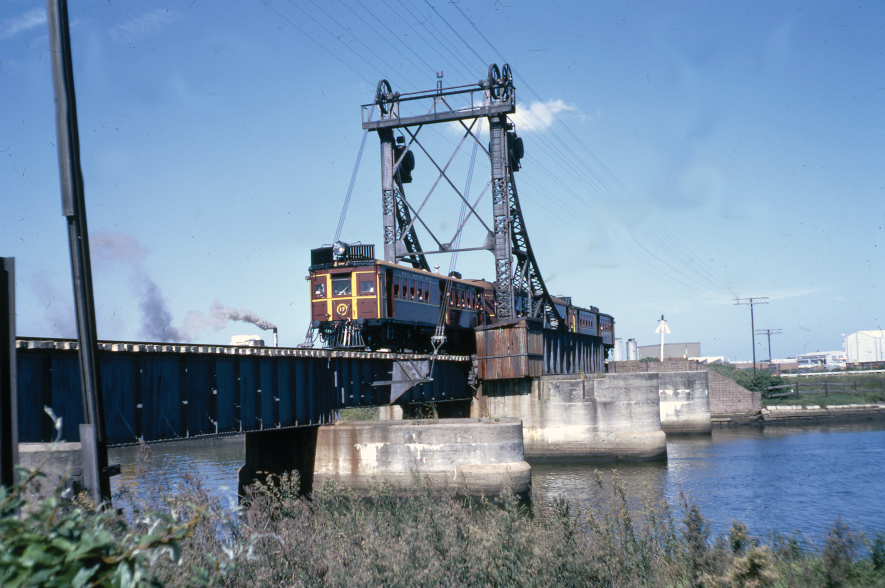

**The Metropolitan Goods Lines were a series of lines designed to divert goods trains off passenger lines and avoid unnecessary delays for both forms of transport. They spread throughout the Sydney area from 1916 and played a major role in the development of the city and suburbs. Many of the lines are no longer used and have been abandoned, while others have been turned over to light rail.**

The railways spread to country regions very quickly following the opening of the first railway line in 1855, as farmers realised their goods could be sent to Sydney quickly and efficiently by rail. Suburban passenger services were provided along these country lines, but no specific suburban lines were built for many years due to the influence of rural interests.

Following the Federation drought (1895-1903), grain and wool production increased rapidly, causing delays to suburban passenger trains as a result of the slow moving grain trains that needed to get their loads to Darling Harbour.

The NSW Government sought a new Chief Commissioner from Britain and a select committee chose Mr Thomas Richard Johnson, who had been assistant engineer on the Great Northern Railway in Britain. Johnson arrived in Sydney on 7 April 1907 and set about restructuring the NSW Railways.

In 1908-09, 470 miles of track work was carried out, including the rehabilitation, duplication and creation of lines, as well as the development of a tunnel to bypass the Lithgow Zig-Zag. An additional 97 locomotives, 104 passenger carriages and 1,064 goods vehicles were purchased.

Over the next few years, two reports were released – one in 1910 and another in 1914 – regarding the development of a series of lines to ease the pressure on suburban traffic and place goods traffic on lines of their own.

The Metropolitan Goods Lines were designed to:

* Relieve pressure on the crowded wharves, transit sheds and goods yard at Darling Harbour by developing Glebe Island as an alternative; constructing a double-track from the Main Suburban Line at Summer Hill to White Bay, Rozelle and Darling Harbour, together with an extension of this line to Wardell Road; providing a large yard at Rozelle for goods wagons; building a grand wheat receiving and loading terminal; and creating two coal-loading berths at Glebe Island.
* Relocate goods trains from crowded suburban lines by establishing the Metropolitan Goods Lines network (including the two lines noted above).
* Connect the new State Abattoirs at Homebush with a new central meat market and offal treatment plants at Botany. (A central meat market at Rozelle with dressing rooms, chilling rooms and dedicated sidings was planned, but did not proceed. Instead, decentralised meat markets opened at Rockdale and St Leonards in April 1921. The location of offal treatment works at Botany meant that the Goods Line network would need to include a route from the State Abattoirs via Campsie to Botany.)
* Enable goods trains from the Illawarra to traverse the north, south and west lines. James Fraser, Chief Commissioner between 1917 and 1929, argued for dedicated goods lines that facilitated stock trains using these lines.

Part of this network had been built in September 1855 at the time of the opening of the Sydney to Parramatta railway, but the rest was to be new work.

On 23 June 1914, the new Chief Commissioner, John Harper, announced four additions to the project:

* Quadrupling the Belmore to Wardell Road Line due to increased traffic on the Bankstown Line following its extension to Liverpool;
* Constructing a 'great' marshalling yard at Enfield, which would become the nucleus of the Goods Line network;
* Moving Eveleigh Workshops to Chullora (a proposal that did not eventuate); and
* Deviating the authorised line between Rozelle and Darling Harbour. This was in response to requests from the Harbour Trust, which was planning a massive expansion of wharves in the area. The new line would diverge near Rozelle Goods Yard and pass around Rozelle Bay before entering a four-track, 178-foot tunnel from which it joined the original route near Johnson Street.

The Belmore to Flemington section of the Metropolitan Goods Line opened on 11 April 1916. The Wardell Road–Rozelle and Glebe Island section opened on 29 May 1916. The delayed section from Rozelle to Darling Island opened on 23 January 1922 and the short main line to Darling Harbour the following August.

The new marshalling yard and locomotive roundhouses at Enfield were a major infrastructure project. The gravitation yard, with capacity for 4,000 wagons, followed 'best practice' in North America and England. It featured 26.5 miles (42.65km) of sidings. The new facilities for servicing and maintaining locomotives were subsequently upgraded to handle the huge 4-8-2 three-cylinder D57 class goods locomotives introduced between 1930 and 1932.

An early addition to the goods network was the Abattoirs Line, which left the Main Western Line at Pippita and crossed Parramatta Road on an overbridge to serve the State Abattoirs via various meat sidings. The line opened on 31 July 1911 and the complex itself commenced operation on 7 April 1915. In 1968, the Homebush Saleyards were relocated to the Abattoirs precinct, being accessed by a balloon loop of the Abattoirs Line. Sydney's fruit and vegetable markets were relocated from Haymarket to the old saleyard site adjacent to the Main Western Line in 1975. For many years, trains from the Murrumbidgee Irrigation Area arrived at the market sidings each morning to unload fresh fruit and vegetables for sale at the markets.

Goods sidings along the Metropolitan Goods Lines played an important role in the industrialisation of a number of Sydney's inner suburbs. Notable examples were Dulwich Hill; Charles Street, Leichhardt; and Gordon Street, Rozelle. These sidings saw little use after 1970, as road transport became more popular.

Coal-fired power stations at Ultimo, Pyrmont and White Bay in the Darling Harbour–Rozelle area required large quantities of coal to fire the generators, as did the larger Power A and B Power Stations at Bunnerong. The Bunnerong site led to the extension of the Goods Line from Botany to the power stations, which the Sydney Municipal Council constructed and opened in 1929. The coal for these stations was transported over the Metropolitan Goods Lines from the Western coalfields and Glenlee south of Sydney. The Bunnerong power stations were decommissioned by 1975, although peak load gas turbines were in use on the site between 1982 and 1984.

The NSW Railways also had several works associated with the Goods Lines. The locomotive depot at Enfield had significant workshops to maintain and repair the steam locomotives based there. With the introduction of diesel and electric locomotives in the 1950s, the diesel and electric (DELEC) locomotive depot and maintenance centre was established on the opposite side of the marshalling yard.

A significant complex was the Chullora Railway Workshops. Its first three workshops opened in 1926 on 200 hectares of land adjacent to the Enfield marshalling yards. At its peak, there were ten specialist workshops undertaking work for three branches of the NSW Railways. During World War II, it served as a manufacturing and assembling plant for aircraft and tanks. The Sydney Rail Freight Terminal opened on the site in October 1984, while the ELCAR workshop that maintained suburban electric trains was closed in March 1994, with maintenance of the City Rail fleet being taken over by A Goninan and Company at its new Auburn facility. Many of the workshops have closed and the work is now undertaken by privately-operated facilities.

Flour mills located on the Goods Lines provided a regular source of rail traffic, such as the Mungo Scott mill north of Dulwich Hill and the Edwin Davey flour mill at Darling Harbour. The Rozelle–Darling Harbour section of the line closed in January 1996 and the Rozelle Yard closed on 17 January 2009. The last train ran to the Mungo Scott flour mill on 1 December 2008. The Rozelle Bay wharves served Crest flour mills and the Clyde Sawmilling complex. On the Botany Line, the Kellogg's plant at Gelco was a major industry served by goods trains, which delivered grain to its towering silos.

A train led by CPH 17 on the Botany Line during a tour in April 1973. -John Youngman

On 21 April 1995, a bottleneck between Homebush and Flemington Goods Junction was removed with the opening of a single-track goods line that had an underpass beneath the Short North Line, enabling freight trains to access the Homebush loop unimpeded.

The Maritime Services Board wanted to build a container terminal at Port Botany and, with government approval, work commenced on construction of two terminals adjacent to Sydney Airport in 1972. The Public Transport Commission commenced upgrading and extending the Botany Line to access the Port Botany facility in 1977. The initial plan was to duplicate, extend and electrify the line to the Port Botany terminals in order to transport 12 million tonnes of coal to the port in addition to containers. However, local opposition to coal export through Port Botany resulted in an upgrade with passing loops and 2.2km of new track.

The Southern Sydney Freight Line, a $1 billion, 36km single-track line, was built by the Australian Rail Track Corporation for freight trains on the Main South Line from south of Macarthur to Enfield West. On the Main Northern Line, the Northern Sydney Freight Corridor provided a dedicated underpass to North Strathfield for freight trains to pass under the western suburban passenger lines, together with dedicated freight lines bypassing passenger stations on the Main Northern Line.

Much of the Metropolitan Goods Line network remains in place. The section from Sydney Yard to Darling Harbour, together with the later extension to Wentworth Park, was converted to Sydney's first modern light rail line, which opened in August 1997. The section from Central Station to the former Haymarket complex followed a former tram route and then utilised the former Goods Line right-of-way. The line was extended to Lilyfield in August 2000 and the link to the Main Suburban passenger line at Dulwich Hill formally opened on 27 March 2014.

In 2015, a portion of the Goods Line from Central to the Powerhouse Museum was converted to a walkway and parkland. Access to the walkway is via an extension to the Devonshire Street tunnel at Central.

**References**

*Sydney’s Forgotten Goods Railways*, John Oakes, Australian Railway Historical Society, 2001.

*This article was originally published in the winter 2019 edition of Roundhouse magazine. Written by John Casey, Roundhouse Editor.*
