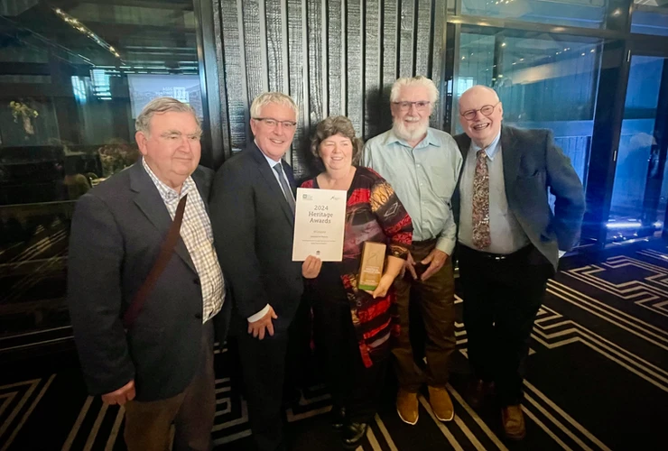
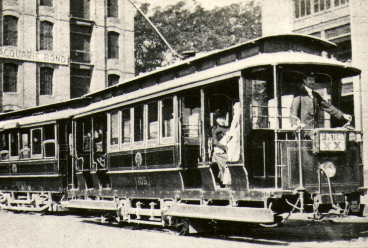

**The Sydney Tramway Museum has been awarded winner of the Interiors and Objects category at last week’s National Trust 2024 Heritage Awards.**

The Awards are New South Wales’ biggest and most anticipated celebration of outstanding practice in the field of heritage, recognising excellence in the conservation, protection, and interpretation of Aboriginal, built, natural and cultural heritage over the past year.

The Loftus based museum won the Interiors and Objects category for its restoration of 1890s Sydney D Class Tramcar 117, part funded by Transport Heritage NSW’s Transport Heritage Grants Program.

There were just 25 D Class trams in Sydney, all being built between 1898-99. These single truck, four wheel ‘California Combination’ trams were inspired by similar trams entering service in Brisbane at the time.

In their heyday, the D Class trams could be seen across the Sydney tramway network, including on the Lower North Shore – long before the connecting Sydney Harbour Bridge.

While their passenger carrying days ended in the mid-1920s, it wasn’t the end of the D class. Almost half the fleet were converted to breakdown or scrubber cars, being used in Sydney, North Sydney and in Newcastle to rescue broken-down, derailed or accident damaged trams, or to simply maintain the tram rails in good condition. In this role, many survived into the last years of the tramway system. This allowed at least two of the class to make it into the ranks of preserved Sydney trams.

D Class 117 was converted to ‘Scrubber 112s’ in 1931. It is currently being restored to near original condition as ‘D Class 117’.

You can read more on the D Class 117 restoration project at the [Sydney Tramway Museum website](https://www.sydneytramwaymuseum.com.au/tramfans/restoration-of-d117/).

*Congratulations to the Sydney Tramway Museum team!*

