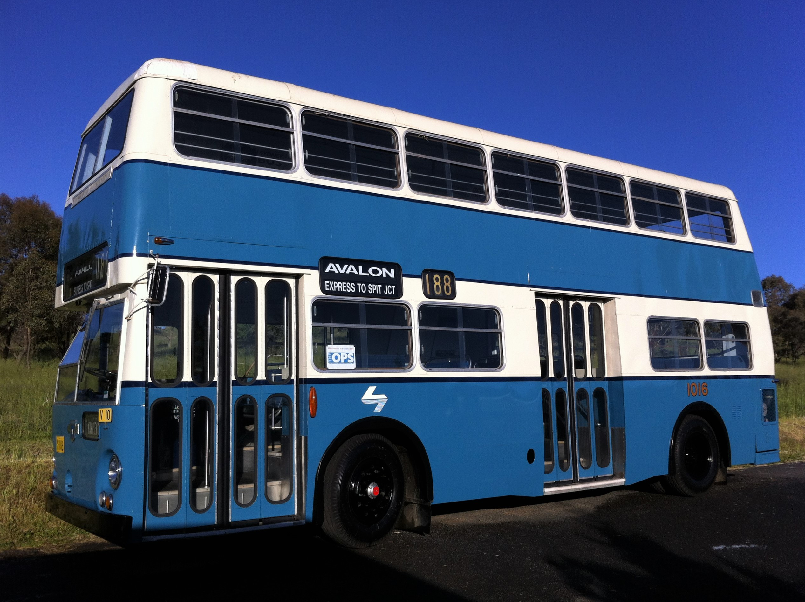

**The Omnibus Preservation Society (T.O.P.S.) is delighted to report that our contractor completed the suspension overhaul of ex-Public Transport Commission Leyland Atlantean 1016 on time and on budget.**

The overhaul became necessary because the double-decker bus was leaning heavily to the near side, causing considerable angst to the society when people leaning out the top deck windows came precariously close to power poles, shop awnings, etc.

The front and rear springs of the bus were removed and reset to Leyland's original specification for the Sydney Atlanteans. The spring packs were then powder coated for durability and new shackle pins installed. Thanks to Fearne's Coaches of Wagga, the society has many new Leyland parts that were donated to us when the bus business was sold.

1016 is the flagship of the T.O.P.S. fleet, loved by the community and members alike, and highly popular on heritage bus experiences. The bus now rides superbly and, more importantly, is much safer to operate.

The society would like to thank RAHS and THNSW for the opportunity to make these essential repairs, allowing us to continue the thrill a double-decker bus ride gives our community.

1016 stands proud and tall after its overhaul.

*This article was originally published in the autumn 2019 edition of the sector report. Written by Ron Ison.*
