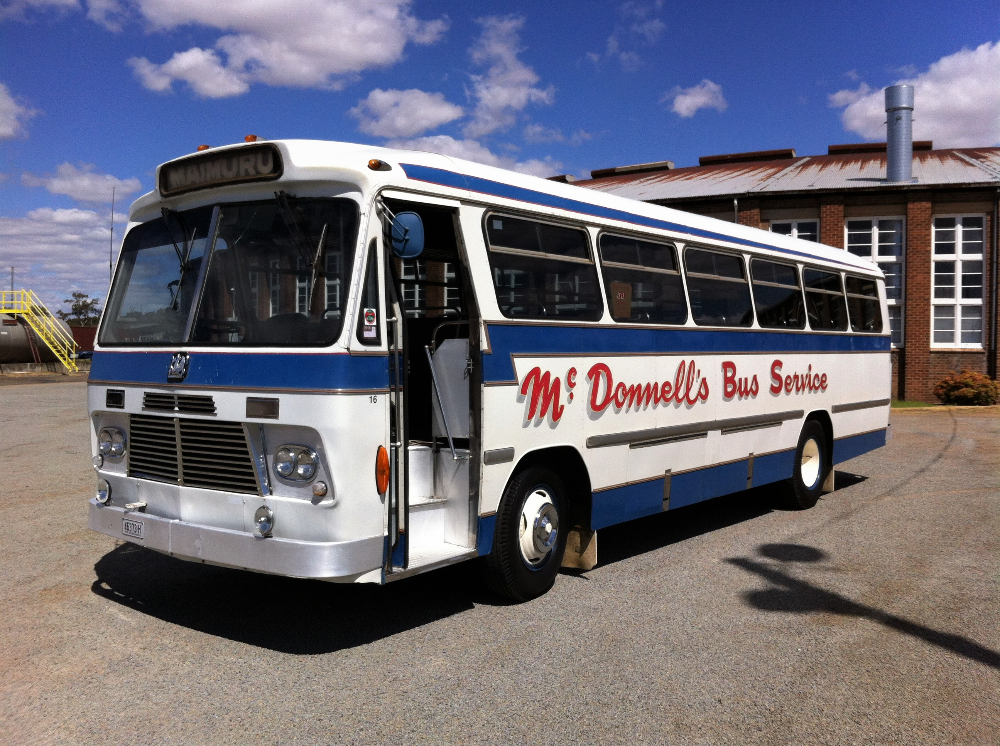

**The latest addition to the Omnibus Preservation Society's (T.O.P.S.) fleet is a 1969 Bedford VAM 70 with a Custom Coaches body.**

Kindly donated by McDonnell's Bus Service of Young in NSW, the Bedford had been kept by Les McDonnell after he sold his bus business due to his fondness of the vehicle.

Bought new in September 1969, the Bedford (registered MO5456) is completely in original, as delivered condition. Incredibly, the bus retains its original engine and gearbox, factory paintwork, rubber flooring and untouched, immaculate red upholstery.

This could be the most well documented bus in preservation today. Every registration paper from new, all heavy vehicle inspection records, plus original purchase receipts from dealer John A Gilbert are intact. All delivery handbooks and official Bedford workshop manuals have been faithfully retained.

Department of Motor Transport maps and service records of the school runs in the Young district that MO5456 performed reliably for 33 years have been carefully preserved and kept as part of the history of this bus.

The society intends to leave the bus with its original patina, only regular servicing, safety checks and cleaning will be necessary. Driving this bus today is a trip back to 1969 and we look forward to engaging the community with heritage bus rides in this most significant vehicle.

5456 located at T.O.P.S. base.

*This article was originally published in the autumn 2019 edition of the sector report. Written by Ron Ison.*
