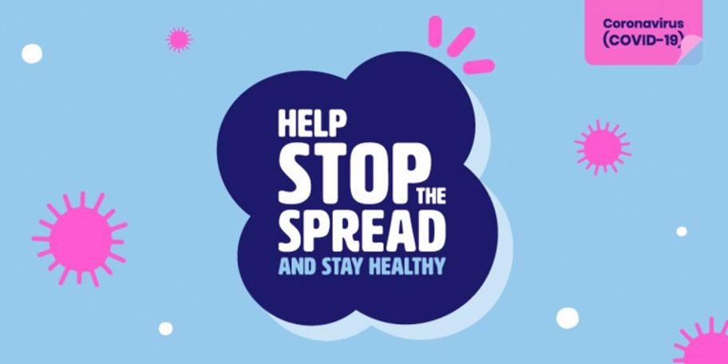

**Transport Heritage NSW continues to work within the guidelines and advice provided by the State and Federal governments in managing risks associated with the current novel coronavirus (COVID-19) outbreak.**

**Effective from Tuesday 24 March 2020, the NSW Rail Museum will be temporarily closed to the public until further notice.**

This is in addition to previously announced measures including:

* The temporary suspension of all passenger heritage train operations, including Steam Train Weekends at the NSW Rail Museum.
* The temporary suspension of all dedicated public programming at the NSW Rail Museum, including large events, onsite learning programs, guided tours, along with all school holiday and vacation care activities.
* The temporary closure of the Valley Heights Locomotive Depot Heritage Museum to the public.

**Customer refunds**

As previously announced, customers who have purchased tickets for any of our upcoming events, including *Steam Train Weekends, Blue Mountains Flyer* or*Day Out With Thomas*, will be automatically refunded in full.

Please direct any ticketing or group booking inquiries to our customer service team on 1300 11 55 99 or [customers@thnsw.com.au](mailto:customers@thnsw.com.au)

**Keeping you informed as advice changes**

We will continue to monitor the situation and take guidance from the relevant authorities and will respond promptly to any new information or advice.

We encourage you to keep updated by following our social media channels and regularly checking the THNSW news page: [www.thnsw.com.au/news](http://www.thnsw.com.au/news)

*Thank you for your cooperation and understanding.*

For more information on government updates related to COVID-19, please visit the Department of Health [website](https://www.health.gov.au/news/health-alerts/novel-coronavirus-2019-ncov-health-alert) or call the National Coronavirus Health Information Line: 1800 020 080.
