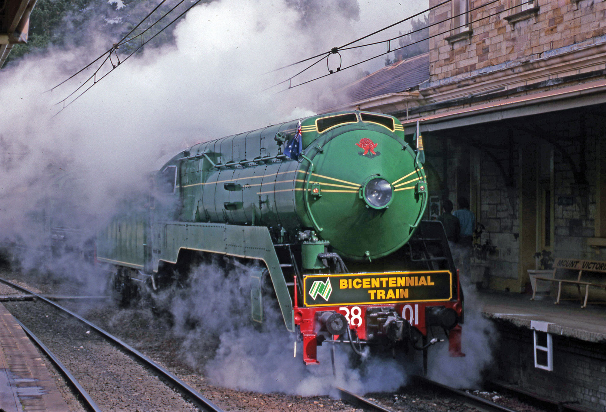
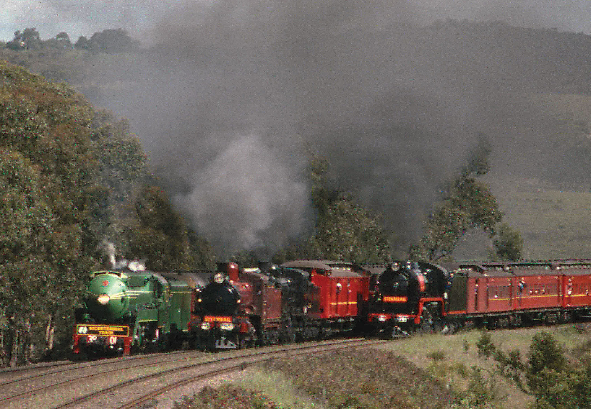

**In October 1984, the Railways of Australia Committee, comprising the chief executives of each of Australia’s five railway systems, considered how the railways could celebrate the Australian bicentenary in 1988.**

David Hill, then Chief Executive of the State Rail Authority of NSW, told of plans to restore 3801 to service and suggested that a train hauled by the engine could visit each of the mainland state capitals. He envisaged an exhibition depicting the history of rail in Australia could be conveyed on the train. The chief executives agreed in principle, but the proposal was later modified so that passengers could be carried on each of the train’s journeys.

A working party was formed and preparations for the Bicentennial Train were made with the plan for 3801 to do the lion’s share of the work. Each interstate journey would originate in Sydney and responsibility for service of the locomotive would be carried by NSW.

Locomotive 3801 had been withdrawn from regular traffic in 1967, but an appeal by the NSW Rail Transport Museum (forerunner of NSW Rail Museum) saved the engine and it was restored to working order. It operated tour trains throughout NSW and, in 1970, made the first east to west crossing of the continent by a steam engine. The tours took their toll and 3801 became a static exhibit at Thirlmere in 1976.

The proposal by David Hill saved 3801 from its static state and it was taken to the Newcastle State Dockyard where apprentices at the Hunter Valley Training College carried out the restoration. The main problems encountered were the firebox and the boiler. A new firebox was designed and fitted with the new boiler. The boiler pressure was reduced from 245 psi to 215 psi.

On 15 November 1986, engine 3801 steamed out of the Dockyard ready for return to service.

A company, to be known as 3801 Limited, was formed to operate tourist and historic trains. The Board consisted of representatives of State Rail, the Museum of Applied Arts and Sciences, the Australian Railway Historical Society and the NSW Rail Transport Museum.

The Bicentennial Train hauled by 3801 and 5910 passes through Mount Victoria in the early days of its journey to Perth. It is seen here on 27 April 1988. -David Oram

The planning committee realised that 3801 would need assistance over steep grades on some trips and express passenger engine 3642 was chosen for the job. For the last tour, 3642 was not available and 2-8-2 goods engine 5910 was used.

The Bicentennial Train consisted of the following engines and rolling stock:

* 3801 – To work all tours
* 3642 or 5910 – To assist when required
* L 1178 – Water gin
* L 1174 – Water gin fitted with pumps
* L 516 – Crew van
* LHY 1516 – Parts van
* FS 2017, FS 2133, MFE 1858, MCE 582 – Passenger accommodation
* FNR 2185 – Buffet car
* BV 485 – Lounge car
* MBE 62, MCE 114 – Passenger accommodation
* MHS 1863 – Guards van with passenger accommodation

In preparation for the interstate trips, 3801 made a special trip to Newcastle and return on 15 February 1988. The purpose of the trip was to test the efficiency of the petrol driven water pumps on the water gins and to have the tender drawgear renewed.

The first capital city to be visited was Canberra on 13 March. Locomotive 3801 hauled the train to Campbelltown where 3642 joined the train to assist with the heavy grades ahead. At Goulburn, the water was topped up and the locomotives swapped so that 3801 was leading. This was the first time a 38 class worked the Canberra branch and crowds were enthusiastic in welcoming the train along the branch.

At Canberra, thousands thronged the station and nearby roads, and ample time was given to the crowds to inspect 3801 and 3642.

From 15 to 19 March, the train ran shuttles to Queanbeyan and Goulburn. On March 20, the train departed Canberra for Sydney, ending the first of the capital city visits.

The trip to Perth was the longest made by the Bicentennial Train. The return journey was meant to be 37 days and 3642 was prepared to assist on the journey to Broken Hill. The train departed Sydney at 8.20am on 27 April and headed to Penrith, where electric locomotive 4623 was attached to assist the train to Katoomba. The train arrived in Perth on 5 May.

Despite problems with the engine approaching Perth, repairs were undertaken by Midland Workshops, and 3801 undertook a trial and was passed fit to return to work on 15 May.

On 16 May, the Bicentennial Train left Perth for the return journey and arrived in Adelaide four days later. On arrival in Adelaide, 3801 was washed, polished and made ready for departure for Peterborough on 22 May. The train spent another 14 days running tours out of Adelaide before departing for Sydney on 31 May.

When the train arrived in Parkes on 2 June, 3642 was waiting to assist 3801 to Sydney. The train arrived in Sydney’s platform 2 four minutes early on 3 June.

There was a short hiatus in Bicentennial Train tours after arrival back from the longest journey any steam locomotive had ever undertaken in Australia.

It was not until 16 September that 3801 and the Bicentennial Train departed on its next journey. This time in pouring rain, the crew and passengers headed north to Brisbane. The train departed Sydney at 8.30am with 3801 and 3642 at the helm. The train spent the evening at Taree before departing for Casino. Short stopovers were made at Kempsey, Coffs Harbour and South Grafton.

Departing Casino on 16 September saw a one-hour stop at Kyogle for morning tea before the train entered the spiral at Border Loop and then Border Loop tunnel and into Queensland. The train arrived in Brisbane 14 minutes early at 2.30pm.

Another two weeks were spent in Queensland running tours from Brisbane before the train departed for Sydney on 3 October.

The Bicentennial Train’s last tour was to Melbourne and on this trip the train was to involve the British 4-6-2 Flying Scotsman if it arrived in Sydney in time. Unfortunately, the ship bringing Flying Scotsman to Sydney would not dock until 16 October. The shipping company guaranteed the locomotive would be on the rails by noon that day. The Bicentennial Train was due to depart Sydney on 15 October.

Locomotive 3642, which had assisted 3801 during the tours, was unavailable due to a mechanical problem and 5910 was pressed into service to assist 3801 from Campbelltown to Wagga Wagga. The train departed at 7.33am with 3801 hauling the load to Campbelltown, where 5910 was waiting to couple to the front of the train.

The train entered Victoria on 16 October and, after stops at Albury and Wodonga, a parallel run with Victorian 4-6-4 R class 761 and vintage cars was made all the way to Melbourne. The first tour for the Victorian leg of the journey was not until 18 October, so time was spent relaxing in the southern capital.

The triple run of 22 October provides a magnificent view for the thousands who crammed every vantage point. On the left, 3801 on the standard gauge, then D3 639 and K 153 running 'wrong road', and R 761 on the right. -Ian Dunn

Two trips to Seymour filled the two days until Flying Scotsman arrived in Melbourne. On 22 October, a triple run was planned with 3801, VR R 761, and double-headed D3 639 and K 153. The three trains set off together for Seymour. An unfortunate derailment at Seymour to R 761 during shunting saw two of the trains diesel-hauled back to Melbourne. The R Class (761) took its cars back to Melbourne after it was re-railed.

On 23 October, a display of Victorian and New South Wales steam and diesel locomotives, as well as Flying Scotsman, drew huge crowds to Spencer Street. After another trip to Seymour for 3801, the train took a break until starting the return journey to Sydney.

The Bicentennial Train departed Melbourne for Albury on 29 October and arrived back in Sydney on 30 October. Locomotive 5910 was attached to the train at Wagga Wagga with 3801 to lead the train home after 23,973km.

***References***

*Diary of the Bicentennial Train, Tony Gogarty and Ron Preston, Eveleigh Press, 1990.*

*This article was originally published in the spring 2018 edition of Roundhouse magazine. Written by John Casey, Roundhouse Editor.*
