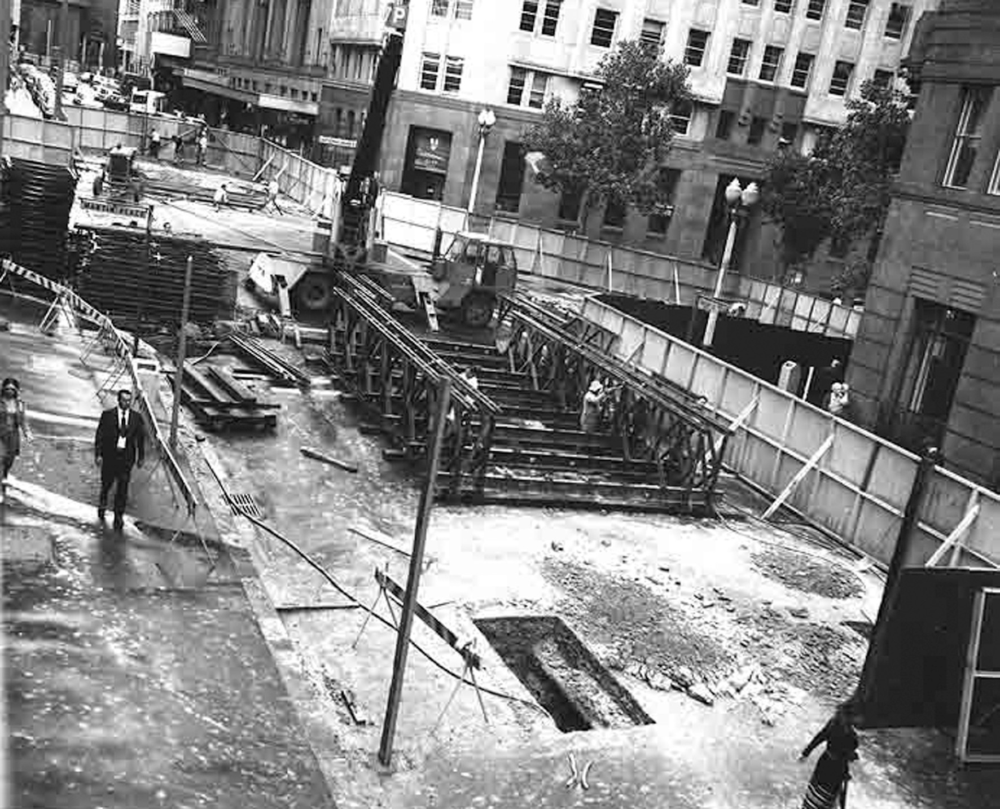
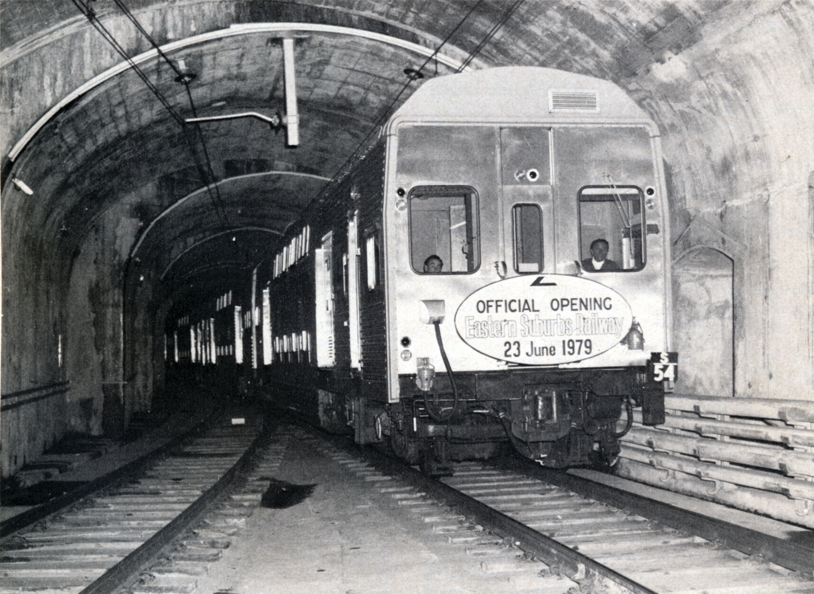

**The idea of a railway serving the eastern suburbs inspired generations of planners and politicians, and sparked a number of Royal Commissions and committees of inquiry.**

Back in the 19th century, the Sydney railway terminal was called Redfern, which was located on what was the southern side of Devonshire Street. (Redfern Station, as we know it today, was called Eveleigh.)

The first proposals for an eastern suburbs line were associated with demands that the rail terminal be extended into the city proper. But in those years, and for many years after), Sydney provided only a quarter of the population of New South Wales and the politicians of the day were aware of what this meant to them.

A typical view was that of John Sutherland, Minister for Works, when in 1868 he was asked to extend the railway from Redfern into the city. Although representing the electorate of Paddington, where the voters favoured a railway, he pointed out that the amount needed to build a railway from Redfern into the city centre would be enough to extend the Western line from Bathurst to Orange.

Sutherland's priorities were borne out by events; the railway reached Orange in 1877, but did not get to St James until 1926.

Strong opposition also came from powerful country interests and the first suburban railways could only get Parliamentary approval if they formed part of a line to the country.

The first suburban railway – nine miles from Redfern to Hurstville – was opened in 1884 and reached Waterfall two years later. The Strathfield to Hornsby line was opened in 1886 and extended to Hawkesbury River shortly after. Both lines were proposed to Parliament on the basis that they formed part of the Illawarra and Northern lines, but there was no way in which an eastern suburbs line could be part of a country service. Another limiting factor was the small population of the eastern suburbs – and numbers are important if a city railway is to be viable.

In 1871, the suburbs of Paddington, Woollahra, Waverley and Randwick contained only 11,000 people. Twenty years later, their population had risen to only 45,000.

Waverley, for example, had shown a population increase of 300 per cent to 9,000 over the ten years to 1891, living in 1,900 houses. But only one-fifth of its area had been built on.

The first real attempt to persuade Parliament to provide public transport for the eastern suburbs came with a draft bill of 1873 to authorise the building of a horse-drawn tramway from Redfern to the city and to the eastern suburbs. This was passed on to a sub-committee for consideration and there it was lost – the fate of many proposals over the years to come.

However, given the cost-saving option of building a tramway system to link the city with the eastern suburbs, the Government of the day was quick to seize it.

Despite opposition from private transport operators, the Tramways Extension Bill was passed early in 1880. The first line from Liverpool Street to Randwick Racecourse was opened in September 1880, with an extension to Randwick in March 1881 – the same month as the Darlinghurst–Ocean Street line came into service. The tramway network gradually spread across the suburbs, reaching Bondi Beach in 1894, Rose Bay in 1898 and Watsons Bay in 1909.

Despite the success of the trams, a rail link continued to be urged on a series of reluctant governments. In 1890, a Royal Commission proposed the building of a city terminal and the extension of four tracks into the city terminating at Circular Quay, with provision for an extension to the eastern suburbs. But no action was taken – nor was there any action after another Royal Commission made similar suggestions in 1896.

Central Station was built in 1906, but the agitation for a city and eastern suburbs railway continued, and plans continued to be drawn up and pigeonholed.

In 1915, Parliament approved a proposal for a city and eastern suburbs railway drawn up by Dr J.J.C. Bradfield, Chief Engineer, Metropolitan Railway Construction. This entailed the building of the present City Circle loop, with provision for a rail link off this line to the eastern suburbs via a tunnel beneath the Domain and a viaduct over Woolloomooloo to Kings Cross.

There were to be stations at Glenmore Road, Paddington; a site near Elizabeth Street, Paddington; Woollahra; Bondi Junction; Waverley; Little Coogee (near Frenchman's Road, Randwick); Coogee (near High Street and Belmore Road); Daceyville; Rosebery; and Waterloo, linking with the Illawarra line near Erskineville Station.

The visionary Dr Bradfield, planner of the Sydney Harbour Bridge, foresaw an extension from Bondi Junction to Watsons Bay and an inner loop between Central Station and Daceyville, with stations at Moore Park (serving the Sydney Cricket Ground, Sports Ground and Showground) and at Randwick Racecourse.

During the 1920s, work continued on the city railway to complete the Town Hall–Wynyard link in time for the opening of the Sydney Harbour Bridge, but the eastern extensions still languished despite regular demands for the work to begin. After paying for the city railway, the government of the day could not find the funds to extend the work.

The eastern link of the city railway was opened on 20 December 1926, with stations at Museum and St James. St James was constructed with four platforms, two of which were to be used for a future railway to the eastern suburbs. Until the City Circle railway was completed in 1956, St James was used to terminate trains from the Bankstown, East Hills and Illawarra lines.

The western side of the city was serviced by stations at Town Hall and Wynyard, which were opened on 28 February 1932 to coincide with the opening of the Sydney Harbour Bridge on 19 March 1932.

A 1946 plan for an eastern suburbs railway included two new tracks from Sydenham to the City, which were to be known as the Illawarra Relief Lines. These lines were planned to continue to Bondi Junction, which would give the eastern suburbs line a city connection. The system was designed to cope with anticipated increases in railway patrons from the Illawarra line. However, seven years later, the demand had not occurred and the railways did not have sufficient rolling stock to provide services.

Part of the announcement of the 1946 plan was that the eastern pair of lines from Sydenham to Erskineville would be diverted into a tunnel beneath Alexandria goods yard and on to Bondi Junction.

By the early 1950s, the NSW Railways had decided that patronage on the Illawarra line would not justify the expenditure on these new tracks and it was decided they were no longer needed or justified.

In 1947, an Act was passed authorising completion of the City Circle and railway extensions into the suburbs, including the eastern link, which provided for a station at Martin Place with a line going on a viaduct over Woolloomooloo to Kings Cross and eventually to Bondi Beach. Another line was to go out from St James via Taylor Square and the Cricket Ground to terminate at Kingsford, with a further extension from Taylor Square via Paddington, Woollahra, Bondi Junction, Waverley, Bronte and Clovelly to Coogee.

Work proceeded slowly until 1952, when a recession caused the Government to order a halt. By this time, tunnels had been driven from the Domain to a point beneath Rowe Street; the Chalmers Street excavation had been completed; tunnels had been driven a short distance from a shaft in Prince Alfred Park; and some of the work at Erskineville and Redfern had been carried out.

In 1962, the Government commissioned a report from overseas experts De Leuw Cather and Company, which recommended that the line be completed basically on the earlier route to Bondi Junction thence proceeding to Kingsford.

On 1 May 1965, a Liberal-Country Party Government was elected under the leadership of Robert Askin and announced that the intention was to commence work if the railways were ready. Transport Minister Milton Morris announced on 18 March 1966 the Government’s intention to commence construction, which would take 10 years at a cost of $70 million. No work took place until the government announced on 4 October 1966 that $500,000 had been allocated to the project.

Nothing was done on the De Leuw Cather report until 1967, when an Act covering work on the proposal was passed and work actually began. Finally, on 28 February 1967, it was announced the project would resume at a cost of $85.3 million.

The line was to be independent of the rest of the system except for a single line connection from Erskineville to Central. The final plan was for the line to pass beneath the city and out to Bondi Junction, instead of Waverley, then on to Kingsford where it would terminate. Stations would be located at Chalmers Street (Central), Town Hall, Martin Place, Rushcutters Bay, Edgecliff, Woollahra, Bondi Junction, Charing Cross (Waverley), Frenchmans Road (Randwick), University of NSW and Kingsford. Bus / rail interchanges were planned at Edgecliff, Bondi Junction, Randwick and Kingsford. The line would be operated by double-deck trains with automatic doors.

It was planned to have the line opened to Edgecliff by 1973, Bondi Junction by 1974, Randwick by 1976 and Kingsford by 1977.

In January 1968, tenders were called for twin tunnels under Kings Cross from McElhone Street, Woolloomooloo, to Hartford Place, Rushcutters Bay, which was a distance of 550m. The work included construction of Kings Cross Station. The contract was let on 9 June 1968 to Pearson Bridge Pty Ltd in partnership with Roberts Construction Co Ltd of South Africa. The contract was to be completed in 600 days at a cost of $2.2 million. Construction began from each end and was completed on 3 June 1969.

Demolition work then started in Woolloomooloo for the construction of the viaduct, which began early in 1970. The Railway Commissioners decided that the station at Rushcutters Bay was not required and it was abandoned on 17 June 1970.

A consortium of Italian companies won the $8 million contract for the construction of the tunnels from Chalmers Street to Martin Place. At Edgecliff, plans for a bus interchange and eight-storey office building were well underway.

By early 1972, rising costs started to bite into the state government’s funds. Land acquisitions and the new double-deck carriages pushed the cost of the new railway to well over $130 million, according to Milton Morris. At the same time, he questioned whether the line should be extended beyond Bondi Junction.

Estimates in late 1972 put the cost of completing the line to Kingsford at $155.5 million, of which $53.2 million would be the cost of the section from Bondi Junction to Kingsford. The fleet of 106 double-deck carriages would cost $17.5 million.

On 29 June 1972, a 175-tonne rotary boring machine commenced working through the sandstone from Woollahra to Edgecliff. The boring machine worked at the rate of 2.74km and hour, 24 hours a day. Despite local residents successfully stopping the boring from 10.00pm to 6.00am, Edgecliff was reached on 26 September. One month earlier, the down tunnel was completed from the Domain to Chalmers Street.

A $17 million tender was accepted by Commonwealth Engineering (Comeng) on 13 July 1972 for 54 motor cars, 42 trailers and 10 driving trailers. The first of these vehicles were placed in service in November 1973.

In October 1972, the NSW Government put rail, bus and ferry services under the newly formed Public Transport Commission (PTC). The PTC also took over as constructing authority for the Eastern Suburbs Railway (ESR). In September 1972, the Transport Minister had admitted that the cost of construction of the railway was now over $200 million. It was also announced that the line would open to Edgecliff in late 1974, Bondi Junction in 1975 and Kingsford in 1977-78. At this time, no work had been carried out beyond Bondi Junction.

At the Erskineville end of the line, the first junction points to connect the new line to the rest of the system were ready for use on 10 July 1974. This allowed two 73 class diesels (7342 and 7343) to deliver rails, sleepers and other equipment, as well as special overhead wiring trains.

During the State election campaign of 1976, the Liberal government pledged to continue much needed upgrading of the main system before funds could be released for the ESR and they announced the line would terminate at Bondi Junction. The Labor party did not specifically mention the ESR.

The Labor party was voted into power on 1 May 1976 with Neville Wran as premier. Peter Cox, Minister for Transport, appointed a board of review to inquire into the future of the ESR. The board was to report back in 13 weeks on whether construction should be continued to Bondi Junction or abandoned. The cost of the line to Kingsford had risen to $250 million, three times to original estimate. The rails had been laid from Erskineville to Martin Place and wiring and signalling was underway.

Construction underway at Martin Place. -NSW Railway Archives

The result of the review announced by the Minister was that the line would terminate at Bondi Junction and the extension to Kingsford be abandoned. Woollahra Station would not be built, saving $3.4 million, and shops at Martin Place and Bondi Junction would not be built. The estimated completion was $164.4 million with a completion date of 1980-81.

Several excursions by interest groups were conducted over the line from 29 October 1976, one trip being organised by the Australian Railway Historical Society in 1978 with 70-year-old end platform cars hauled by the two 73 class diesels.

Due to rust build up on the rarely used line, tramcar 134S, on loan from the Sydney Tramway Museum, was used to grind the tracks. This tram was D class car 102, built in 1899 and converted to a track scrubber in 1930. It towed its own power unit on a truck. The overhead wiring was completed and energised for testing on 23 October 1978. The first test train departed Flemington Car Sidings at 8.52am via Enfield and entered the new line at 9.40am. It spent five hours testing the line and returned to Erskineville at 2.30pm.

When it appeared the ESR would open early in 1979, it was discovered there were not enough carriages to provide the services. Industrial disputes during 1978 reduced the number of electric motor cars available by 50. The new cars being delivered by Comeng and Goninan Ltd were running late and Comeng had slowed production in order to maintain its workforce.

A new signalling centre was involved in an industrial dispute and a decision was made to operate the line isolated from the rest of the system. At Erskineville, the points had to be hand worked. Several other industrial disputes disrupted proceedings until Premier Neville Wran visited the ESR on 24 March 1979 and announced the opening date as 23 June that year.

The ESR was officially opened by Neville Wran at 10.30am at Martin Place and the official party travelled to Bondi Junction, where another ceremony took place. The party then returned to Martin Place for a luncheon on the concourse. From 12.30pm, Sydney had its opportunity to travel free on the new line. On the following day (Sunday), free travel was also available. In 1.5 days, 250,000 passengers travelled on the line. On Monday 25 June at 4.35am, the first regular passenger train left Central for Bondi Junction.

The official train heads from Martin Place after the opening ceremony in June 1979. The track diverging to the bottom left of the photograph leads to a dead end, which did not see regular use until the Illawarra and Eastern Suburbs services were integrated in 1980. This allowed some services to be terminated at Martin Place. -NSW Railway Archives

Not all the work of past planners was lost in the development of the new railway. The stations are close to the locations envisaged by the engineers and designers long ago, and the platforms at Town Hall, which handle the eastern suburbs traffic, were partly built by Dr Bradfield half a century ago as part of his city and suburban system to cater for a new line he envisaged to serve the western suburbs.

The ESR was one of the largest engineering projects undertaken by the NSW Government at that time and expanded the operations of the metropolitan rail network to serve the densely populated eastern suburbs of Sydney.

The main form of public transport for commuters from this area had, up until the opening, been provided by an extensive bus service since replacement of trams commenced in 1954. However, to keep pace with the increasing peak hour road traffic, the new rail link offered a rail service, which enabled the movement of large numbers of passengers into and out of the city in the quickest possible time with reduced traffic congestion.

**Stations**

New underground stations were built at Redfern, Central, Martin Place, Kings Cross, Edgecliff and Bondi Junction. Initially, Redfern was not used, as the railway was first operated as a shuttle service between Central and Bondi Junction. All the new stations were provided with an automatic fare collection system with ticket vending machines and automatic barriers. Town Hall Station was extended to include additional platforms. Major bus interchanges were provided over the stations at Edgecliff and Bondi Junction.

There are storage tunnels and facilities for terminating trains at Central, Martin Place and Bondi Junction. The new stations were the most modern in Australia, and were bright and attractive with many inclusions, such as studded rubber platforms, special level adjusting P.A. sound equipment, higher quality lighting, closed circuit television surveillance equipment at Martin Place, Kings Cross, Edgecliff and Bondi Junction, and modern amenities and booking office facilities.

**Central**

The new platforms numbered 24 and 25, situated beneath Chalmers Street, are served by four escalators. The concourse provides access to the other electric train platforms, country and interstate trains, and Broadway through the Devonshire Street tunnel.

**Town Hall**

The two ESR platforms numbered 4 and 5 were originally provided for during construction of the City Railway 50 years ago. The previously uncompleted platforms were finished, and four new escalators integrate the new platform with the existing Town Hall system.

**Martin Place**

The new station was designed to cater for the large number of city workers who use it during peak travelling times.

Immediately below Martin Place, between Phillip and Macquarie Streets, is the 'gallery' level and three escalators lead down to the concourse level between Elizabeth and Phillip Streets. From here, six escalators service the station platforms. Entry to the station is via stairs from Martin Place at Phillip, Macquarie and Elizabeth Streets. Ventilating air for the station is drawn from the Domain through tunnels passing under Sydney Hospital.

**Kings Cross**

The station is below Victoria Street and the concourse is entered by an arcade from Darlinghurst Road via three escalators or by stairs on each side of Victoria Street. Four escalators provide access from concourse to platform level.

**Edgecliff**

Edgecliff is one of the two bus / rail interchange stations on the ESR, with an extensive bus deck above the station. From the bus platform, stairways lead to the gallery and thence by stairs and escalators to the concourse area at New South Head Road level. Four escalators lead to the platform level.

**Bondi Junction**

This station is also a bus / rail interchange and terminus for the ESR line. The bus area is above the underground station and provides quick access for rail passengers. Two escalators, complemented by stairs, operate between bus platforms and concourse.

**Tunnels**

From Erskineville to Redfern, twin box tunnels were constructed using the 'cut and cover' method.

Tunnels were driven by the conventional blasting method between Redfern and the Domain and under Kings Cross.

A 179-tonne tunnel boring machine known as the 'Mole' was used to tunnel the section from Edgecliff to Bondi Junction. The tunnels were finished with a concrete lining, varying in thickness from 200mm to 600mm. As tunnels are naturally wet areas, drainage was provided by weep holes in the walls running into drainage systems beside the tracks. The water is directed into pump chambers located at the lower points of the system and pumps are automatically activated as needed to discharge water into stormwater drains. There are four pumping stations on the ESR system.

During construction, it was necessary to support city building footings. Some of this work was extensive and involved major support with massive steel beams.

The railway was tunnelled up to 30 metres below ground level and the line travels beneath the earlier constructed City Circle railway.

**Viaducts**

Viaducts were constructed at Woolloomooloo and Rushcutters Bay. With the exception of a small open section at Woollahra, these are the only outwardly visible signs of the railway line.

The Woolloomooloo viaduct, a post-tensioned reinforced concrete structure of precast segmental construction, crosses the Woolloomooloo Valley as one continuous beam supported by nine concrete piers and two abutments. The Rushcutters Bay viaduct is of similar design with the addition of a spectacular portal frame structure passing over the roadway.

Noise on both viaducts was minimised using continuously welded rail with cork / rubber pads between the sleepers and rail base. Acoustic parapets to absorb sound were built on either side of the viaducts.

**Services**

Initially, a shuttle service was provided between Central and Bondi Junction. Services will be integrated with the Illawarra Line with the new underground Redfern Station being brought into service.

Illawarra Line trains join the ESR line at Erskineville and trains of up to eight cars operate on the line. Passengers travelling to or from other metropolitan lines can change trains at Redfern, Central and Town Hall for connecting services with the Eastern Suburbs Railway.

The diversion of Illawarra trains into the Eastern Suburbs system relieved pressure and improved reliability in the City Circle underground.

A few South Coast peak hour services have been diverted from Central to the ESR with some terminating at Martin Place and others continuing through to Bondi Junction.

Journey times on the Eastern Suburbs Railway are approximately 11 minutes between Central and Bondi Junction.

Train services being provided between Central and Bondi Junction offer a five-minute frequency throughout the day, Monday to Friday from 7.30am to 6.30pm. Outside these times, a 10 to 15-minute service operates. Trains do not run on the ESR between midnight and 5.00am, but buses run through to the city between these times.

Basically, Eastern Suburbs bus services in the bus feeder areas operate to and from the interchange stations at Bondi Junction and Edgecliff, where passengers change to and from city trains.

**REFERENCES**

Eastern Suburbs Railway, I.A. Brady, ARHS, 1797.

The Story of the Eastern Suburbs Railway, Public Transport Commission of New South Wales, 1979.

*This article was originally published in the winter 2019 edition of Roundhouse magazine. Written by John Casey, Roundhouse Editor.*
