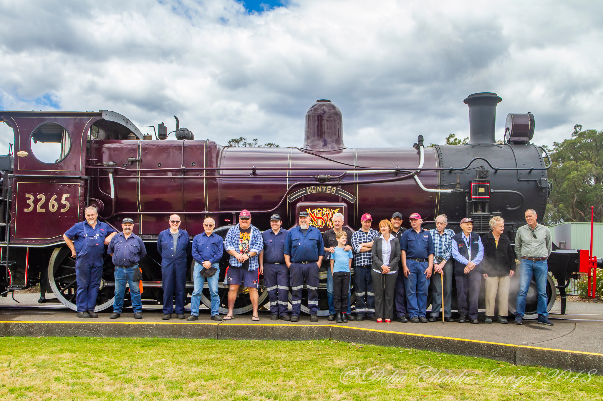

**The P6 was designed in 1891 by William Thow, Locomotive Superintendent of the NSW Government Railways (NSWGR), in collaboration with Beyer, Peacock & Company, who built the first 50 during 1891 and 1892. They entered service on all main lines in 1892 and 1893 at a cost of £3,742 each, replacing the D, H and C classes on express trains. After a year in service, more P class were needed. Between 1901 and 1911, Beyer, Peacock & Company supplied another 56 locomotives, the Baldwin Locomotive Works 20, Clyde Engineering Company 45 and the NSWGR Eveleigh Workshops 20.**

They formed the standard main line power until the arrival of the 36 class in 1925. As built, they had 5'0" coupled wheels, 20” x 26” cylinders, 160 psi boiler pressure and a tractive effort of 22,200lb. Total weight with a six-wheel tender was 88 tons 7 cwt. All batches except the first were built with bogie tenders, increasing their weight to 98 tons, or 101 tons 12 cwt in the case of the Baldwin-built engines.

As a result of trials, all the P class were superheated and fitted with piston valves between 1914 and 1939. From 1933, a number were fitted with new and heavier frames.

The P class became the 32 class in the 1924 reclassification.

The first engine withdrawn was 3264, which featured in the Centenary of NSW Railways Exhibition of 1955 and was condemned following an accident in 1956. Wholesale withdrawal did not start until the early 1960s. The 32 class outlived three types of engines built to supersede them.

Four engines were set aside to be preserved – 3203 and 3214 by the NSW Rail Museum (NSWRM), 3237 by Lachlan Valley Railway and 3265 by the Museum of Applied Arts & Sciences (MAAS).

The staff and volunteers who worked on the 3-year mechanical overhaul of 3265. The locomotive was originally restored by the Museum of Applied Arts & Sciences (MAAS) in 2009. However, it required a recent mechanical overhaul completed by Transport Heritage NSW and MAAS. -Delta Charlie Images

Locomotive 3203 was placed in service on 3 February 1892 and was the first of the class to enter traffic. It was withdrawn and condemned in 1967, to be used for special workings only, but it saw some service on the Richmond line during 1969.

Locomotive 3214 was placed in service on 15 June 1892 and withdrawn in early 1970 after being allotted to Goulburn, Enfield and Broadmeadow towards the end of its service life. It was the intention of the museum to paint 3214 in the maroon livery carried by some 32 class during the mid-1930s.

Locomotive 3265 entered service in January 1902. In 1933, the engine was painted maroon and carried the *Hunter* name plates from 6 July 1933 until 19 March 1935, when the name was transferred to 3608.

A 32 class locomotive, 3229, hauled the last regular steam-hauled passenger service on the NSW railways on 31 December 1971.

In all, there were a total of 191 members of the 32 class, and they hauled passenger, mail and goods trains over a varied career that spanned eight decades, two world wars, two depressions and the post war boom. Some of the reasons for the locomotive’s longevity may lie in the fact that the 32 class were popular with train crews, being good steamers and capable of a ‘good turn of speed’. Furthermore, mechanical staff found them simple and easy to maintain and repair, while administrators considered them economical to run and failures were infrequent.

They were so versatile that the 32 class could work anything from express trains to mixed traffic and even shunting. Their finest role was hauling the Royal Train for the visit of the Duke and Duchess of Cornwall and York for the opening of the first Commonwealth Parliament in 1901.

The classic design features and outstanding operational record of the class symbolises the successful transfer of British locomotive engineering to Australia in general and NSW in particular.

**References**

*Steam locomotive No. 3265* (2018). Museum of Applied Arts & Sciences. Accessed 19 ‎November 2018 at https://ma.as/87855.

*Standards in Steam: The 32 Class*, R.G. Preston, 1987, NSW Rail Museum

*Roundhouse*, various issues, NSW Rail Museum

*This article was originally published in the summer 2019 edition of Roundhouse magazine. Written by John Casey, Roundhouse Editor.*
