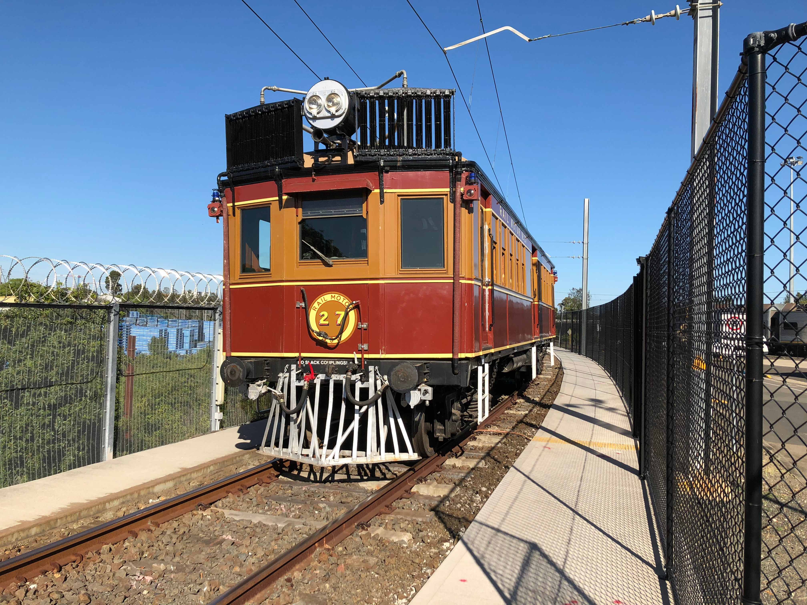
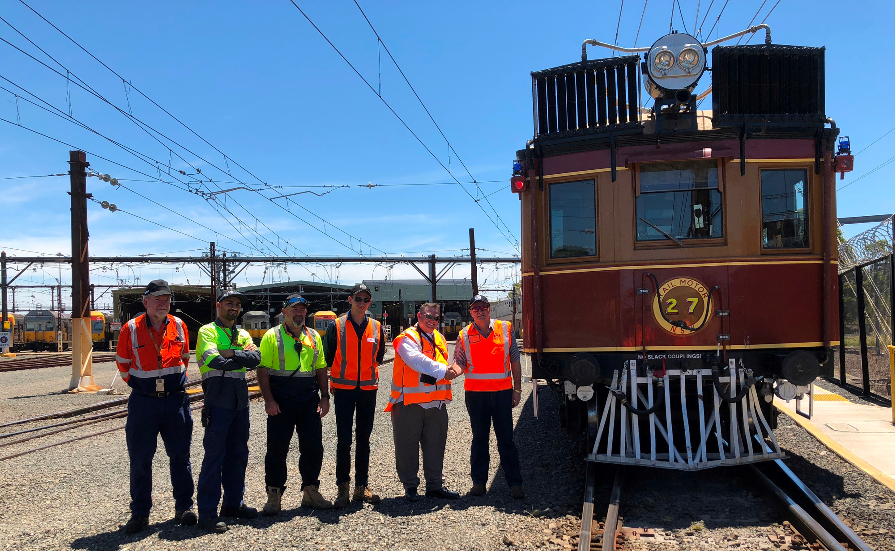

**Flemington Maintenance Centre Family Safety Day**

**Sydney Trains recently enlisted the help of Transport Heritage NSW for the hire and use of railmotor CPH 27. This was for the purpose of providing observation rides around the Flemington Maintenance Centre precinct during a planned Christmas open day of the maintenance centre on 8 December 2018. The event was on offer for Sydney Trains employees and their families, a good showcase to see otherwise unhidden parts of a working maintenance depot.**

The day before, CPH 27 made the transfer run from Thirlmere to Flemington using the South Sydney Freight Line and stabled overnight in the maintenance centre.

CPH 27 on the rails. -Stephen Pieri

An area of the maintenance centre was blocked off for the event to take place. Arrangements were made with barbecue food stalls, jumping castles, a petting zoo and show bags on offer, as well as Santa performing family photos. The vintage electric F1 along with an ‘S set’, new second generation ‘B set’ and interurban ‘V set’ were on display.

To complement these activities, CPH 27 was on offer starting in the middle of the depot with a temporary platform set up for easy boarding. Its ‘shunt’ run took patrons from the event area to the operational areas of the yard, safely contained within the railmotor. Views of the depot were easily accessible from the railmotor, seeing facilities such as the lift shop, were FMC staff arranged for two Xplorer cars by the wheel mill road and an ‘S set’ motor car lifted on a crane with its leading bogie pulled from underneath it. Before returning into the event area, the railmotor then travelled through the wash shed, seeing what it takes to clean trains. This was all coordinated between the THNSW rostered crew and the ST shunters operating the yard.

CPH 27 at the Flemington Maintenance Centre. -Stephen Pieri

*This article was originally published in the summer 2019 edition of Roundhouse magazine. Written by Fred Sawyer, Rail Operations Coordinator.*
