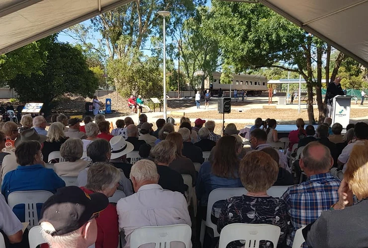
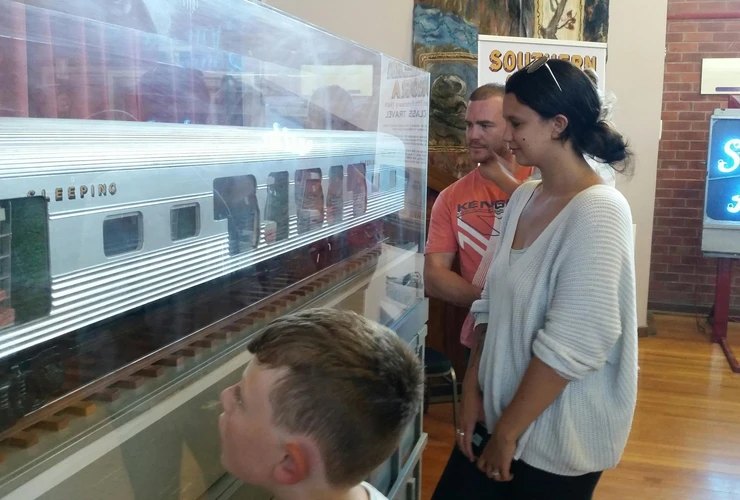

**The 50th anniversary of the *Southern Aurora* railway disaster was commemorated in Violet Town, Victoria, from 7-10 February 2019.**

Transport Heritage NSW was honoured to take part in the occasion by providing the event organising committee (of Violet Town) with the short-term loan of *Southern Aurora* related artefacts. These included the still-functioning electric neon tailboard, two large-scale models of the lounge and sleeping cars made by the NSW Railways, a recorded 2GB radio interview conducted in 1962 aboard the then brand new overnight express passenger train, and other associated ephemera. The objects were on exhibition at the Violet Town Community Complex with an estimated 3,000 people attending the four-day event.

Other formal events organised by the community included a vigil in memory of the nine people who died on 7 February 1969, as well as the official opening of the *Southern Aurora* memorial garden on Sunday 10 February. The memorial garden includes nine newly planted trees in reference to the nine people who lost their lives in the accident. *Southern Aurora* sleeping car NAM 2337 (not involved in the 1969 accident) was placed as a centre piece within the memorial garden, which will now act as a permanent memorial to all those killed, injured and affected by the incident. This new site also includes a one- kilometre walking track from the memorial garden to the scene of the crash.

NAM 2337 was donated to Violet Town by V/Line in 2018 and will continue to be preserved by local volunteers. The NAM carriages are twinette sleeper cars, with compartments to accommodate two people, and were introduced to the public in April 1962. The carriages were one of several types of stainless-steel cars that became a common sight on interstate overnight express travel between Sydney and Melbourne.

**How the 1969** ***Southern Aurora*** **disaster unfolded**

The *Southern Aurora* railway disaster was a head-on collision, which occurred just after 7.00am on 7 February 1969. The passenger train and a goods train were due to pass one another at a crossing loop in Violet Town when, 9.7 kilometres from the crossing, the driver of the *Southern Aurora* suffered a heart attack. The goods train driver had slowed on approach to Violet Town and was ready to enter the loop, but noticed the oncoming train had not done the same. The goods train driver applied emergency braking and started flashing his headlight to warn the other driver.

The two trains collided at a combined speed of over 170km/h, which forced the locomotive of the *Southern Aurora* and several of the goods wagons into the air. Six of the passenger carriages were derailed and one was completely crumpled. The piled-up wreckage was more than nine metres high.

Subsequent investigations into the accident found that the driver of the passenger train, John Bowden (aged 52), had been dead due to cardiac failure for at least ten minutes before the crash. Coroner H.W. Pascoe reported that the real cause of the incident should be attributed to Bowden for continuing in a role he was not well enough to perform.

Bowden knew he had a pre-existing heart condition and was advised by his doctor that he should retire, as he could die at any time. When asked what would happen if he died suddenly at the controls, Bowden replied there would be another crew member qualified to stop the train in an emergency.

There were two other crew members on board the *Southern Aurora* at the time who were qualified to perform this duty, but both failed to act before the collision. As such, Coroner H.W. Pascoe found that the fireman and guard of the *Southern Aurora* were both partly to blame for the incident.

Nine people died and more than 100 were injured as a result of the incident.

The Coroner made several recommendations to avert future disasters, including the introduction of more rigorous medical tests, major changes in warning devices and altering the layouts of some sections of the passenger train. He filed a verdict of death by misadventure for the eight people who were killed in the tragedy and death by natural disease, namely heart attack, on John Bowden.

Attendees gathered for the official opening of the Southern Aurora Memorial Garden, Violet Town. -Chris Fielder

Visitors enjoy viewing the sectioned large-scale model of the Southern Aurora sleeping car on display at the Violet Town Community Complex. -Chris Fielder

*This article was originally published in the autumn 2019 edition of Roundhouse magazine. Written by Chris Fielder, Collections Officer.*
