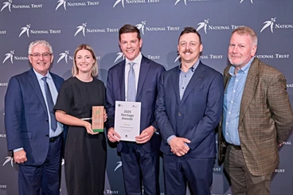

**Transport Heritage NSW is proud to be recognised today in multiple categories at the 2025 National Trust Heritage Awards.**

**Winner – Events Category: Transport Heritage Expo 2024**

Our dedication to preserving and sharing our state’s rich transport history was honoured with a win in the Events category – a huge achievement for our entire team, event partners at Sydney Trains, transport heritage sector organisations, and community of supporters.

**Highly Commended – Education Program**

The NSW Rail Museum Education Program – a testament to the hard work of our education team, who continue to inspire the next generation of rail fans.

**Special Congratulations to Ben Elliot**

We’re thrilled to announce that THNSW Fleet Maintenance Manager Ben Elliot has been recognised with the Heritage Skills Award for 2025 – a well-deserved honour that highlights Ben’s exceptional craftsmanship and dedication to heritage conservation.

**People’s Choice Award: Transport Heritage Expo 2024**

Thank you to everyone who voted for us – your support helped us secure the People’s Choice Award and reaffirms your belief in our mission.

The Heritage Awards is a highlight of the Australian Heritage Festival and run by the National Trust of Australia (NSW) in partnership with the NSW Government. [You can learn more and see the full list of this year's award recipients here.](https://issuu.com/nationaltrustsaustralia/docs/2025_national_trust_nsw_heritage_awards_results_)

Congratulations to all the THNSW team – this is a fantastic reflection of the passion and purpose that drive Transport Heritage NSW forward every day.

