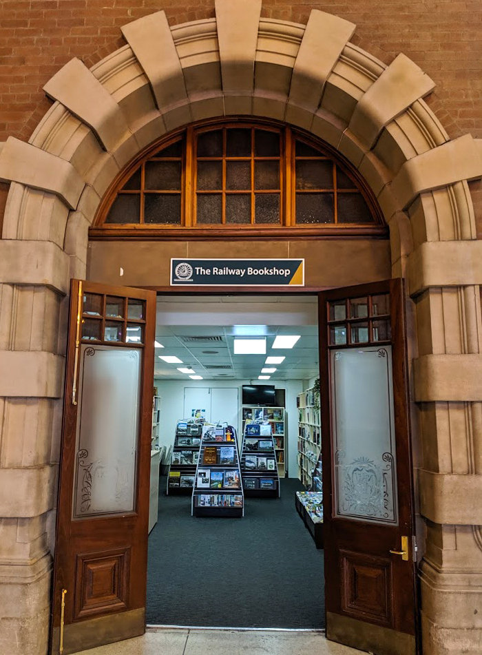

**The ARHSnsw Bookshop has reopened at Central Station after an absence of over five years, with a new location opposite Platform 1 in the northern corner of the Grand Concourse. The bookshop is open Monday to Saturday and still stocks the wide range of books and DVDs ARHS has become known for. The reopening follows several months of work with Sydney Trains, which allowed the bookshop to be open in time for the 2019 Transport Heritage Expo.**

Entrance to the new ARHSnsw Bookshop.

Meanwhile, another exciting project is underway with the organisation moving out of its premises in Renwick St, Redfern, as building work takes place in a new location near South Eveleigh. The aim is to create a headquarters that is a focus for enthusiasts and all who are interested in railway history. It will allow us to consolidate and index all our research materials in a single location and make them more accessible to members and the public, while continuing to be a centre for digitisation and conservation of historic records. This will also help us better serve the rail heritage sector in their efforts to preserve physical assets and tell the story of the railways of NSW. The new building is expected to be open in early 2020.

In the meantime, the Railway Resource Centre has moved to a temporary location at 9/23 Bowden St, Alexandria, where staff and volunteers are still able to help with most research requests and visits for private research can be arranged by appointment.

*This article was originally published in the winter 2019 edition of the sector report. Written by James Dalton, RRC Manager, ARHSnsw.*
