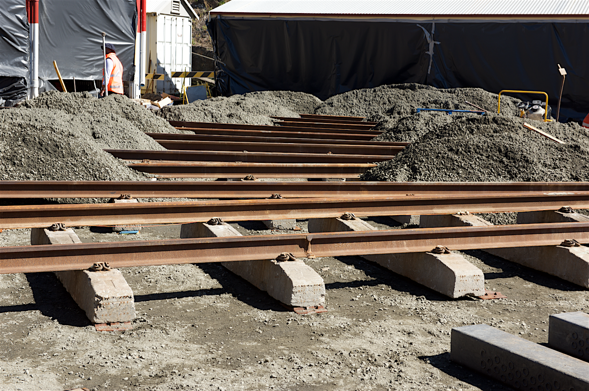

**Visitors to Valley Heights will notice that the forecourt refurbishment has been completed, a project that we are all very pleased with.**

The newly resurfaced forecourt. -Bruce Coxon

The previously uneven surface had rail heads protruding above the bitumen, creating potential trip hazards to our volunteers and visitors. This risk has been eliminated. A smooth surface all round, as well as foam strips in the flangeways, should ensure the safety of all.

The risk of derailment of a locomotive or carriage when entering or leaving the roundhouse has been removed by the replacement of all sleepers below the surface and the replacement of rails that had substantial corrosion of the rail foot, largely caused by the lack of drainage below the bitumen.

There were several challenges along the way, including the issue of how to weld standard 53kg replacement rail to the original, small 41kg rail coming from the roundhouse. This took the specialist welders a bit of time to perfect, but it was skillfully achieved (see below).

41kg rail ready for welding to 53kg rail. -Adrian Dreyer

A completed weld and composite sleeper.

Most rails were replaced, as they were severely corroded. The railways had previously done some rail replacement using transition bolted plates, but the common thought was that drilling new holes through the original rail would produce a weak joint and welding was the way to go. Andrew Tester filmed and creatively edited an informative 12-minute video, which can be found at <https://tinyurl.com/yddcqk4r>.

Concrete sleepers were primarily used throughout the project. However, where the rails converge at the turntable, concrete sleepers were not functional because they couldn’t be cut to length and would foul the adjacent sleepers where they intersect. Timber could have been used, but has a limited working life, so a composite sleeper (made from recycled soft drink bottles) was used that could be cut to length and fixed to the rail with coach screws.

The new compacted roadbase with concrete sleepers installed and composites ready for use. -Adrian Dreyer

An interesting heritage item discovered during the process was the original brick facings to the entrance of the roundhouse roads. The brickwork was installed in 1913 during the depot’s construction. Great care was taken to protect this infrastructure. As you can see, it was an intriguing construction project that took 22 working days to complete. The culmination of two years’ preparation in arranging funding and tenders while heritage approvals from Sydney Trains and the Office of Environment and Heritage took place in order for work to proceed.

The project had a number of issues the team had to resolve:

1. In a prior test dig, a very small amount of asbestos was discovered in the soil below the bitumen. This meant that precautions had to be taken by specialist groups to remove the contaminated soil and it needed to be tipped in a registered facility. Also, all staff, including a skeleton volunteer crew, had to follow strict guidelines on how to be present at the site. The asbestos removal added considerably to the cost and complexity of the project and you will see in the accompanying photos how the site was protected with plastic in order to contain the potential hazard.

2. As with all large projects, dust and vibration from machinary can be a concern, and many volunteers spent considerable time covering and moving exhibits to safe storage locations. Some large exhibits like the Ampol bitumen tanker, single deck interurban trailer car, 5711’s tender and standard goods loco 5461 were moved to allow work to proceed.

3. A section of our shop area was set up as a site office for the safety briefings that occurred every day to ensure no incident or accident occurred. I am happy to say that the whole construction period was injury free, which shows just how seriously safety was handled by the entire team.

4. Site supervision and access was another major issue. A roster was set up and an authorised representative was on site every day from 6.30am until 5.00pm. Progress meetings were held weekly between Valley Heights volunteer managers and the contractors to ensure the agreed Inspection and Test Plan was being met, and that work was proceeding to budget and program. Due to the potentially contaminated soil that had to be removed and the extra plumbing works, the project was over budget by about 13 per cent, which is acceptable when you consider we were working on a very old site with many hidden secrets.

5. The weather was fairly kind to us, but rain, hot days and small amounts of wind tended to wreak havoc with our plastic dust screens.

There were a number of smaller day-to-day issues that we had to overcome, but all volunteers and contractors worked together to come up with an excellent finished product that will serve the people of NSW and beyond for many years to come.

*This article was originally published in the winter 2018 edition of Roundhouse magazine. Written by Bruce Coxon, Valley Heights Volunteer Project Manager.*
