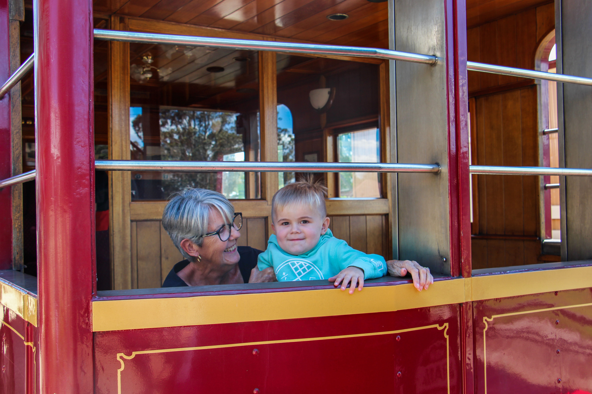

**In 2018, THNSW commissioned a visitor snapshot to gain a better understanding about what motivates people to visit transport museums and heritage operators in NSW. The consultants provided us with some useful takeaways about our organisation and the broader sector that we hope will be useful for your organisation as well.**

**What attracts visitors?**

* Subject matter is key for visitors. Basically, this means visitors are just as interested in connecting with the past through heritage transport experiences and interpretation as we hope they are!
* Travelling on heritage transport is the most attractive activity for visitors. However, seeing restorations and special exhibitions are also highly rated, coming in second and third overall.
* Facebook is a key resource for visitors. However, word of mouth is still a top method of finding out about events and museums that interest visitors.

**What are barriers for visitors?**

* For people who wish they could visit, but don’t, cost is **not** the primary barrier. Lack of time and not knowing what is happening in our organisations are the major barriers. This emphasises the importance of marketing and using communication channels that visitors want to use, such as Facebook. Approximately 87 per cent of Australians over the age of 13 have an active Facebook account and over 74 per cent use Facebook to regularly connect with organisations they’re interested in. It’s an engagement tool you can’t afford to ignore.
* Distance to travel is also a major barrier. This underlines the importance of working with local Council and the other cultural and tourism organisations in your region to make your area (and your organisation) a truly viable option for visitors.

**Who are our visitors?**

* Most visitors to transport museums and heritage transport operators are families. This should be at the forefront of all our minds when we design our programs and interpretation.
* Most respondents to the survey expressed that they understand there are costs involved in heritage activities and that they can’t be offered for free.

Grandma and grandson visit the NSW Rail Musuem.

**What do visitors look for in events and museums?**

* Adults look for new, innovative events and displays. This may be important information for those of us who are trying to attract repeat visitation and engagement from our local community.
* Parents look for activities for their children, as well as educational elements aimed at children. This is not surprising, but does underline the importance of reading your signage and information booklets with a critical eye. Can someone without technical knowledge get interesting information from what you’re telling them?
* All respondents seek easy access and there was a heavy emphasis across the board about sufficient parking.
* The majority of respondents want events and displays that engage a wide audience and are inclusive of diverse backgrounds and ages. This final point would also seem to call for a critical assessment of the way we approach storytelling in our organisations.

**References**

If you’re interested in reading the full report, please contact the heritage and collections team by emailing [sector@thnsw.com.au](mailto:sector@thnsw.com.au).

[1] Social Media News (November 2018). *Social Media Statistics Australia – November 2018*. Accessed at <https://bit.ly/2SGEyQl> and the Australian Bureau of Statistics.

*This article was originally published in the summer 2019 sector report. Written by Margot Stuart, Sector Development Officer.*
