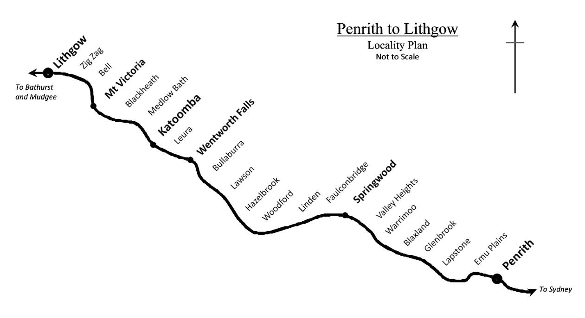
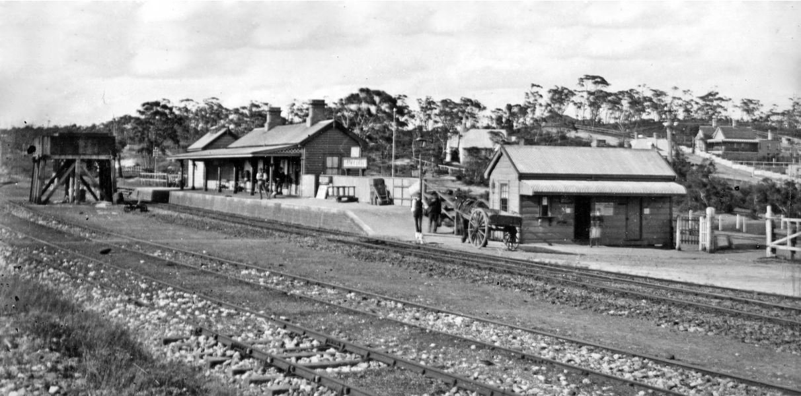
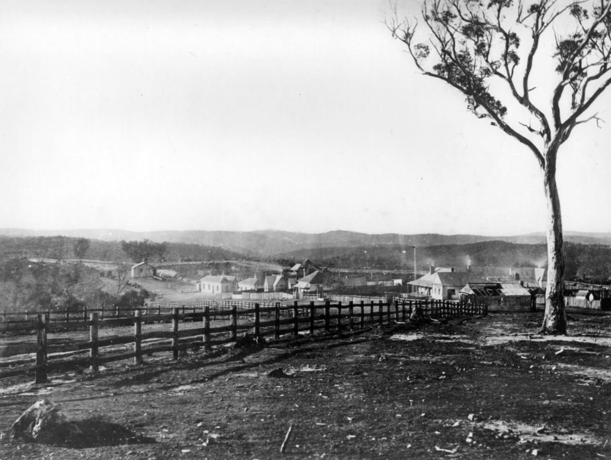

**When the record flood of June 1867 reached Penrith, it severed the main transport and communication link between Sydney and the Western Plains. This was the fourth occasion in seven years that the population to the west had been isolated.**

Although the road to Bathurst was rugged and difficult in its various iterations, it was nonetheless an increasingly important transport route as settlement in the west grew. Traffic increased and basic facilities became available to travellers in the form of roadside inns, roughly spaced about one day’s travel apart. The gold rush of the 1850s saw a substantial increase in the colonial population and a stream of migration westwards to the gold fields. The roadside inns prospered, but significant communities failed to develop alongside them. The exception was One Tree Hill (present day Mount Victoria), which occupied a pivotal position on the stock route and was a key resting place for driven stock.

Drawing by Chris Troy, Valley Heights Locomotive Depot Heritage Museum

The floods of 1860, 1863 and 1864 had all damaged the early road bridges across the Nepean River at Penrith and ravaged sections of the road to Bathurst. The flood of 1867 damaged the approaches to John Whitton’s brand new Victoria Bridge over the Nepean River, as well as parts of the road. These floods caused transport havoc, as the road was the only link between the western plains and Sydney. Consequently, there was considerable pressure to push westwards with the railway as quickly as possible and to open sections of the line as soon as they were trafficable.

Many disappointed prospectors settled permanently on the western plains once land reforms freed up land for small settlers. This population required supplies and reliable communication (by post) with the east coast. Importantly, the west had wool, wheat, fodder, livestock and other commodities for a hungry market.

However, New South Wales politicians were arguing about the merits of horse tramways, constructing modest stretches of single track railway, balking at the cost of construction and grilling members of the Works Department about their professional conduct. Meanwhile, Victoria was surging ahead with railway construction (double track), funded by an abundance of gold.

Against this backdrop, the line reached Penrith in July 1862. By mid-1863, the contracts for the work as far as Blackheath had been let. William Watkins was awarded the earthworks contract for two portions: the Nepean River to near the Pilgrim Inn (present day Blaxland) and the Blue Mountains (now Lawson) to Blackheath. When tenders for the extension from Blackheath to Mount Clarence were called in October 1864, William Watkins was, again, the successful tenderer.

Early photo of Blackheath Station. -ARHS NSW Rail Resource Centre

In 1864, Victoria established a railhead on the Murray River at Echuca. Now western and southern New South Wales could use the Murray, Darling and Murrumbidgee river systems to transport produce to Echuca and the Victorian markets cheaper and quicker than by road to Sydney and the east coast.(1) With an undercurrent of rivalry an on-going feature of the relationship between New South Wales and Victoria, the political and financial inertia was overcome and the push westwards (and southwards) became imperative.

Westwards from Weatherboard (present day Wentworth Falls), the upward climb of the railway line continued and there were no settlements between Weatherboard and Blackheath. As was the case in the lower extension, the Bathurst Road and the railway line shared the ridge and intersected at various points. This occurred four times between Weatherboard and One Tree Hill, and required the construction of level crossings and the associated gatekeeper’s cottages.

No.9 and No.11 level crossings and gatehouses were established in the localities now known as Leura and Medlow Bath, respectively. They were the first permanent houses in these areas. No. 12 was built approximately 800 metres (1/2 mile) on the Sydney side of the little settlement of One Tree Hill.

No.10 level crossing and gatehouse were built in the vicinity of what is now the Sydney end of Katoomba Station. From this locality to the west, the constant ascent of the railway line diminished with just a couple of short, steep sections remaining.

Blackheath had originally been identified as the interim terminus for the next section of the line after Weatherboard. However, Watkins had completed the earthwork construction to Blackheath by the second half of 1866 and had already reached One Tree Hill by the time the approaches to the Victoria Bridge were repaired. So, One Tree Hill was destined to become the temporary terminus of the line to Bathurst.(2)

What is now Mount Victoria was known as One Tree Hill until the opening of the railway line. There was a large tree on a flat area where stock and teams rested before descending into the valley or after the ascent from the valley. The locality experienced regular activity and there had been some development of facilities and services for travellers and stockmen because of its strategic location on the stock route.

The line was opened on 1 May 1868, 10 months after reaching Weatherboard and approximately 15 miles (24 kilometres) further west. The Governor, Lord Belmore, accompanied by S. F. Byrnes MLA (Minister for Works), Henry Parkes (Colonial Secretary) and others left Sydney at 6.45am and arrived at Mount Victoria at 11.40am. The official opening took place just after midday. In his speech, the Governor felt it necessary to “mention a few facts and quote a few figures with a view to show some of the advantages which would, in the future, accrue to the colony from railway works.”(3) Portentously, he chose to highlight the dramatic reduction in the cost of freight per ton, which would be realised by transporting goods by rail.

After the formal proceedings, lunch was served – the official party in the station building, the rest in the goods shed. Departing at 2.00pm, the official party arrived in Sydney at 6.30pm.

The goods shed and provision for handling livestock were very important features of the early station, underlining the significance of the movement of goods and livestock between the west and east coast. From 25 May 1868, goods railed from Sydney would be accepted at One Tree Hill.(4) They would then continue by road. Bathurst now received a daily mail service from Sydney, arriving at 8.00am, and mail was dispatched to Sydney daily at 4.00pm.(5)

The road to Bathurst continued to be poorly maintained, despite toll bars collecting revenue for maintenance. *The Bathurst Times* of 23 May 1868 remarked that “the road for teams from the Weatherboard to One Tree Hill is frightfully bad.”(6) Road deterioration and the difficulty of travelling over it meant that once the railway arrived, the latter quickly became the favoured method of moving stock, goods and people. The road became less travelled, deteriorated even further and most of the roadside inns rapidly disappeared as their clientele dwindled. Convenience for travellers was to be re-born in the 1880s in the form of hotels in the communities which grew up around railway facilities. The tourist boom had begun.

By 1874, Mount Victoria Station had expanded and there was a stone building providing refreshment facilities with a single storey station building adjacent. The station and yards continued to grow over the years to service trains, crews and travellers with the addition of a second storey to the refreshment rooms, a Station Master’s residence, barracks accommodation, a proliferation of sidings, a carriage shed, a succession of ever larger turntables, an engine shed, further stock handling facilities and a low level coal stage. Busy in the days of steam locomotives when train travel was the principal method of moving people and goods, activity at Mount Victoria peaked in the 1940s and then declined. Electrification of the line came in 1957 and there was a decline in tourism by train as a result of the increased mobility and flexibility offered by the motor car.

Mount Victoria c. 1875. -ARHS NSW Rail Resource Centre

Although no longer flourishing in the style of a 1940s stopover, Mount Victoria Station continues to evolve. Still a terminus and stabling facility for the majority of inter-city trains, it is enjoying a new role as a training venue for Sydney Trains. It remains a charming railway station with many layers of transport history.

In the preparation of this article, the author would like to acknowledge the generous assistance given by Roy Bennett, Mount Victoria and District Historical Society; Ted Szafraniec, Blue Mountains Historical Society; John Merriman, Local Studies, Blue Mountains City Library; Ted Dickson, Andrew Tester and Chris Troy, Valley Heights Locomotive Depot Heritage Museum; James Dalton and the staff of the Australian Railway Historical Society NSW Rail Resource Centre; Chris and the staff at Mount Victoria Station; the staff at State Archives and Records NSW; Howard Sinclair and the Research Team of the Bathurst District Historical Society; and Sue Fulton, Springwood Historical Society.

**Footnotes**

1. *Colonial Engineer*, p149-150, Robert Lee.

2. *To the Fertile Plains Beyond*, p119, C. C. Singleton.

3. *Sydney Morning Herald*, 2 May 1868, p7

4. *The Bathurst Times*, 23 May 1868, p2, column 4

5. *The Bathurst Times*, 2 May 1868, p2, column 5

6. *The Bathurst Times*, 232 May 1868, p2 column 4

**References**
 
*Blue Mountains Railways*, Bayley, W. A., Locomotion Productions, reprinted 2000.

*Excursions into History; Joseph Bennett & Son Pty Ltd*, Blue Mountains Historical Society (no author named); Revised edition, 2000.

*Railway West Chronicles: Penrith to Orange,* D. J. Chamberlain, Charles Sturt University Printery, 3rd edition, 2011.

*Jenolan Caves,* B. T. Dunlop, Department of Tourism NSW, 1969.

*Along Parallel Lines: A History of the Railways of NSW 1850-1986,* J. Gunn, Melbourne University Press, 1989.

*Conquering the Blue Mountains,* Mark Langdon, Eveleigh Press, 2006.

*Colonial Engineer: John Whitton 1819-1898 and the Building of Australia’s Railways,* Robert Lee, UNSW in association with the Australian Railway Historical Society, 2000.

*The Greatest Public Work: The New South Wales Railways- 1848-1889,* Robert Lee, Hale & Iremonger, 1988.

*Blackheath, Today from Yesterday,* Peter C. Rickwood, D. J. West, Rotary Club of Blackheath, 2005.

*Old Katoomba and Leura*, Rotary Club of Katoomba (no author named); Rotary Club of Katoomba, 1981.

*To the Fertile Plains Beyond: The Story of the Crossing of the Blue Mountains, N.S.W*. Covering the Period between 1802 and 1969, C. C. Singleton, Australian Railway Historical Society (NSW Division), 2016.

“The Steam Locomotive Depots in NSW. Locomotive Out-depot: Mount Victoria,” R. Love, *Byways of Steam 26*; Eveleigh Press, December 2009.

“William Watkins Railway Contractor Part 1 Crossing the Blue Mountains,” B. McKillop, Australian Railway History. Journal of the Australian Railway Historical Society, Volume 68, No. 947, September 2016.

*Railway Digest*, March 1993.

*The Bathurst Times*, 2 May 1868; 23 May 1868.

*NSW Government Gazette*, 1862 Issue Nos 191 and 243; 1863, Issue No.113.

*Sydney Morning Herald*, 2 May 1868.

*This article was originally published in the winter 2018 edition of Roundhouse magazine. Written by Richard Morony, Springwood Historical Society Inc.*
