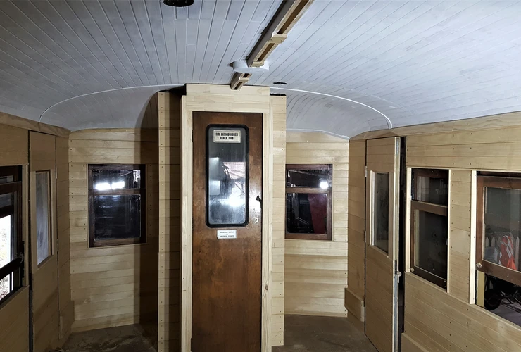
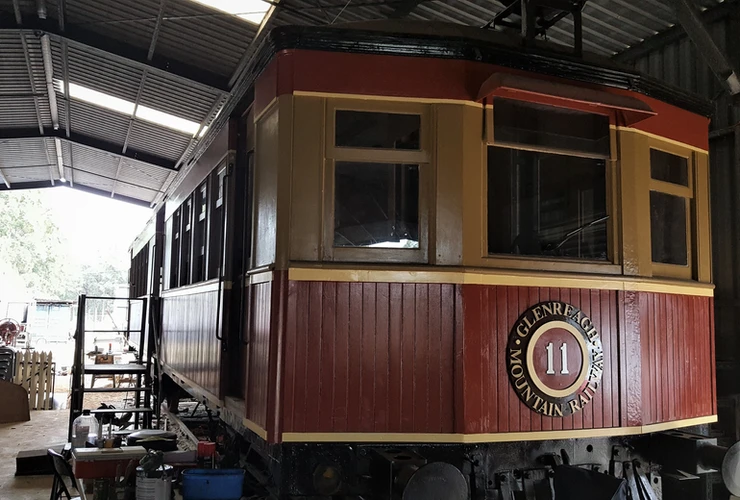

**Glenreagh Mountain Railway (GMR) acquired its CPH11 rail motor in 1999. It was evident that reconstruction would be required to return it to an operational status, as the rail motor was severely affected by weather exposure and much of its fabric could not be saved. Luckily, the sub-frame and contents below were in fair condition and most of the roof was salvageable.**

Work on the restoration of CPH11 halted in 2008, but recommenced in 2014 when GMR received accreditation as a Rolling Stock Manager.

Prior to acquisition, the original timber frame had been replaced by a steel frame fabricated from rolled hollow section and the cladding below the window line comprised of vertical tongue and grooved timber. GMR has decided to retain the steel frame for practical reasons, as it will be completely hidden. To conform to the outer construction of the cabin, it’s been decided to apply the model’s 1927 colour scheme of khaki and red.

Around 1963, a Masonite ceiling was fitted in the rail motor, but it has been removed to expose the original tongue and grooved panelling. Damage was severe at each end, but the remainder has been refurbished and each end reconstructed to present the original feature. Additionally, the outer fabric of the roof was stripped back and replaced where necessary, and sealing was accomplished using a three-part process with a polyurethane membrane.

Using CPH18 as a template, the internal lining is being updated using hoop pine tongue and grooved boards. The internal lining is nearly complete and the GRM team is presently undercoating the ceiling.

Preliminary work has begun on locating missing engine components, and two new volunteers started reviewing all the electrical and control components to determine what’s missing.

Progress has been slow, but steady. We’re hopeful that the rail motor will be ready for movement under its own power by the end of 2019. It’s been a long battle, but it will be worth it when CPH11 once again takes to the rails.

*This article was originally published in the winter 2018 sector report.*
